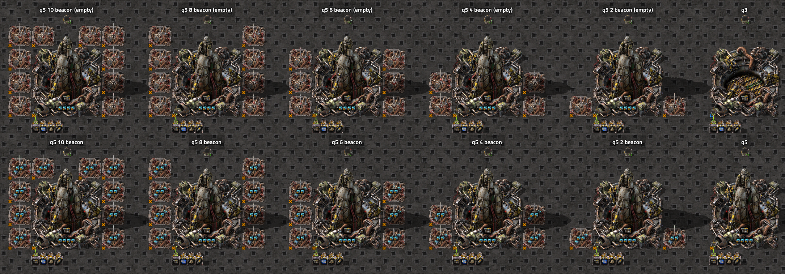
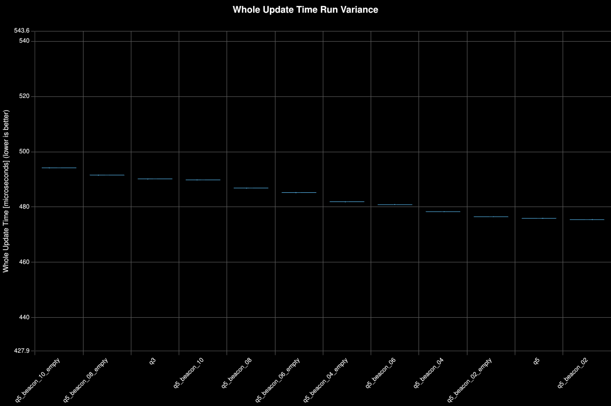
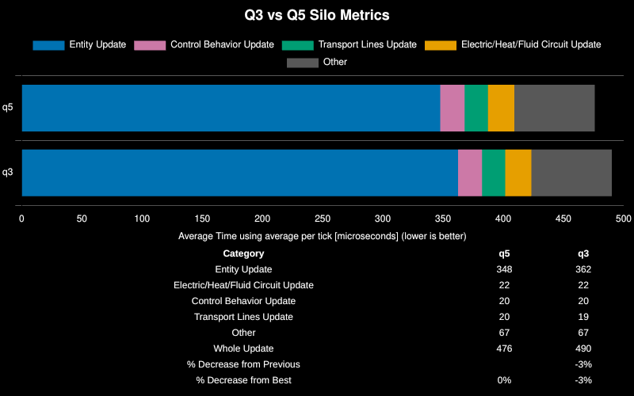
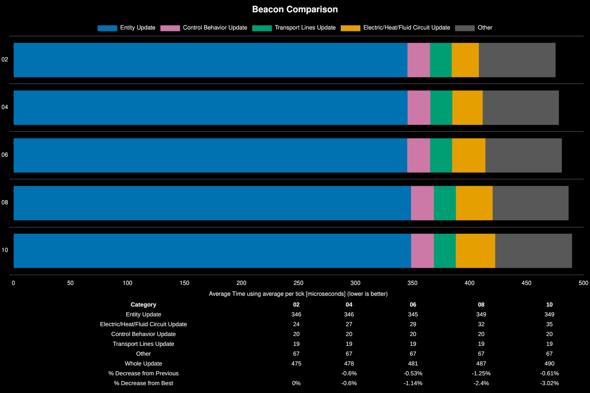
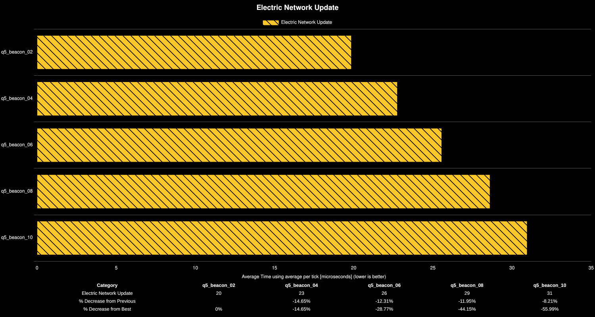
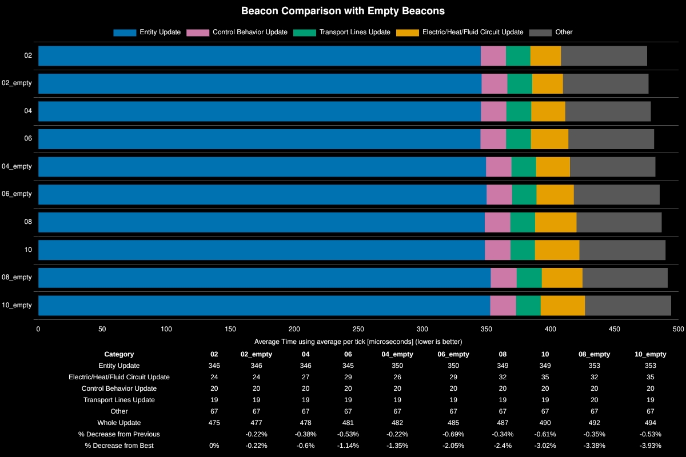

# Rocket Silo Crafting Speed

**Platform:** linux-x86_64

**Factorio Version:** 2.0.76

**Date:** 2026-03-26

## The Question
Does crafting speed have an impact to rocket silos. Is there any benefit to overbeaconing rocket silos.

## Answer

Yes

- higher crafting speed in rocket silos is better
- don't add extra beacons for the sake of purely boosting the silos crafting speed

Good luck building more power infrastructure fellow engineers!

## Scenario

The above screenshot are the combinations that are tested in this save file. The combinations with beacons that have no modules are used as a placehold to have the same crafting speed, but show the cost attributed to beacon counts alone.

Each save file was tested for 161700 ticks which is 100 launches (each launch is 1617 ticks). 

Each save file has rocket part productivity level 30 researched (level 31 available) for the maximum of 300% productivity.

## Results

## All Save Files

### Boxplot

## Crafting Speed Without Beacons

A rare (Q3) silo with a crafting speed of 1.6 is compared against a legendary (Q5) silo.

Higher crafting speed was shown to be be better. The lower crafting speed of Q3 silo was 3% worse.

## Speed Beacons

These save files alterned the number of speed beacons around a silo. The number in the legend indicates the number of beacons present around the silo.

The performance drop directly related to the number of beacons is mainly coming from the electric network update time increasing as is more clearly shown in the chart below:

Additionally, another test was created where the beacons had all speed modules removed while keeping the beacons exactly in place.

The pattern is consistent where the more beacons that were added, the worse the electric network update time and entity time. This is due to beacons taking up entity update time every 120 ticks to check for their distribution power to buildings in the event of a power brown out. Additionally, electric network update time went up. The main takeaway from this however is that when the beacons were empty they performed worse than when they had modules inside them boosting the crafting speed of the silo, thus it stands that faster crafting speed is better.