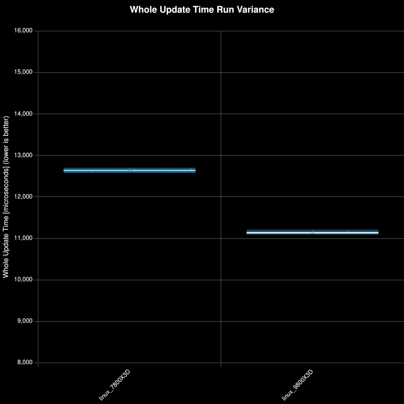
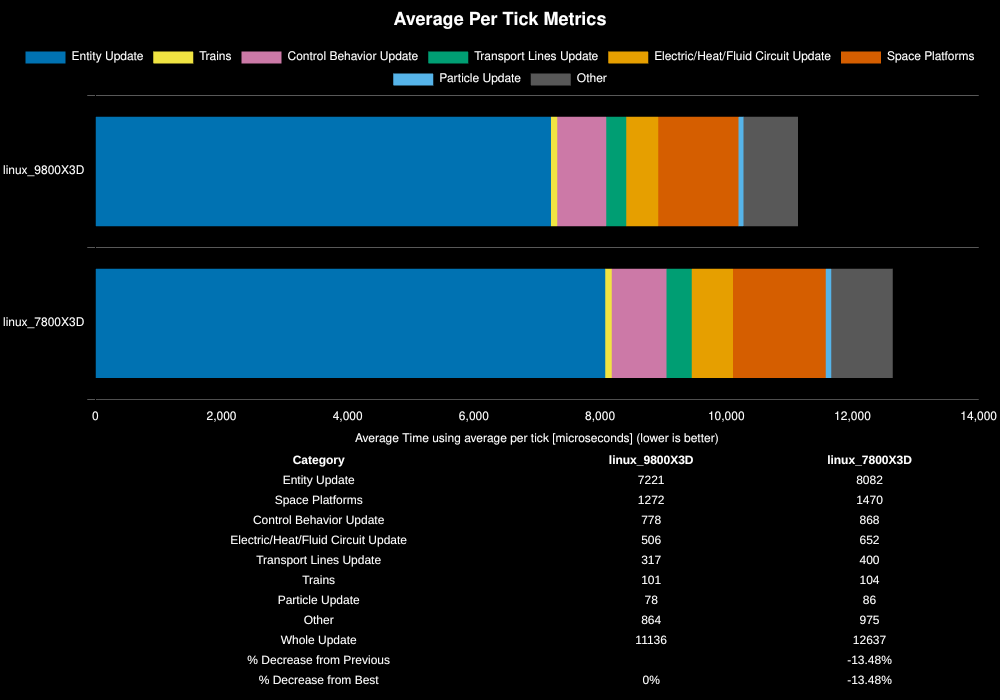

# Hardware Benchmarks
## Overview
An ongoing list of hardware comparison benchmarks on abucnasty's machine. All benchmarks are run with mimalloc injection and 8GB of huge pages allocated to factorio.

All tests are performed on Factorio version 2.0.73.

Save file running research productivity at 100k SPM for an effective 2 million ESPM [Google Drive Link](https://drive.google.com/file/d/1GZeEC00NIrhkuxbWmbTMrJVfuh2UgXSC/view?usp=sharing)

## Results

|Save File|Entity Update|Space Platforms|Control Behavior Update|Electric/Heat/Fluid Circuit Update|Transport Lines Update|Trains|Particle Update|Other|Whole Update|% Decrease from Previous|% Decrease from Best|
|---|---|---|---|---|---|---|---|---|---|---|---|
|linux_9800X3D|7221|1272|778|506|317|101|78|864|11136||0%|
|linux_7800X3D|8082|1470|868|652|400|104|86|975|12637|-13.48%|-13.48%|