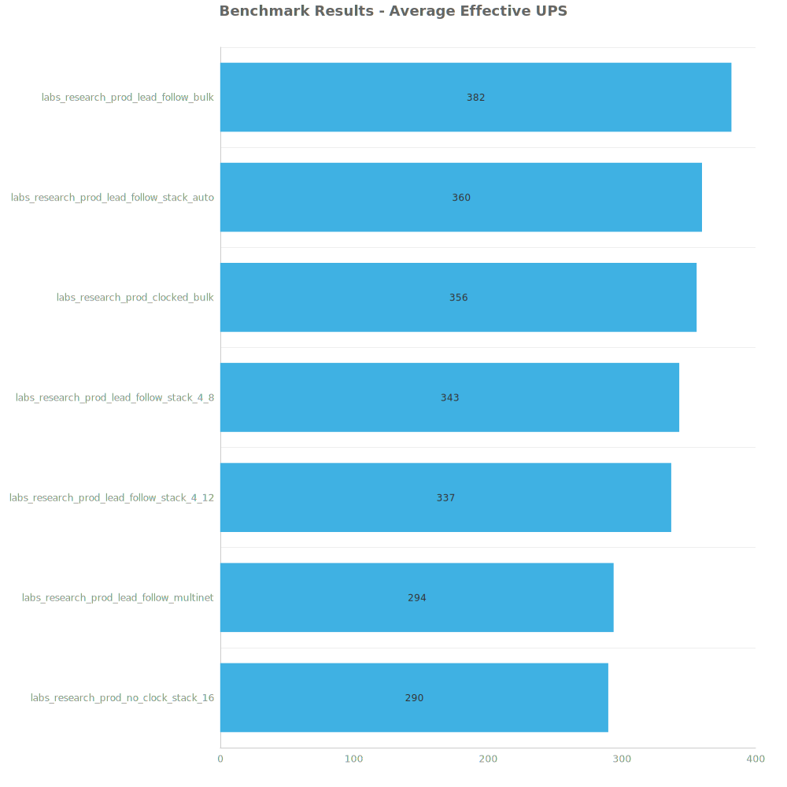
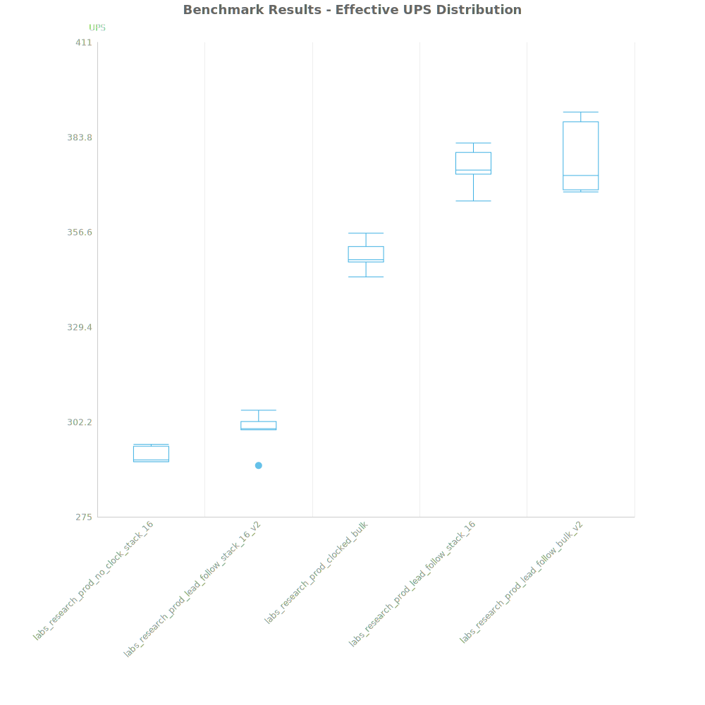
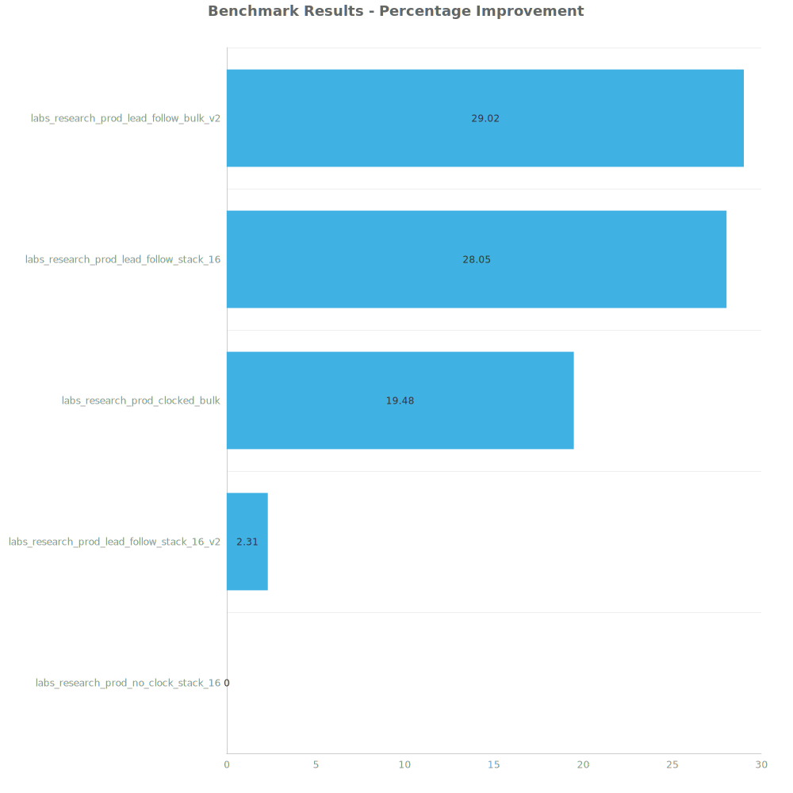

# Factorio Benchmark Results

**Platform:** windows-x86_64  
**Factorio Version:** 2.0.55  

## Scenario
Lorem ipsum..

## Results
| Metric            | Description                           |
| ----------------- | ------------------------------------- |
| **Mean UPS**      | Updates per second - higher is better |
| **Mean Avg (ms)** | Average frame time - lower is better  |
| **Mean Min (ms)** | Minimum frame time - lower is better  |
| **Mean Max (ms)** | Maximum frame time - lower is better  |

| Save | Avg (ms) | Min (ms) | Max (ms) | UPS | Execution Time (ms) |
|------|----------|----------|----------|-----|---------------------|
| labs_research_prod_no_clock_stack_16 | 3.315 | 0.880 | 22.111 | 301 | 23864 |
| labs_research_prod_lead_follow_stack_16_v2 | 3.259 | 1.191 | 12.238 | 306 | 23466 |
| labs_research_prod_clocked_bulk | 2.765 | 1.051 | 25.734 | 361 | 19905 |
| labs_research_prod_lead_follow_stack_16 | 2.659 | 1.008 | 30.692 | 376 | 19143 |
| labs_research_prod_lead_follow_bulk_v2 | 2.611 | 1.100 | 17.894 | **383** | 18800 |

Box and Whisker Plot:

| Save | % Difference from base |
|------|------------------------|
| labs_research_prod_no_clock_stack_16 | 0.00% |
| labs_research_prod_lead_follow_stack_16_v2 | 1.71% |
| labs_research_prod_clocked_bulk | 19.89% |
| labs_research_prod_lead_follow_stack_16 | 24.67% |
| labs_research_prod_lead_follow_bulk_v2 | 26.99% |

## Conclusion