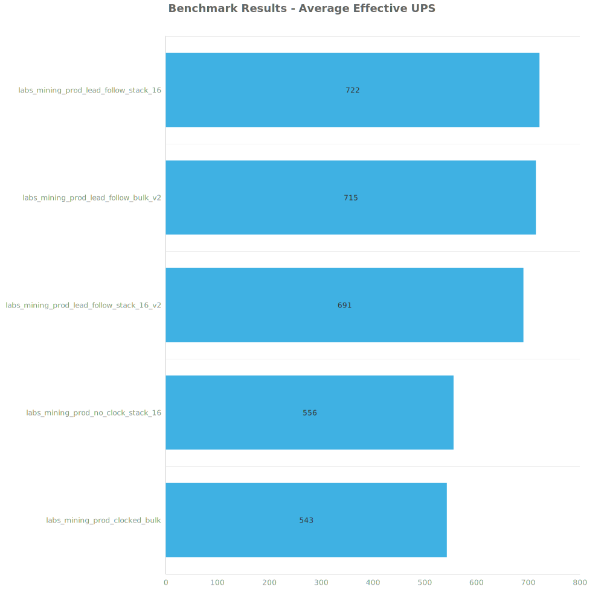
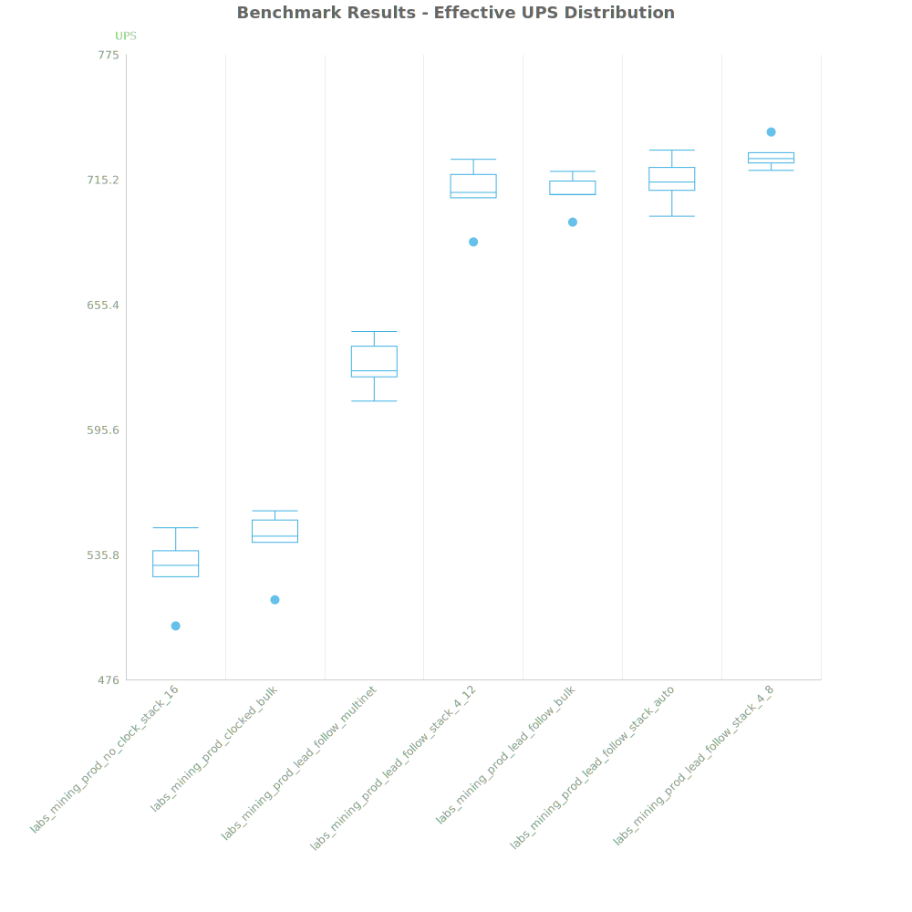
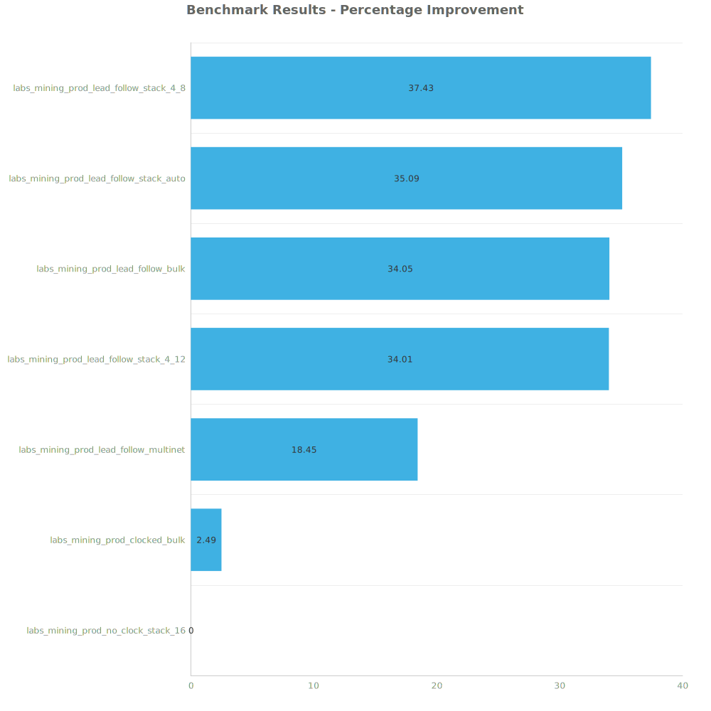

# Factorio Benchmark Results

**Platform:** windows-x86_64  
**Factorio Version:** 2.0.55  

## Scenario
Varying lab designs (64 * 240/s of each science in each test) running mining productivity

## Results
| Metric            | Description                           |
| ----------------- | ------------------------------------- |
| **Mean UPS**      | Updates per second - higher is better |
| **Mean Avg (ms)** | Average frame time - lower is better  |
| **Mean Min (ms)** | Minimum frame time - lower is better  |
| **Mean Max (ms)** | Maximum frame time - lower is better  |

| Save | Avg (ms) | Min (ms) | Max (ms) | UPS | Execution Time (ms) |
|------|----------|----------|----------|-----|---------------------|
| labs_mining_prod_clocked_bulk | 1.892 | 0.489 | 46.119 | 530 | 94585 |
| labs_mining_prod_no_clock_stack_16 | 1.879 | 0.591 | 23.946 | 533 | 93925 |
| labs_mining_prod_lead_follow_stack_16_v2 | 1.501 | 0.850 | 11.600 | 667 | 75037 |
| labs_mining_prod_lead_follow_stack_16 | 1.470 | 0.834 | 15.102 | **682** | 73504 |
| labs_mining_prod_lead_follow_bulk_v2 | 1.465 | 0.827 | 13.382 | **682** | 73280 |

Box and Whisker Plot:

| Save | % Difference from base |
|------|------------------------|
| labs_mining_prod_clocked_bulk | 0.00% |
| labs_mining_prod_no_clock_stack_16 | 0.58% |
| labs_mining_prod_lead_follow_stack_16_v2 | 25.76% |
| labs_mining_prod_lead_follow_stack_16 | 28.60% |
| labs_mining_prod_lead_follow_bulk_v2 | 28.77% |

## Conclusion