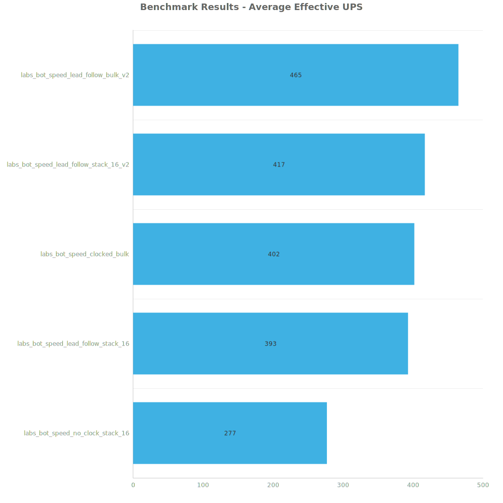
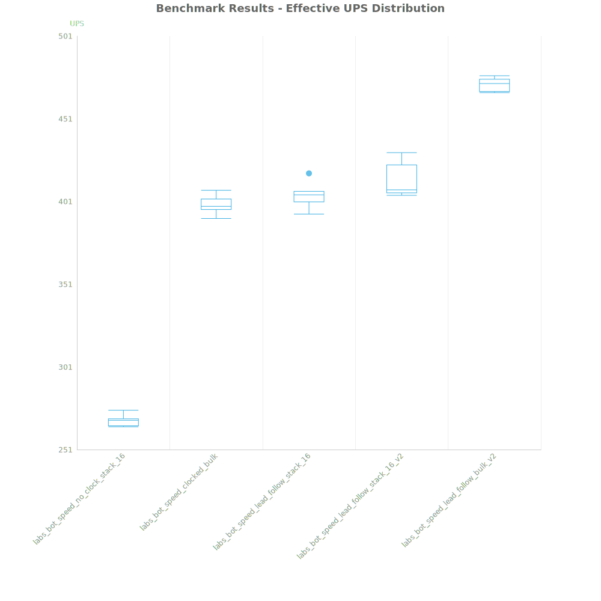
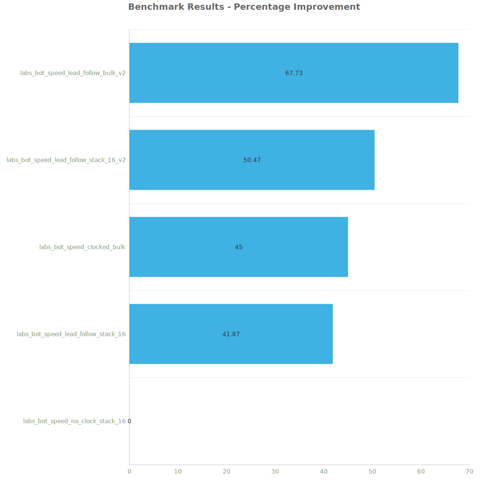

# Factorio Benchmark Results

**Platform:** windows-x86_64  
**Factorio Version:** 2.0.55  

## Scenario
Lorem ipsum..

## Results
| Metric            | Description                           |
| ----------------- | ------------------------------------- |
| **Mean UPS**      | Updates per second - higher is better |
| **Mean Avg (ms)** | Average frame time - lower is better  |
| **Mean Min (ms)** | Minimum frame time - lower is better  |
| **Mean Max (ms)** | Maximum frame time - lower is better  |

| Save | Avg (ms) | Min (ms) | Max (ms) | UPS | Execution Time (ms) |
|------|----------|----------|----------|-----|---------------------|
| labs_bot_speed_no_clock_stack_16 | 3.611 | 0.916 | 20.511 | 276 | 25997 |
| labs_bot_speed_lead_follow_stack_16 | 2.548 | 1.086 | 23.343 | 392 | 18350 |
| labs_bot_speed_clocked_bulk | 2.490 | 0.965 | 26.427 | 401 | 17929 |
| labs_bot_speed_lead_follow_stack_16_v2 | 2.399 | 1.246 | 20.748 | 416 | 17279 |
| labs_bot_speed_lead_follow_bulk_v2 | 2.156 | 1.142 | 14.567 | **464** | 15523 |

Box and Whisker Plot:

| Save | % Difference from base |
|------|------------------------|
| labs_bot_speed_no_clock_stack_16 | 0.00% |
| labs_bot_speed_lead_follow_stack_16 | 41.87% |
| labs_bot_speed_clocked_bulk | 45.00% |
| labs_bot_speed_lead_follow_stack_16_v2 | 50.47% |
| labs_bot_speed_lead_follow_bulk_v2 | 67.73% |

## Conclusion