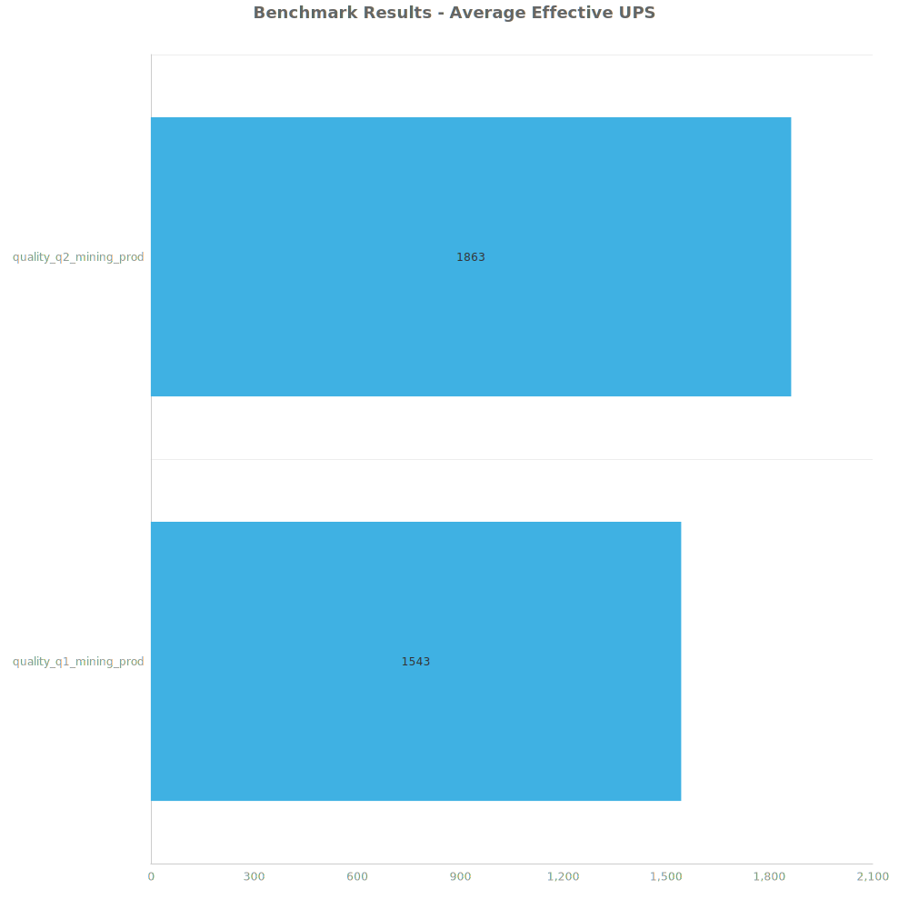
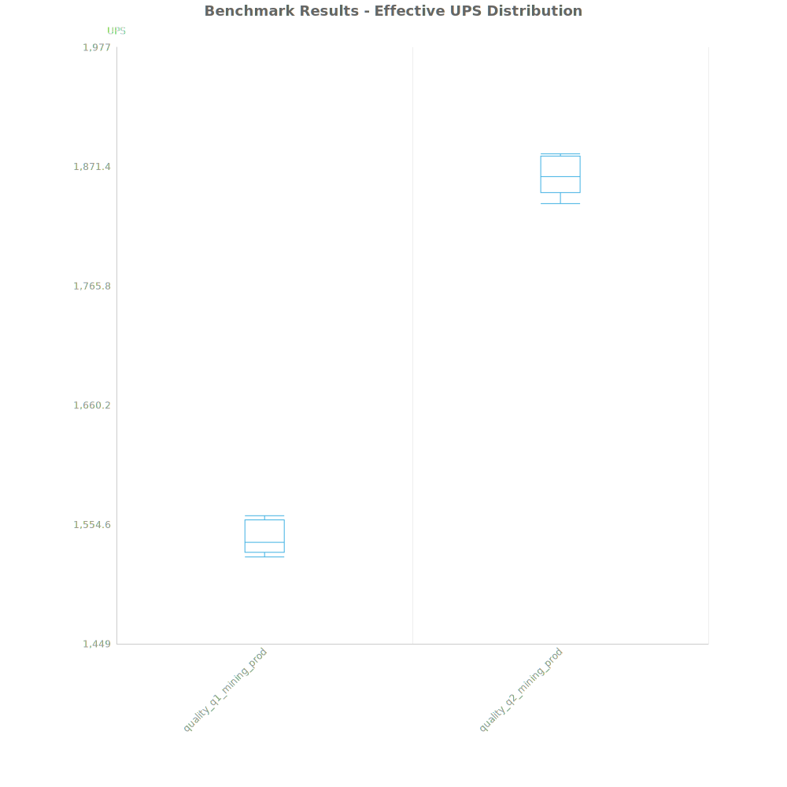
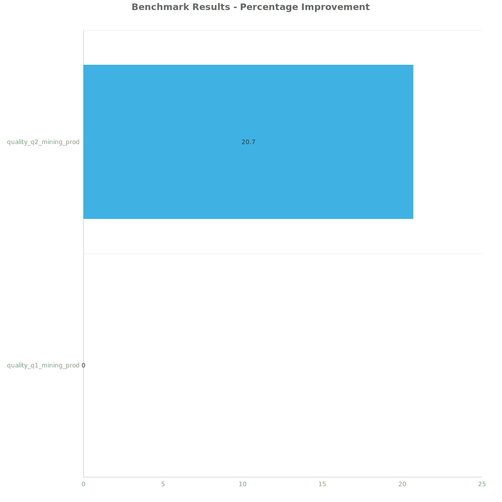

# Factorio Benchmark Results

**Platform:** windows-x86_64  
**Factorio Version:** 2.0.55  

## Scenario
Varying lab designs (32 * 240/s of each science in each test)

## Results
| Metric            | Description                           |
| ----------------- | ------------------------------------- |
| **Mean UPS**      | Updates per second - higher is better |
| **Mean Avg (ms)** | Average frame time - lower is better  |
| **Mean Min (ms)** | Minimum frame time - lower is better  |
| **Mean Max (ms)** | Maximum frame time - lower is better  |

| Save | Avg (ms) | Min (ms) | Max (ms) | UPS | Execution Time (ms) |
|------|----------|----------|----------|-----|---------------------|
| quality_q1_mining_prod | 0.648 | 0.382 | 4.014 | 1543 | 32404 |
| quality_q2_mining_prod | 0.537 | 0.312 | 6.178 | **1862** | 26846 |

Box and Whisker Plot:

| Save | % Difference from base |
|------|------------------------|
| quality_q1_mining_prod | 0.00% |
| quality_q2_mining_prod | 20.70% |

## Conclusion