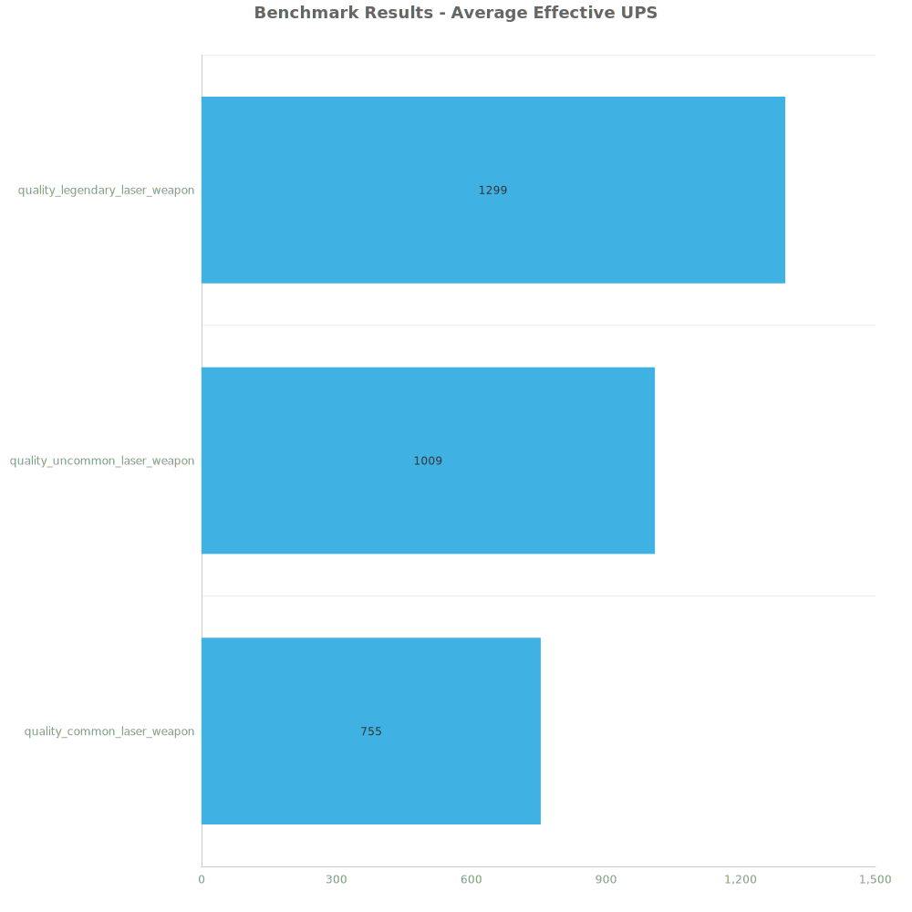
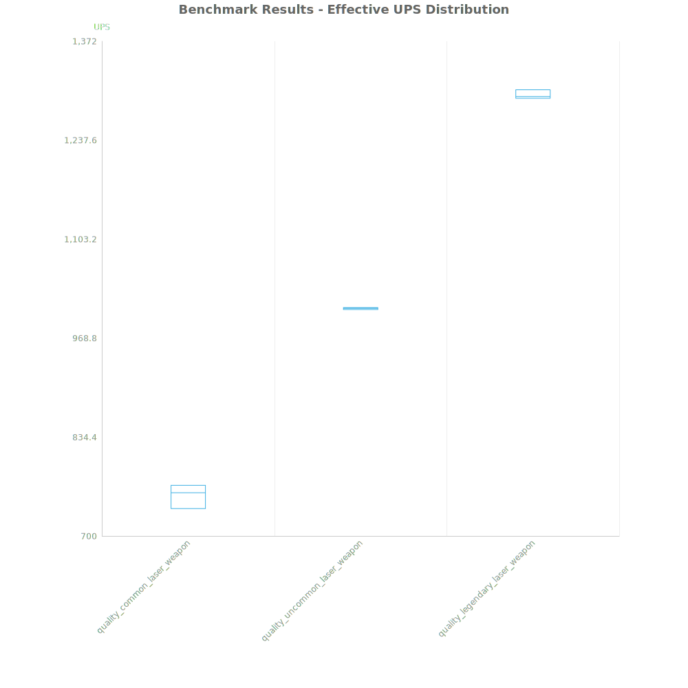
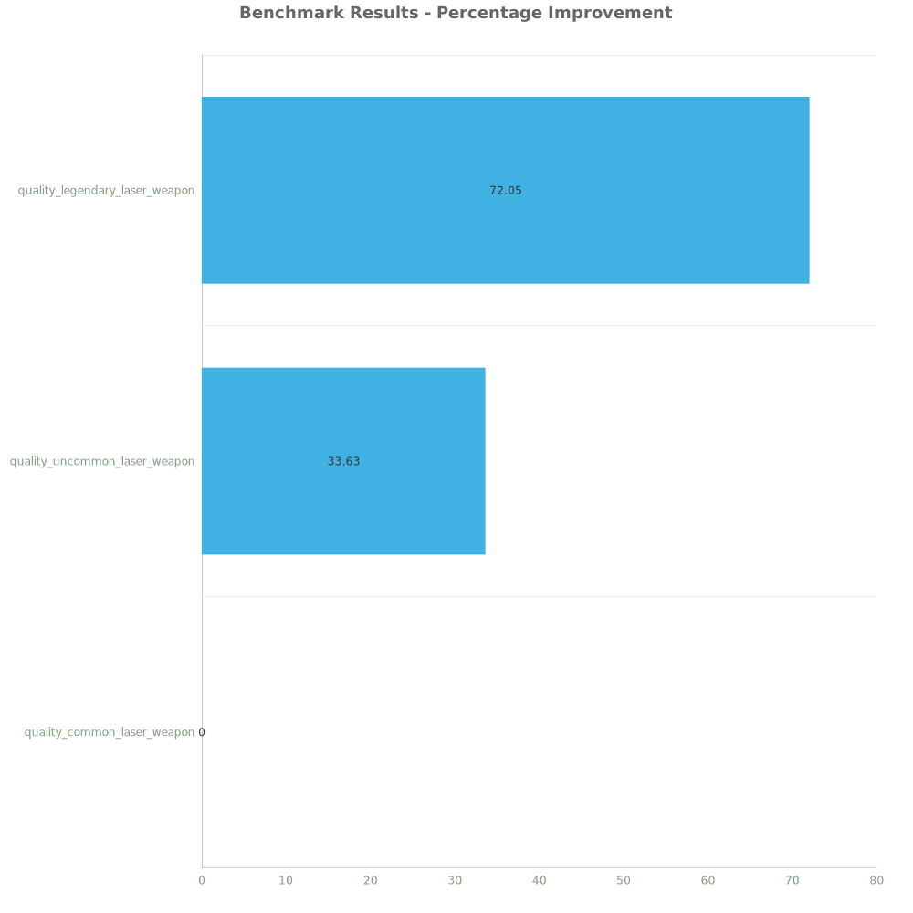

# Factorio Benchmark Results

**Platform:** windows-x86_64  
**Factorio Version:** unknown  

## Scenario
Lorem ipsum..

## Results
| Metric            | Description                           |
| ----------------- | ------------------------------------- |
| **Mean UPS**      | Updates per second - higher is better |
| **Mean Avg (ms)** | Average frame time - lower is better  |
| **Mean Min (ms)** | Minimum frame time - lower is better  |
| **Mean Max (ms)** | Maximum frame time - lower is better  |

| Save | Avg (ms) | Min (ms) | Max (ms) | UPS | Execution Time (ms) |
|------|----------|----------|----------|-----|---------------------|
| quality_common_laser_weapon | 1.325 | 0.745 | 9.774 | 755 | 14305 |
| quality_uncommon_laser_weapon | 0.991 | 0.518 | 11.460 | 1009 | 10702 |
| quality_legendary_laser_weapon | 0.770 | 0.516 | 8.911 | **1299** | 8312 |

Box and Whisker Plot:

| Save | % Difference from base |
|------|------------------------|
| quality_common_laser_weapon | 0.00% |
| quality_uncommon_laser_weapon | 33.63% |
| quality_legendary_laser_weapon | 72.05% |

## Conclusion