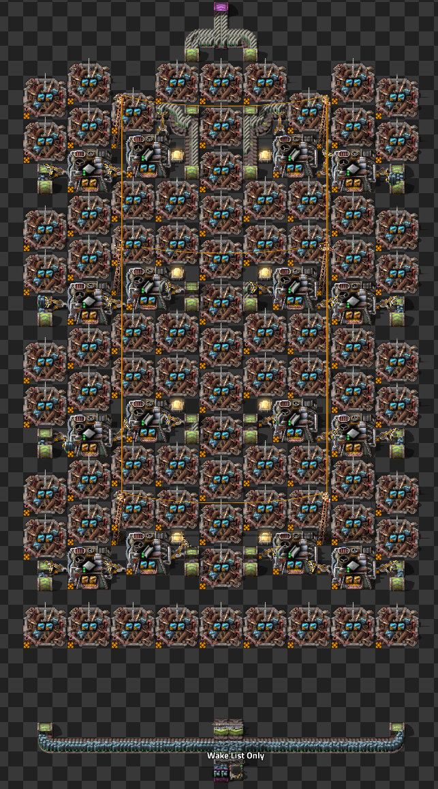
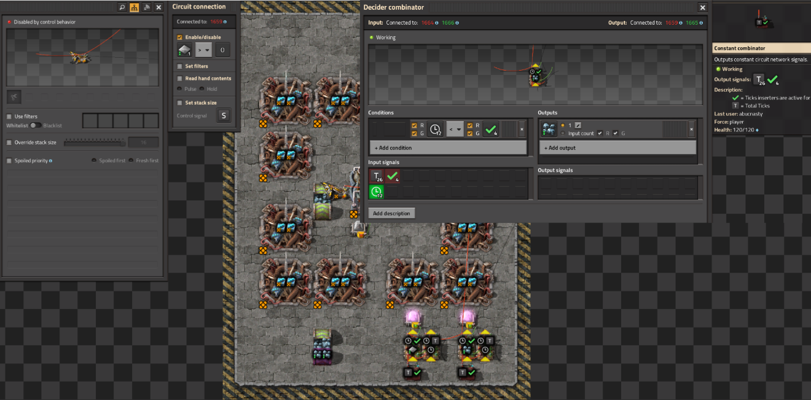
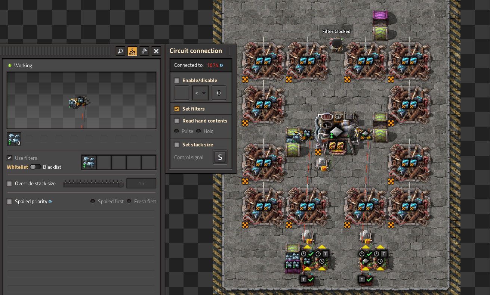
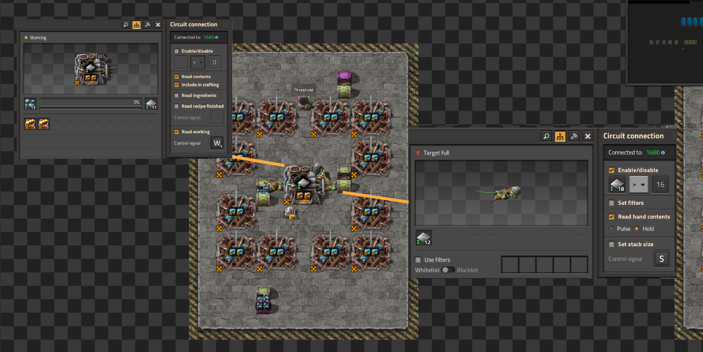
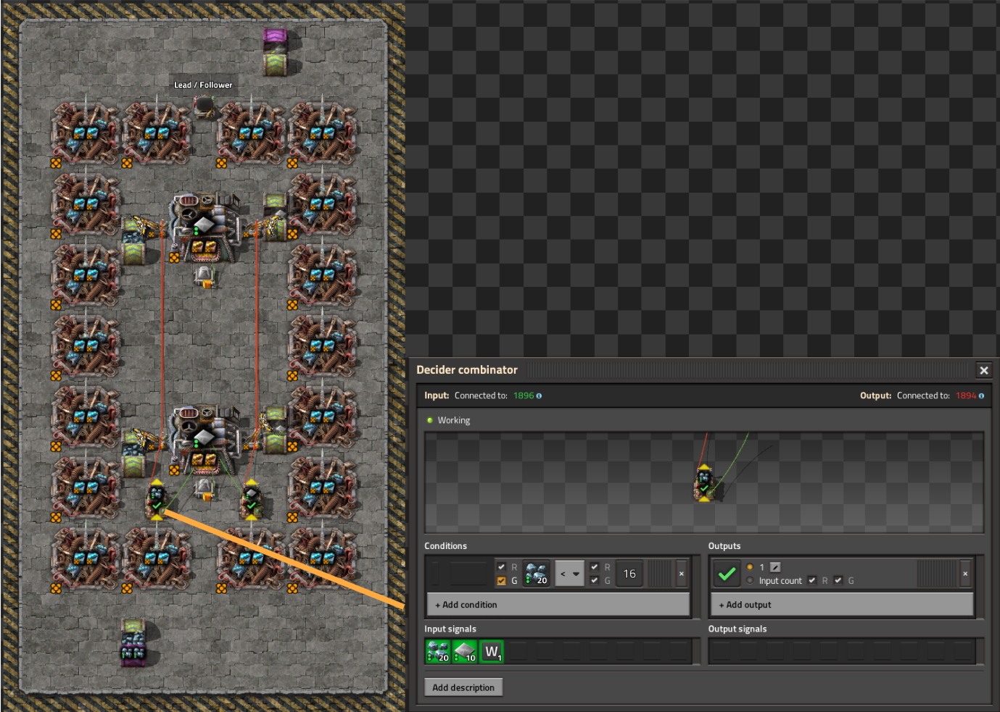
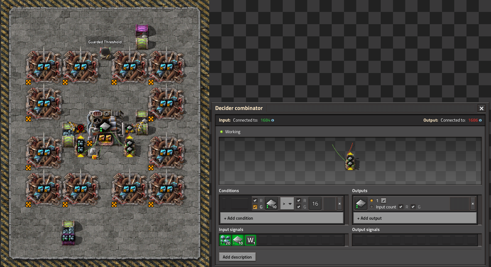
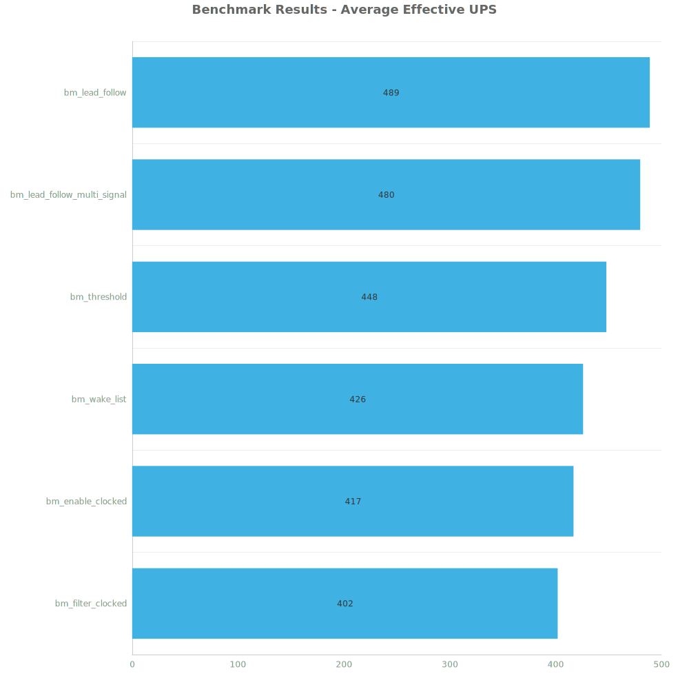
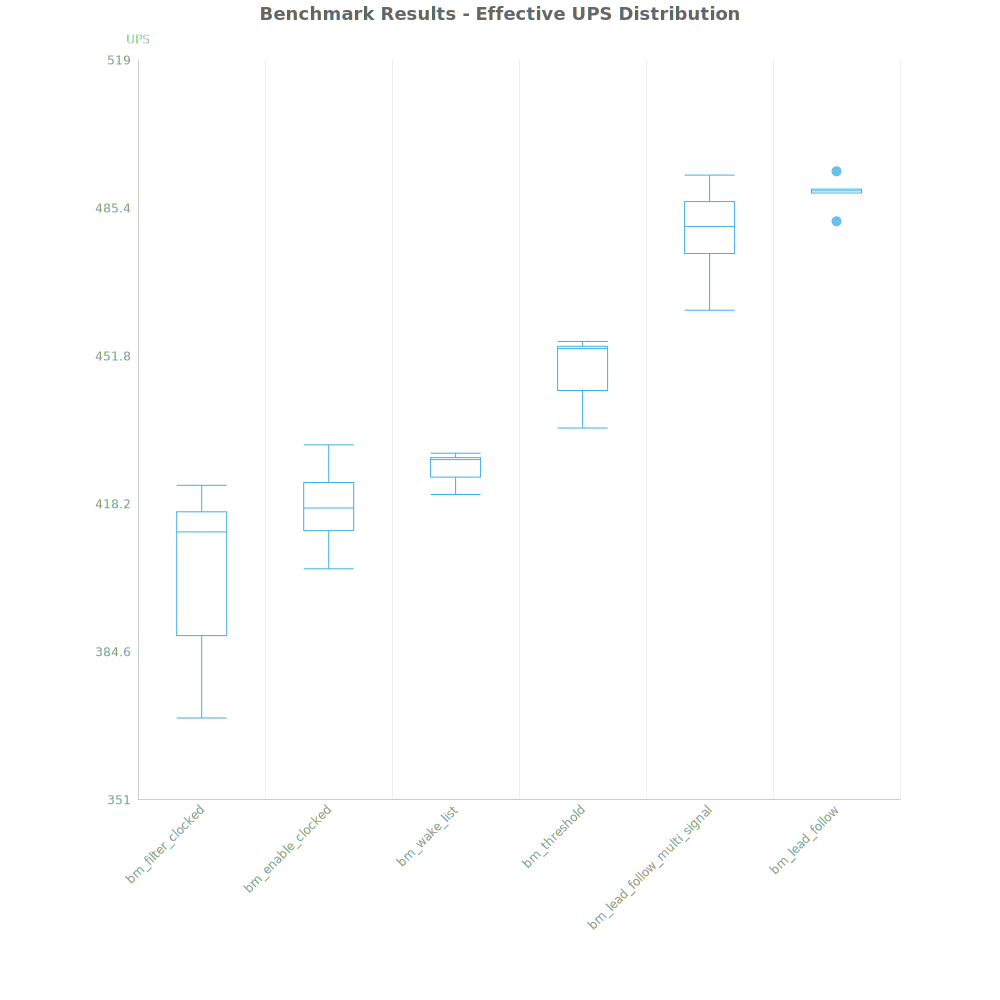
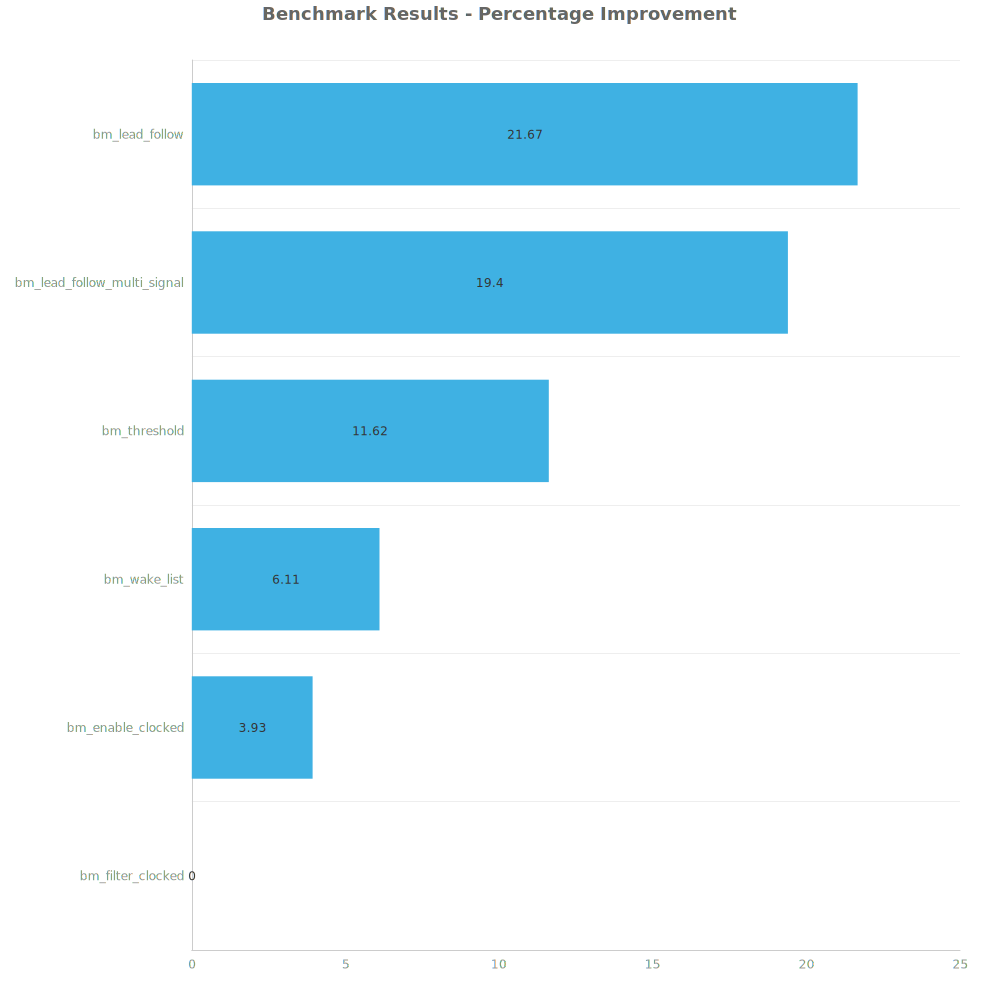

## Overview

## Test Scenario

- steel smelter making 240 steel per second
  - fully beaconed
  - 16 legendary furnaces (8 smelting iron, 8 smelting steel)
  - 24 legendary stack inserters per module
- each test file contains 512 copies of the base module with different inserter control strategies
- camera and player model is in the same location for each file
- each run is executed for 2000 ticks at 64x speed
- blueprints used: [blueprints](./blueprints.txt)

Why was this chosen as the candidate?
- requires separate clocks for each inserter
  - clock pulling from turbo belt into iron plate smelter
  - clock pulling from iron smelter into steel smelter
  - clock pulling from steel smelter and dropping on turbo belt
- This a real world example that would be used, requiring varying inserter clocks for a single assembly module

Preview of furnace stack (specifically the wake list only variation):

## Control Strategy Definitions

### Enable Clocked

Enable / disable inserter based on clock

### Filter Clocked

Set filter on inserters based on clock. (same clock setup as in "Enable Clocked")

### Threshold
Directly connected circuit network to furnace or assembly machine with "read contents" and "include in crafting" enabled.

Sets the inserter enable / disable based on *threshold* values.

### Lead / Follower
First furnace is monitored by a decider combinator. When it drops below a threshold, it sends an activation signal to enable all downstream inserters to insert at the same time. Similiar to threshold, but it introduces the concept of a "lead" furnace. 

> Note: This assumes that within a single assembly module (like the furnace stack used here) all machines (furnaces, assemblers, etc.) have the same demand for inputs and outputs and highly is dependent on having backpressure on the input material (e.g. ore is oversupplied in the example test case).

### Lead / Follower Multi Signal
Same as Lead / Follower except one network is used and individual item signals are sent across the network for each inserter to enable / disable based off its respective signal. The signals used in this test were iron ore, iron plate, and steel and all inserters per furnace stack were connected together.

### Threshold Guarded

Same as `Threshold` but uses decider combinators to intercept the signal. This is to test the theory that an inserter should be "guarded" from upstream changes to the circuit network and only send a single pulse value when it should be enabled or disabled.

## Results

## 📈 **Results**

| Metric            | Description                           |
| ----------------- | ------------------------------------- |
| **Mean UPS**      | Updates per second - higher is better |
| **Mean Avg (ms)** | Average frame time - lower is better  |
| **Mean Min (ms)** | Minimum frame time - lower is better  |
| **Mean Max (ms)** | Maximum frame time - lower is better  |

| Save                        | Avg (ms) | Min (ms) | Max (ms) | UPS     | Execution Time (ms) |
| --------------------------- | -------- | -------- | -------- | ------- | ------------------- |
| bm_filter_clocked           | 2.496    | 0.748    | 10.458   | 401     | 24957               |
| bm_enable_clocked           | 2.397    | 0.696    | 21.587   | 417     | 23964               |
| bm_wake_list                | 2.346    | 1.431    | 6.087    | 426     | 23462               |
| bm_threshold                | 2.231    | 1.352    | 14.638   | 448     | 22309               |
| bm_lead_follow_multi_signal | 2.086    | 0.628    | 6.524    | 479     | 20859               |
| bm_lead_follow              | 2.046    | 0.645    | 5.941    | **488** | 20461               |

Box and Whisker Plot:

| Save                        | % Difference from base |
| --------------------------- | ---------------------- |
| bm_filter_clocked           | 0.00%                  |
| bm_enable_clocked           | 3.93%                  |
| bm_wake_list                | 6.11%                  |
| bm_threshold                | 11.62%                 |
| bm_lead_follow_multi_signal | 19.40%                 |
| bm_lead_follow              | 21.67%                 |

