# Factorio Benchmark Results

**Platform:** windows-x86_64  
**Factorio Version:** 2.0.60  

## Scenario
* Each save was tested for 3600 tick(s) and 5 run(s)

## Results
| Metric            | Description                           |
| ----------------- | ------------------------------------- |
| **Mean UPS**      | Updates per second - higher is better |
| **Mean Avg (ms)** | Average frame time - lower is better  |
| **Mean Min (ms)** | Minimum frame time - lower is better  |
| **Mean Max (ms)** | Maximum frame time - lower is better  |

| Save | Avg (ms) | Min (ms) | Max (ms) | UPS | Execution Time (ms) |
|------|----------|----------|----------|-----|---------------------|
| biolab_uncontrolled | 0.458 | 0.268 | 1.439 | 2184 | 8240 |
| abuc | 0.328 | 0.174 | 0.860 | 3048 | 5904 |
| biolab_synchronous | 0.313 | 0.185 | 1.849 | **3191** | 5642 |

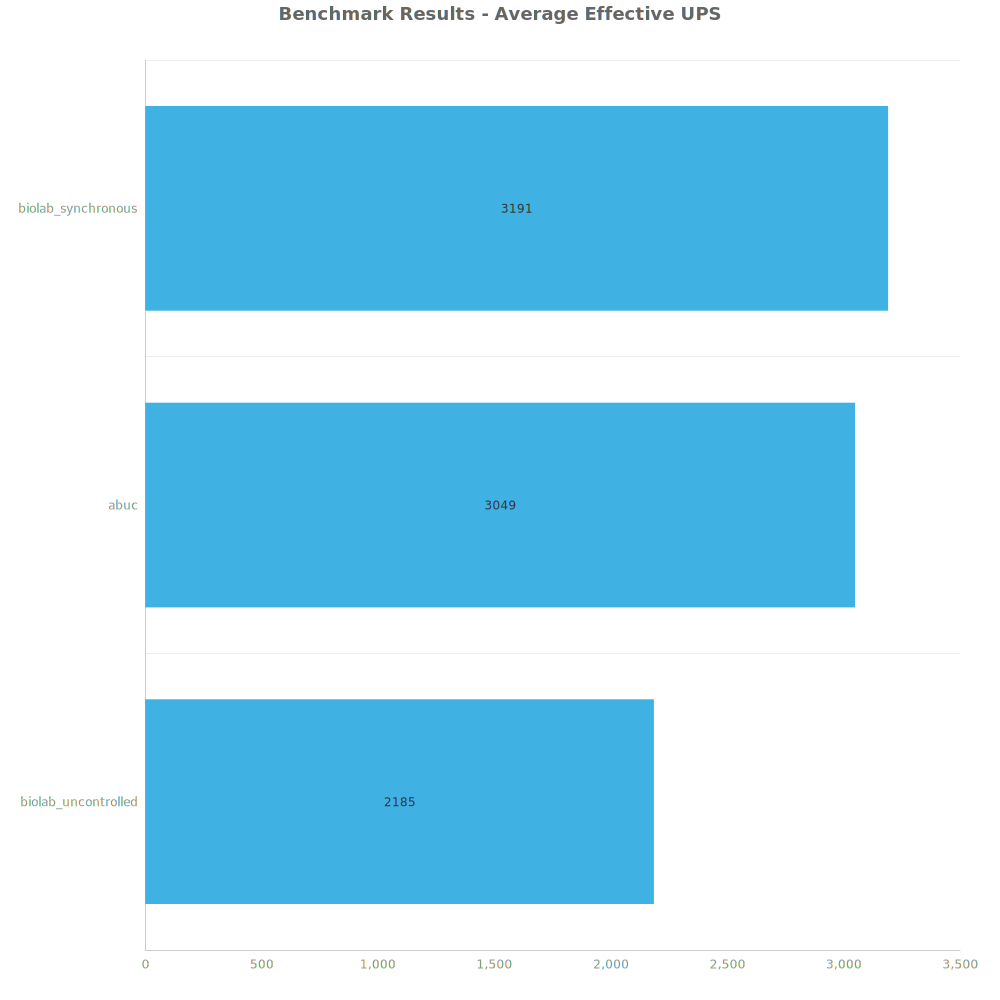

Box and Whisker Plot:
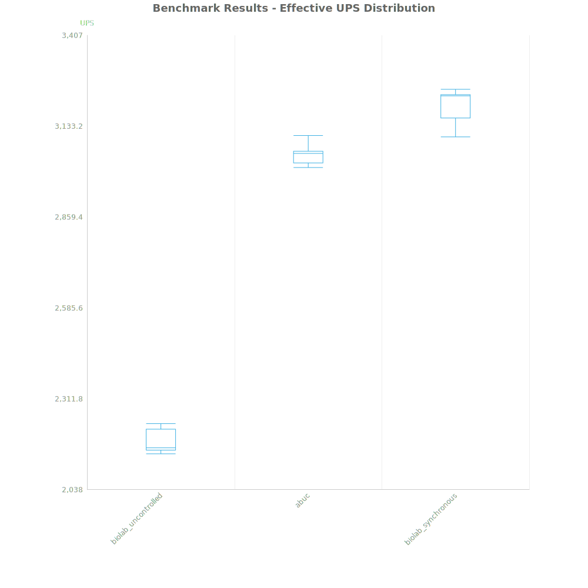

| Save | % Difference from base |
|------|------------------------|
| biolab_uncontrolled | 0.00% |
| abuc | 39.55% |
| biolab_synchronous | 46.05% |

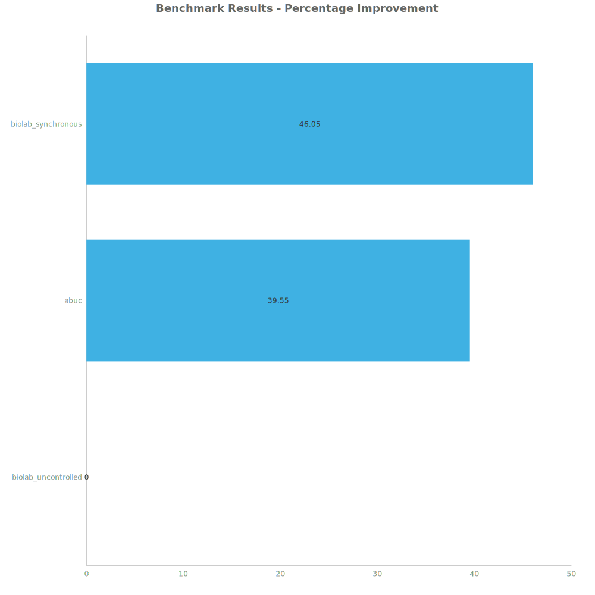

## Verbose Metrics
### Control Behaviour Update
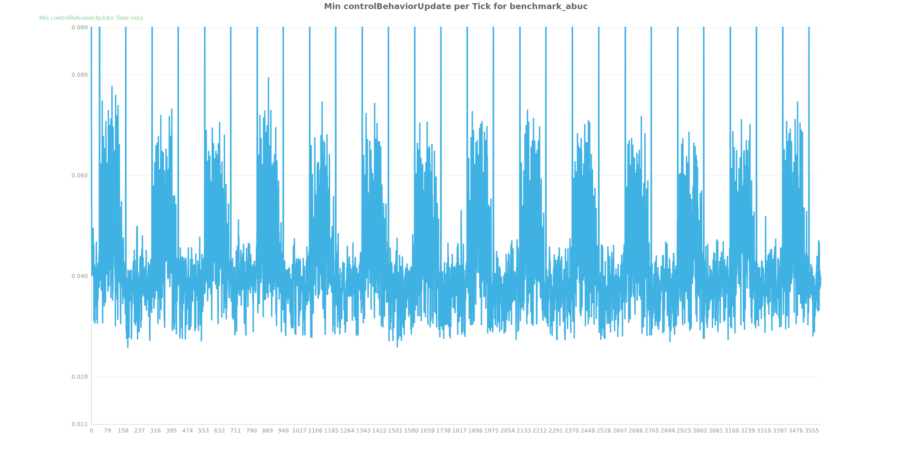
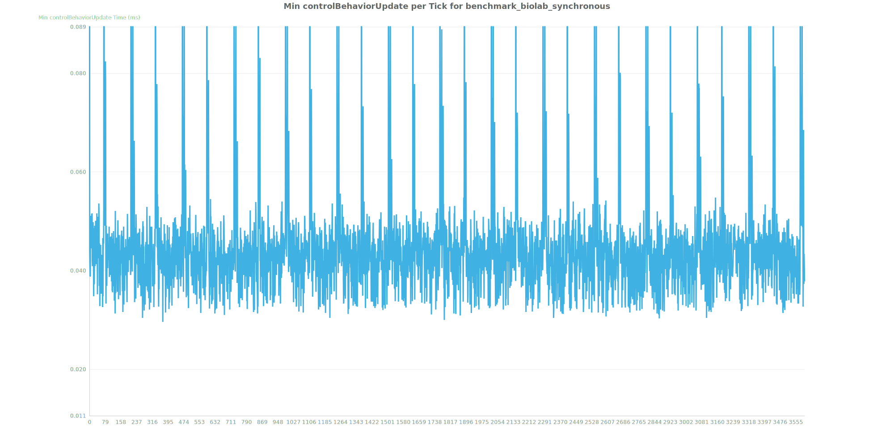
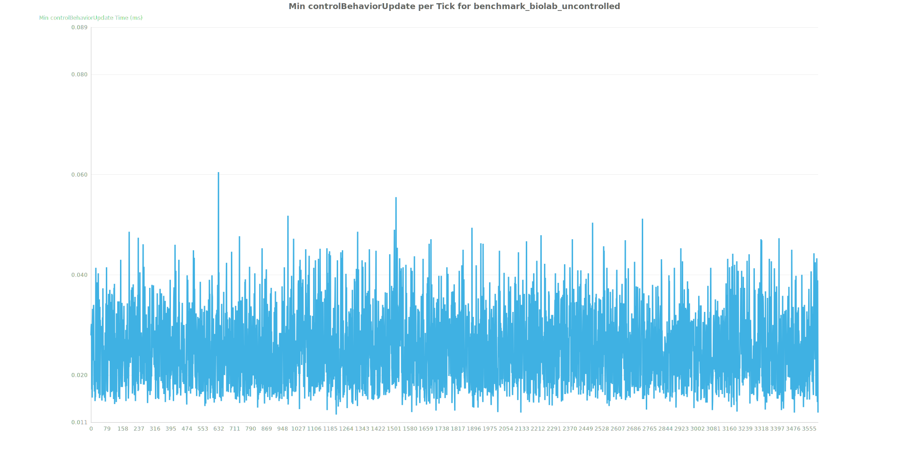

### Entity Update
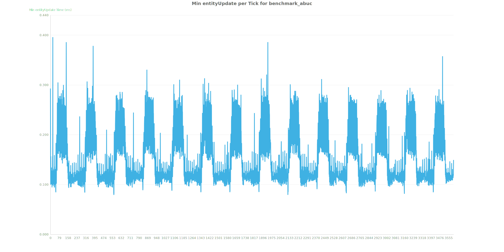
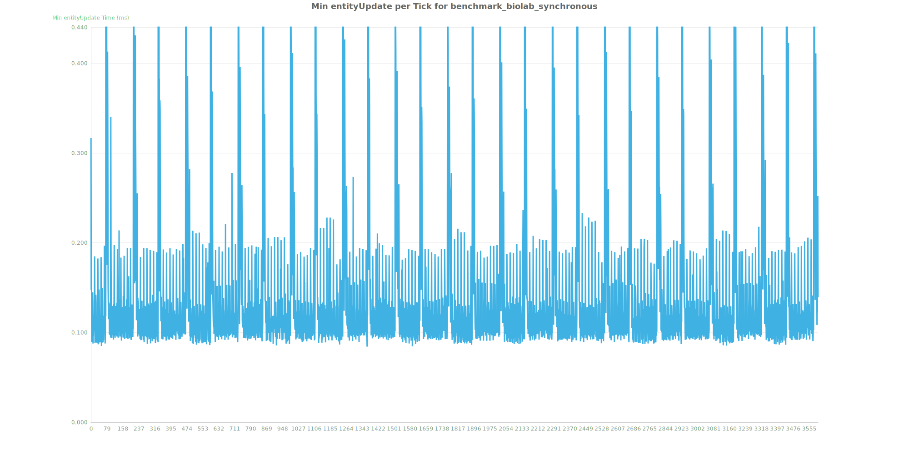
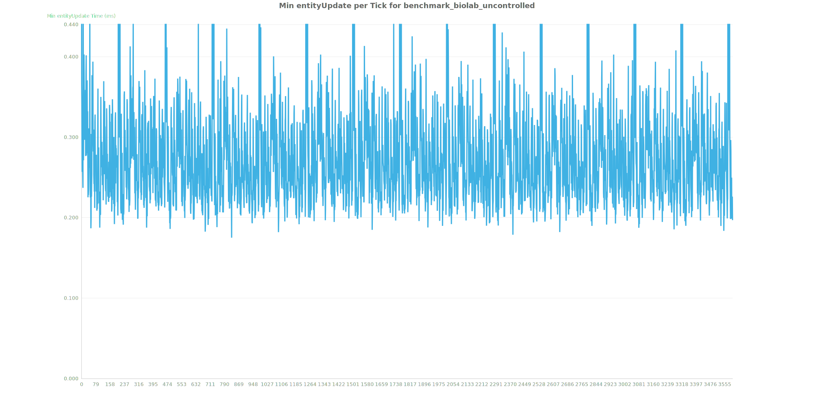

### Transport Line Update

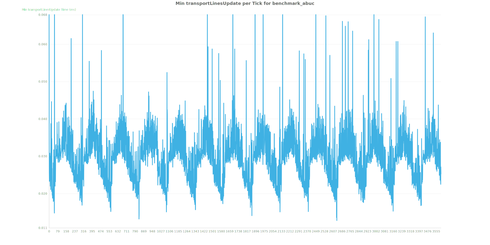
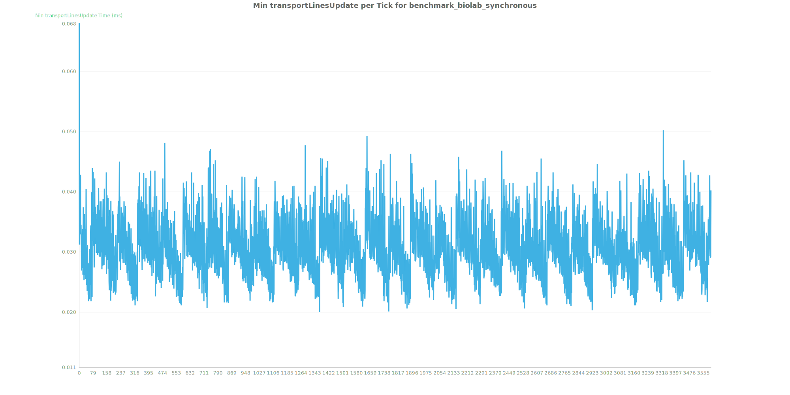
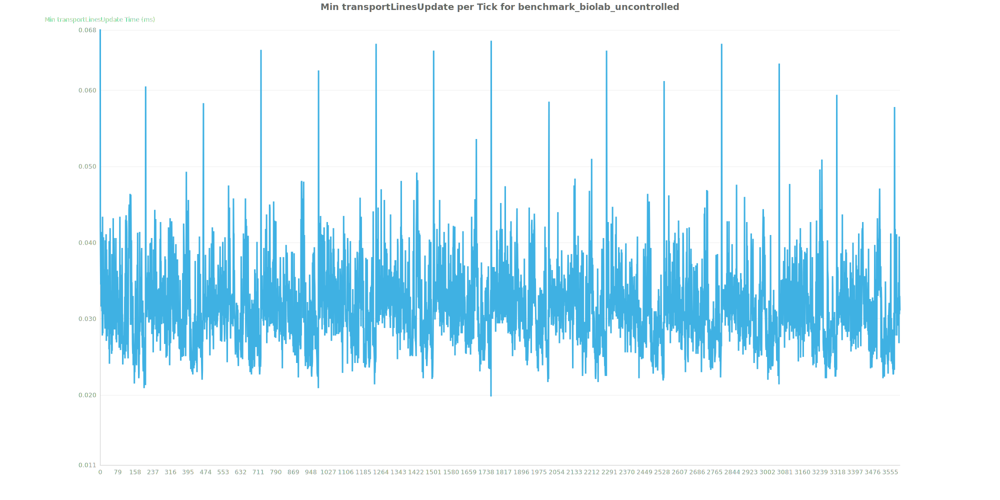

### Whole Update
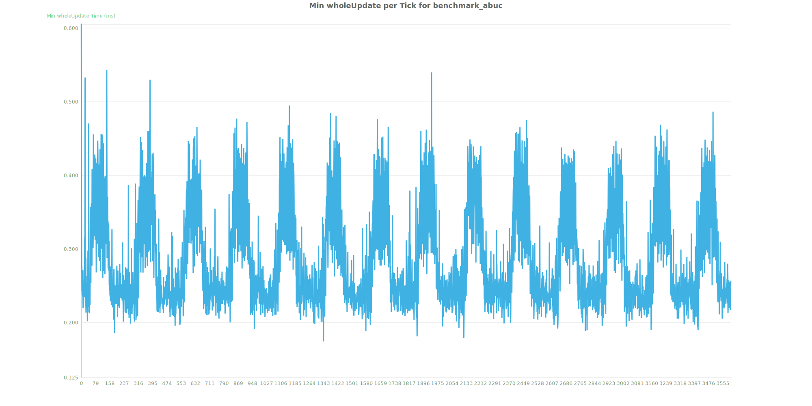
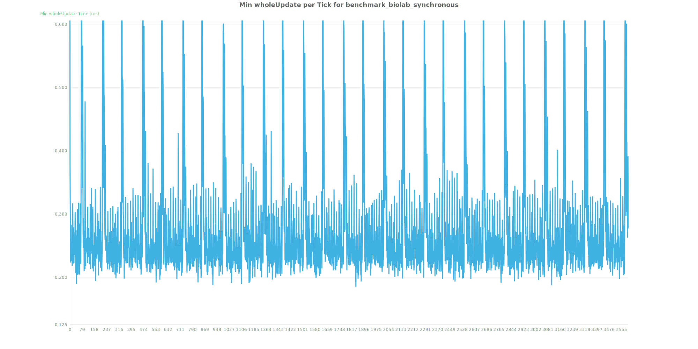
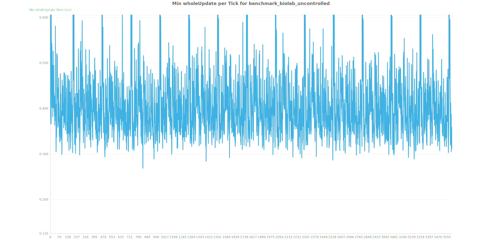