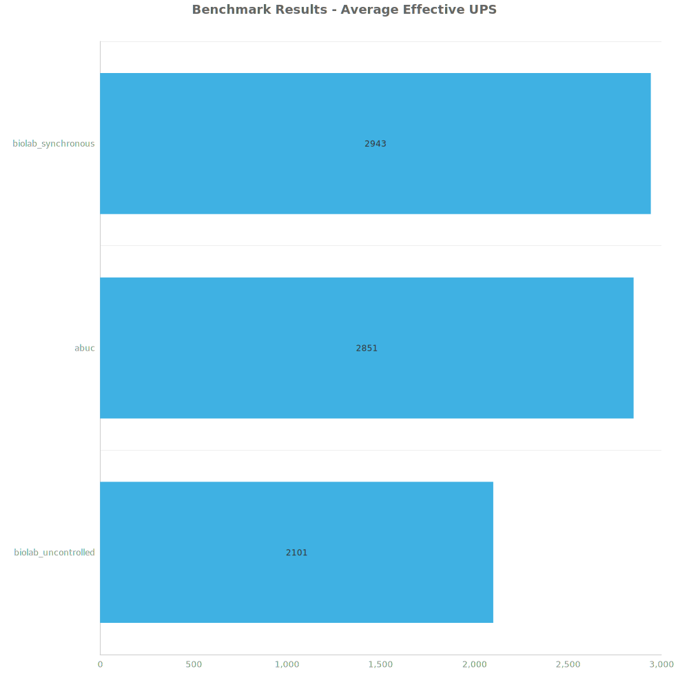
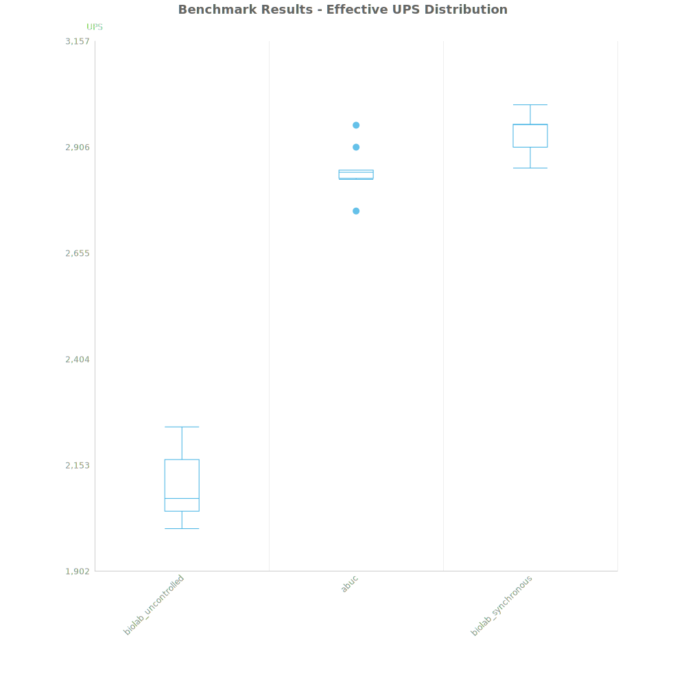
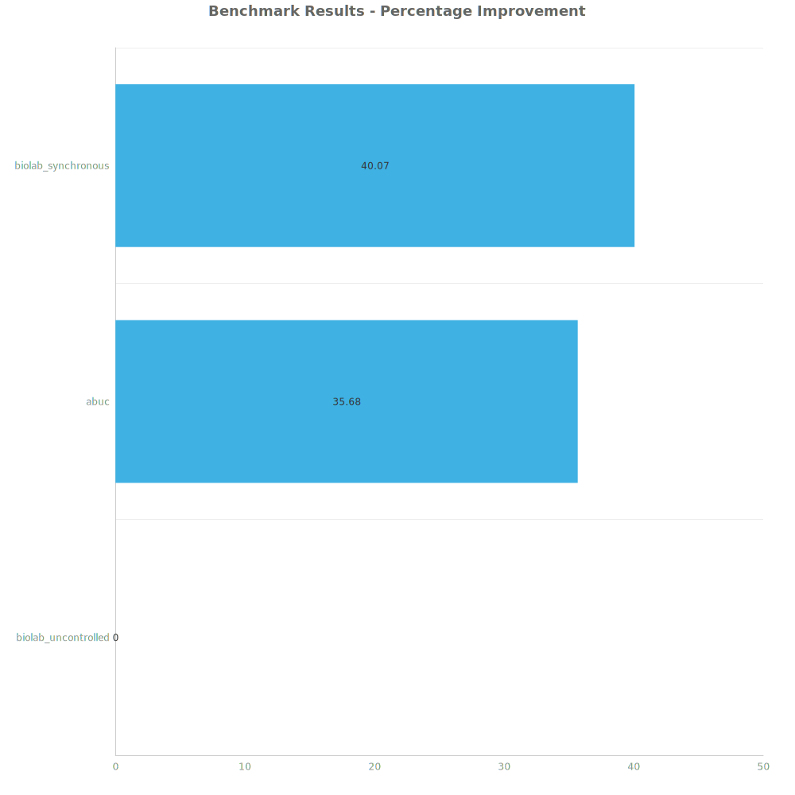
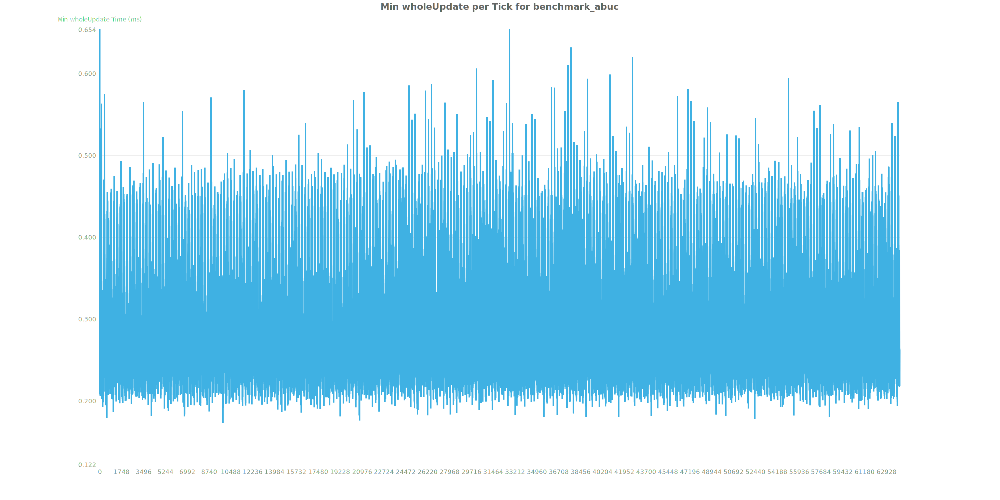
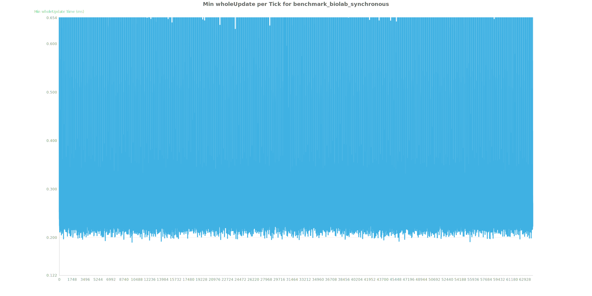
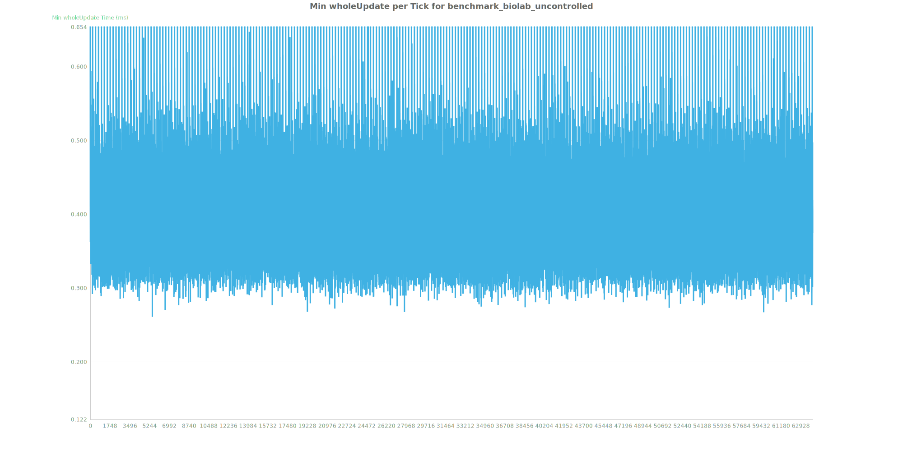

# Factorio Benchmark Results

**Platform:** windows-x86_64  
**Factorio Version:** 2.0.60  

## Scenario
* Each save was tested for 64000 tick(s) and 10 run(s)

## Results
| Metric            | Description                           |
| ----------------- | ------------------------------------- |
| **Mean UPS**      | Updates per second - higher is better |
| **Mean Avg (ms)** | Average frame time - lower is better  |
| **Mean Min (ms)** | Minimum frame time - lower is better  |
| **Mean Max (ms)** | Maximum frame time - lower is better  |

| Save | Avg (ms) | Min (ms) | Max (ms) | UPS | Execution Time (ms) |
|------|----------|----------|----------|-----|---------------------|
| biolab_uncontrolled | 0.477 | 0.261 | 8.322 | 2101 | 305052 |
| abuc | 0.351 | 0.173 | 6.341 | 2850 | 224557 |
| biolab_synchronous | 0.340 | 0.189 | 5.520 | **2943** | 217504 |

Box and Whisker Plot:

| Save | % Difference from base |
|------|------------------------|
| biolab_uncontrolled | 0.00% |
| abuc | 35.68% |
| biolab_synchronous | 40.07% |

## Verbose Metrics

Whole Update: abuc

Whole Update: synchronous

Whole Update: uncontrolled
