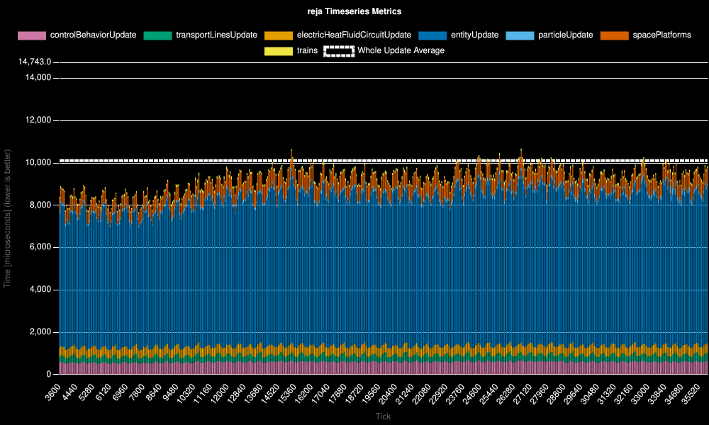
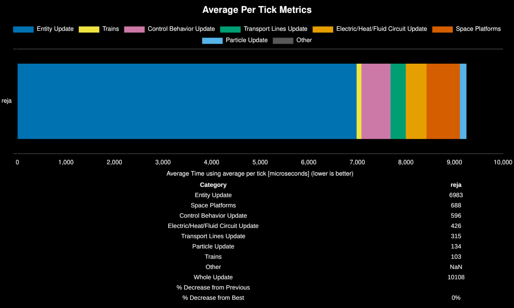

# Factorio Benchmark Results

**Platform:** linux-x86_64

**Factorio Version:** 2.0.75

**Date:** 2026-02-15

## Scenario
* Megabase test from Reja to test hardware differences
* save was tested for 36000 tick(s) and 1 run

## Results
| Metric | Description |
| ----------------- | ------------------------------------- |
| **Mean UPS** | Updates per second - higher is better |
| **Mean Avg (ms)** | Average frame time - lower is better |
| **Mean Min (ms)** | Minimum frame time - lower is better |
| **Mean Max (ms)** | Maximum frame time - lower is better |

| Save | Avg (ms) | Min (ms) | Max (ms) | UPS | Execution Time (ms) | % Difference from Worst |
|------|----------|----------|----------|-----|---------------------| --- |
| reja | 10.038 | 7.246 | 60.867 | **99** | 361374 | 0.00% |

## Conclusion

