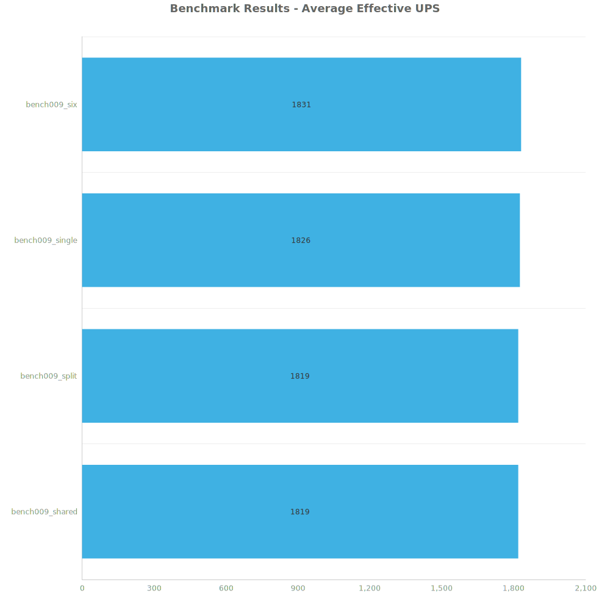
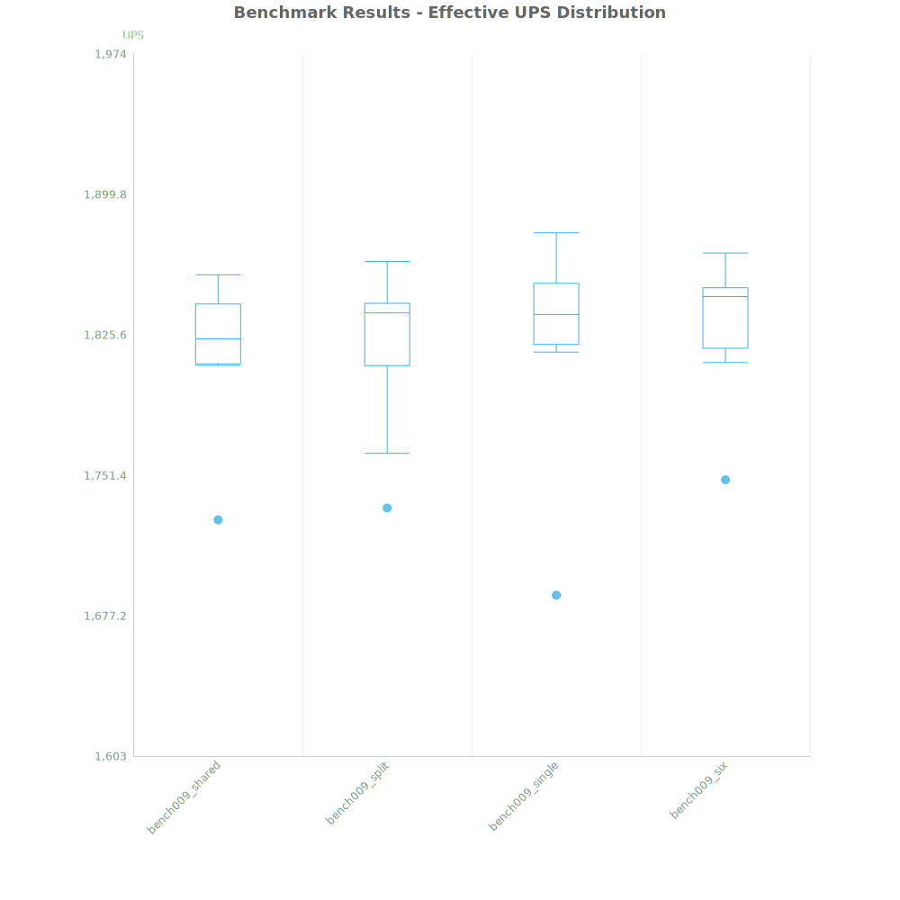
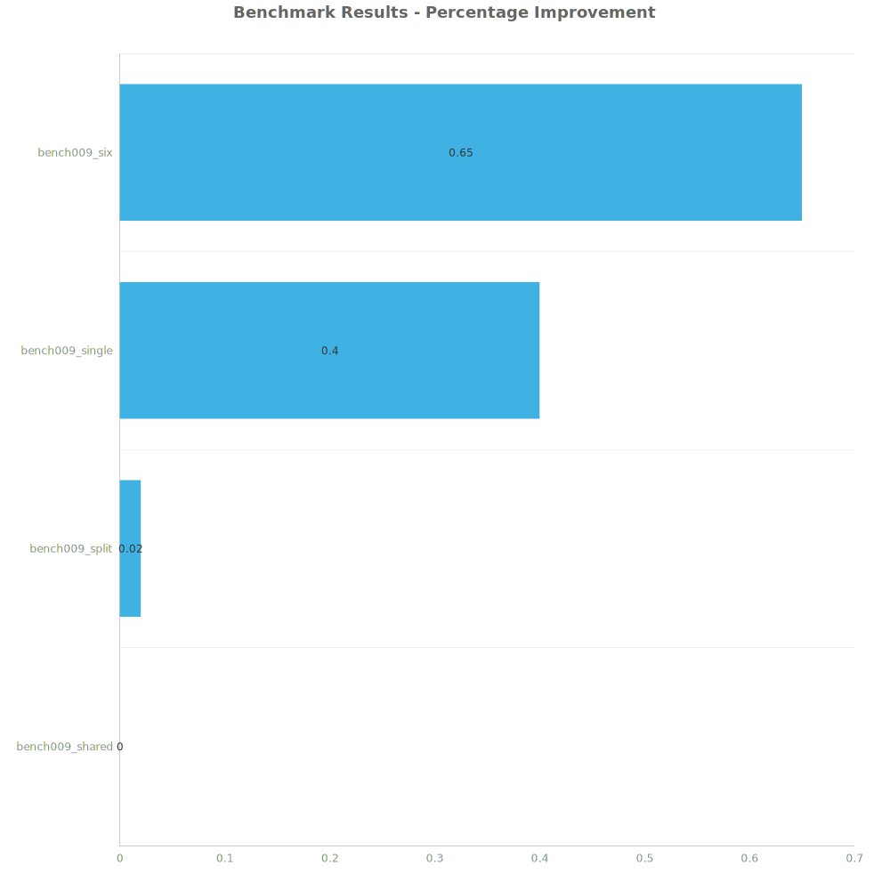

# Factorio Benchmark Results

**Platform:** windows-x86_64  
**Factorio Version:** 2.0.60  

## Scenario

- 10 runs for each save file
- 6000 ticks each

From Konage:

> split & shared are basically the same as they were first sent, but i made sure there were no errors, cause in split there was one inserter aiming nowhere, which takes up UPS unnecessarily, made the gap look much bigger than it was
six is what I would have done myself, although maybe redundant as a test, and single is 32 column copies being in a single network
> i also had bigger versions, 10x as many copies, but that seemed to only increase the noise
> so far it looked like the fewer networks the less update time of everything: control, circuits, electric network and even entity time
> overall the benefit from split down to single, is not much, I think it was 1% or so, but seemed somewhat clear from my results anyway

## Results
| Metric            | Description                           |
| ----------------- | ------------------------------------- |
| **Mean UPS**      | Updates per second - higher is better |
| **Mean Avg (ms)** | Average frame time - lower is better  |
| **Mean Min (ms)** | Minimum frame time - lower is better  |
| **Mean Max (ms)** | Maximum frame time - lower is better  |

| Save | Avg (ms) | Min (ms) | Max (ms) | UPS | Execution Time (ms) |
|------|----------|----------|----------|-----|---------------------|
| bench009_shared | 0.550 | 0.175 | 3.629 | 1819 | 32996 |
| bench009_split | 0.550 | 0.173 | 2.030 | 1819 | 32995 |
| bench009_single | 0.548 | 0.182 | 2.118 | 1826 | 32878 |
| bench009_six | 0.546 | 0.175 | 2.088 | **1830** | 32780 |

Box and Whisker Plot:

| Save | % Difference from base |
|------|------------------------|
| bench009_shared | 0.00% |
| bench009_split | 0.02% |
| bench009_single | 0.40% |
| bench009_six | 0.65% |

## Conclusion