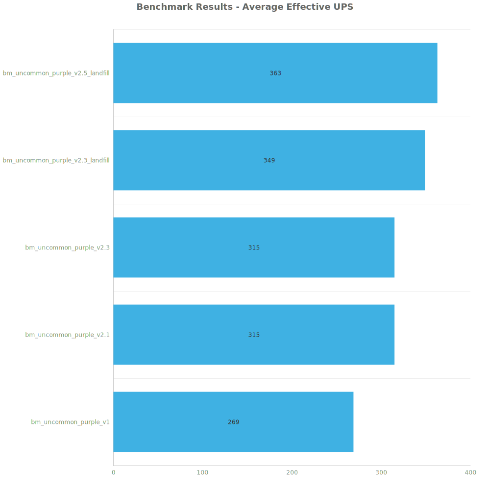
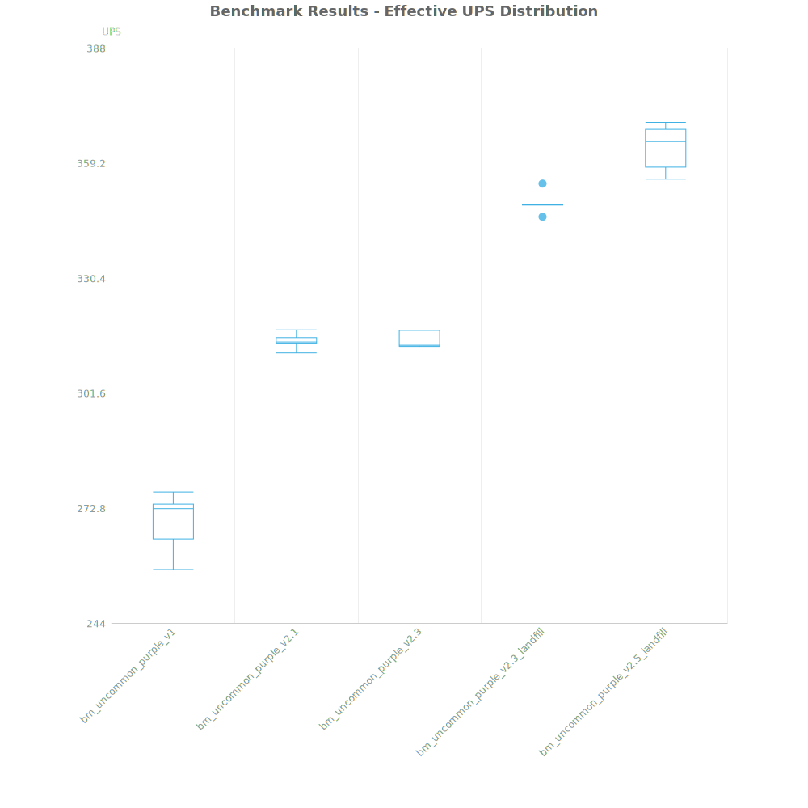
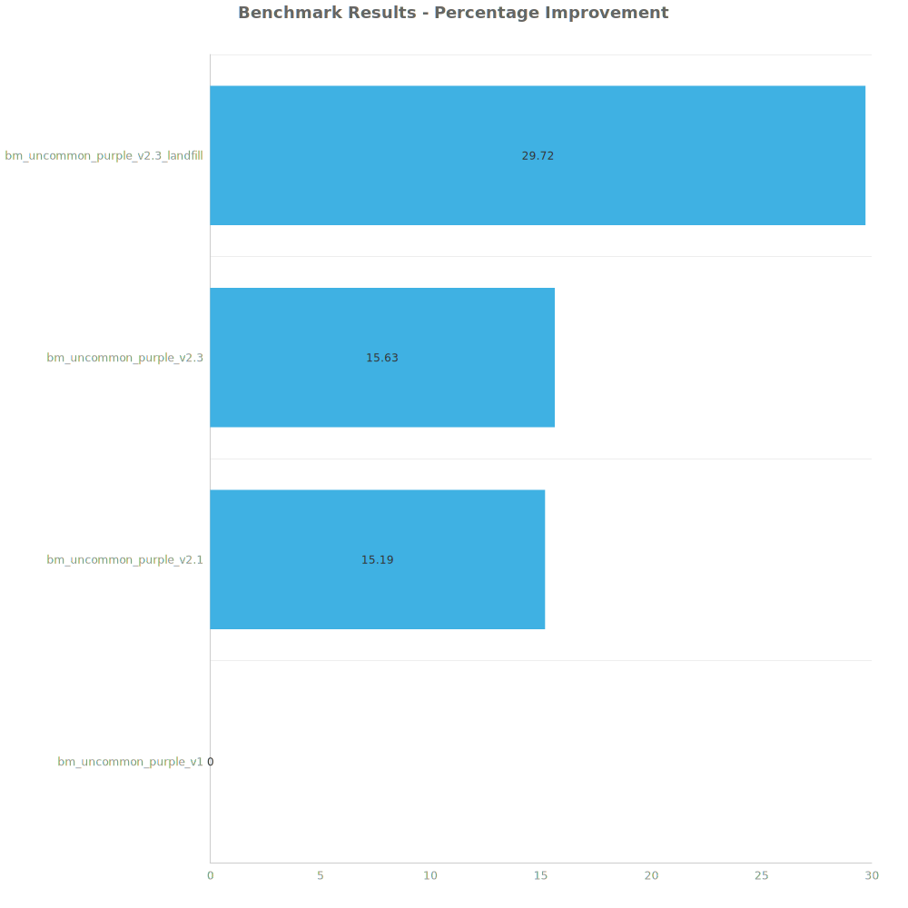

# Factorio Benchmark Results

**Platform:** windows-x86_64  
**Factorio Version:** 2.0.55  

## Scenario
- test scenario of 24 purple science blades making 3.45 million uncommon science per minute (240/s each)
- 5 runs per save file for 5000 ticks each

## Results
| Metric            | Description                           |
| ----------------- | ------------------------------------- |
| **Mean UPS**      | Updates per second - higher is better |
| **Mean Avg (ms)** | Average frame time - lower is better  |
| **Mean Min (ms)** | Minimum frame time - lower is better  |
| **Mean Max (ms)** | Maximum frame time - lower is better  |

| Save                             | Avg (ms) | Min (ms) | Max (ms) | UPS     | Execution Time (ms) |
| -------------------------------- | -------- | -------- | -------- | ------- | ------------------- |
| bm_uncommon_purple_v1            | 3.717    | 2.667    | 10.567   | 269     | 92919               |
| bm_uncommon_purple_v2.1          | 3.177    | 2.326    | 8.858    | 314     | 79440               |
| bm_uncommon_purple_v2.3          | 3.174    | 2.298    | 6.285    | 315     | 79354               |
| bm_uncommon_purple_v2.3_landfill | 2.863    | 2.009    | 5.430    | 349     | 71570               |
| bm_uncommon_purple_v2.5_landfill | 2.755    | 1.849    | 6.036    | **363** | 68867               |

Box and Whisker Plot:

| Save                             | % Difference from base |
| -------------------------------- | ---------------------- |
| bm_uncommon_purple_v1            | 0.00%                  |
| bm_uncommon_purple_v2.1          | 16.89%                 |
| bm_uncommon_purple_v2.3          | 17.02%                 |
| bm_uncommon_purple_v2.3_landfill | 29.75%                 |
| bm_uncommon_purple_v2.5_landfill | 34.86%                 |

## Conclusion
the improvements made in the reduction in buildings and new inserter clocking methods have proven to increase the UPS efficiency by over 15%. The new landfill mining setup however, increases the UPS efficiency by an additional 15% over the best performer with the previous RS clocked uncommon upcycler for a total UPS increase of almost 30%.

Based on the commments correcting my mistakes in my youtube series covering this, an additional 5% could be shaved off of the overall UPS consumption.

This proves a hypothesis that I have that the mining voiding rig is one of the most UPS expesive parts of this entire setup and any improvements that can be made in these designs will have a major impact in the UPS efficiency of Q2 science.