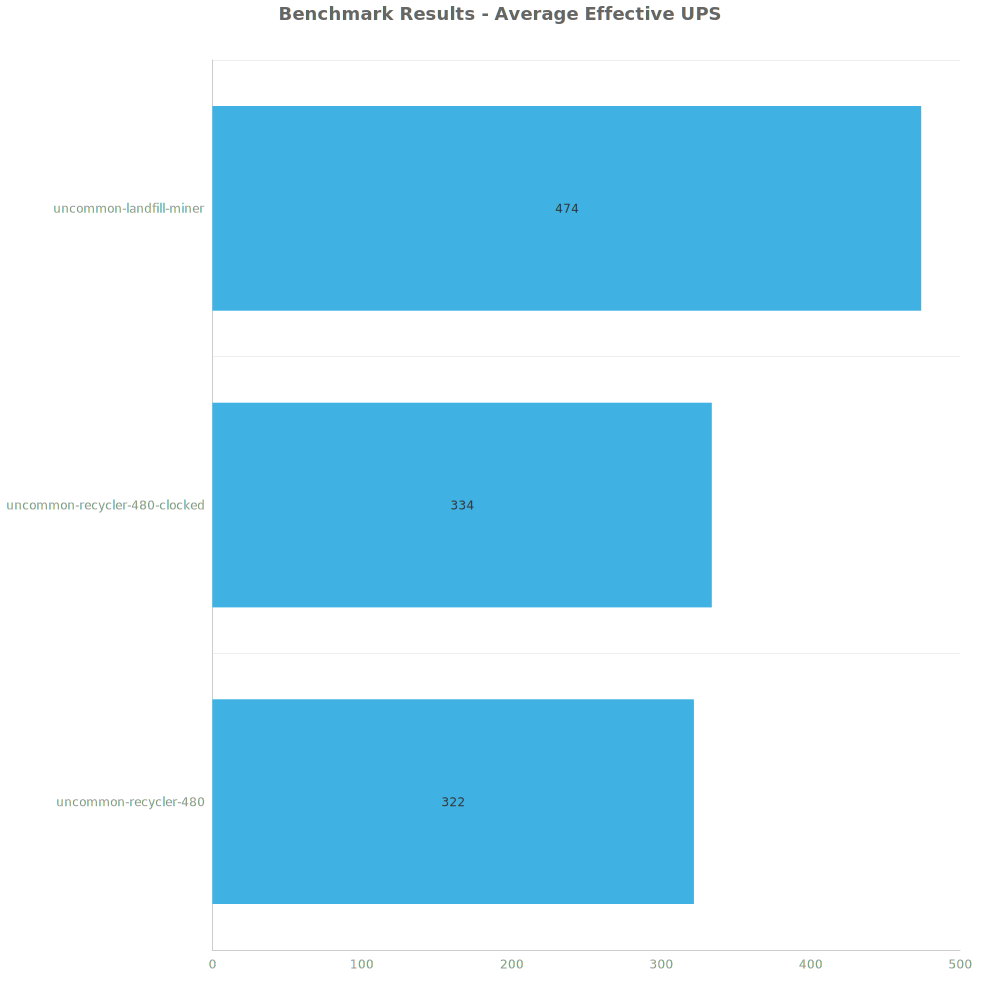
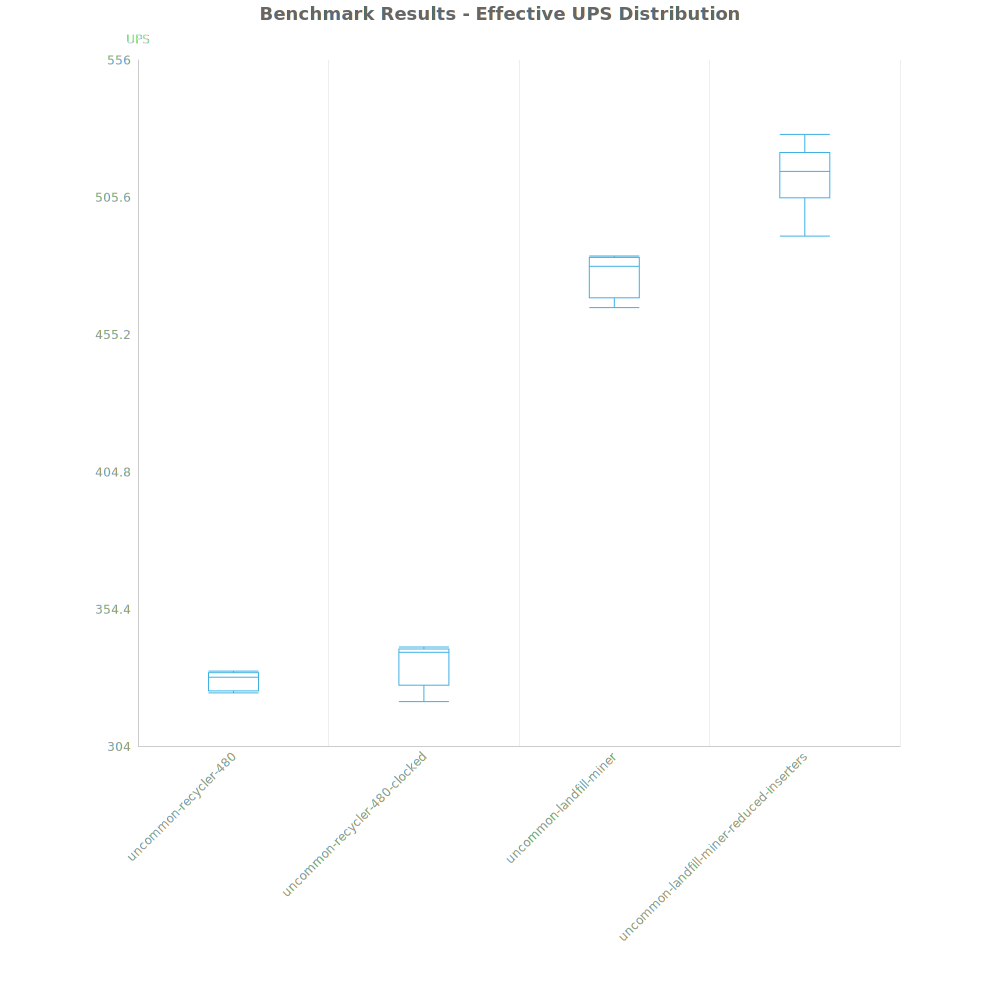
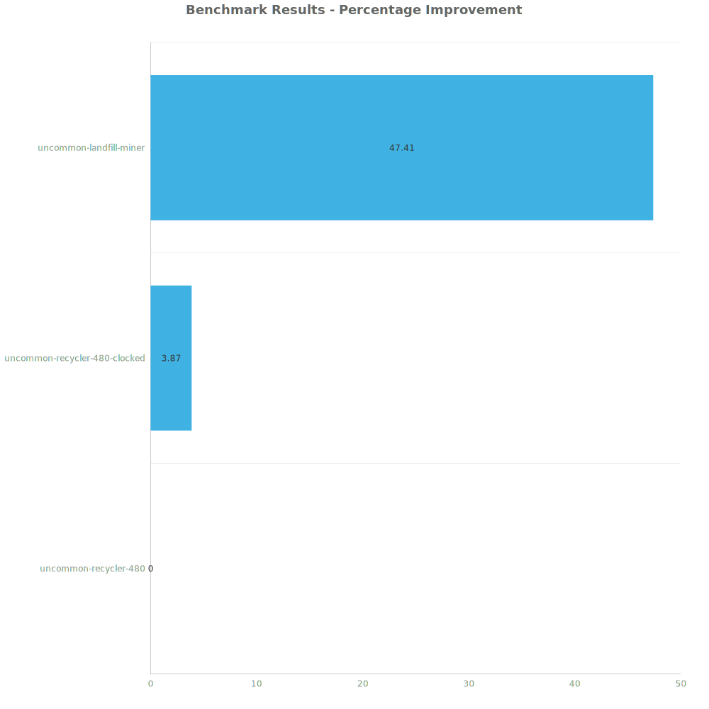

# Factorio Benchmark Results

**Platform:** windows-x86_64  
**Factorio Version:** 2.0.55  

## Scenario
- each save file produces 96,000 uncommon stone per second

## Results
| Metric            | Description                           |
| ----------------- | ------------------------------------- |
| **Mean UPS**      | Updates per second - higher is better |
| **Mean Avg (ms)** | Average frame time - lower is better  |
| **Mean Min (ms)** | Minimum frame time - lower is better  |
| **Mean Max (ms)** | Maximum frame time - lower is better  |

| Save                                      | Avg (ms) | Min (ms) | Max (ms) | UPS     | Execution Time (ms) |
| ----------------------------------------- | -------- | -------- | -------- | ------- | ------------------- |
| uncommon-recycler-480                     | 3.048    | 2.335    | 5.788    | 328     | 30484               |
| uncommon-recycler-480-clocked             | 3.003    | 2.499    | 7.177    | 333     | 30031               |
| uncommon-landfill-miner                   | 2.100    | 1.521    | 4.225    | 476     | 20999               |
| uncommon-landfill-miner-reduced-inserters | 1.953    | 1.323    | 5.025    | **512** | 19524               |

Box and Whisker Plot:

| Save | % Difference from base |
|------|------------------------|
| uncommon-recycler-480 | 0.00% |
| uncommon-recycler-480-clocked | 1.56% |
| uncommon-landfill-miner | 45.20% |
| uncommon-landfill-miner-reduced-inserters | 56.23% |

## Conclusion

Voiding with landfill is 56% more performant.

Using an RS latch to turn on / off the miner makes a slight improvement so still relevant.