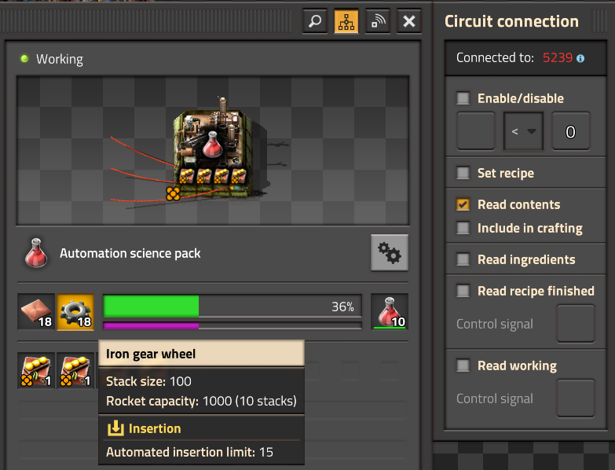
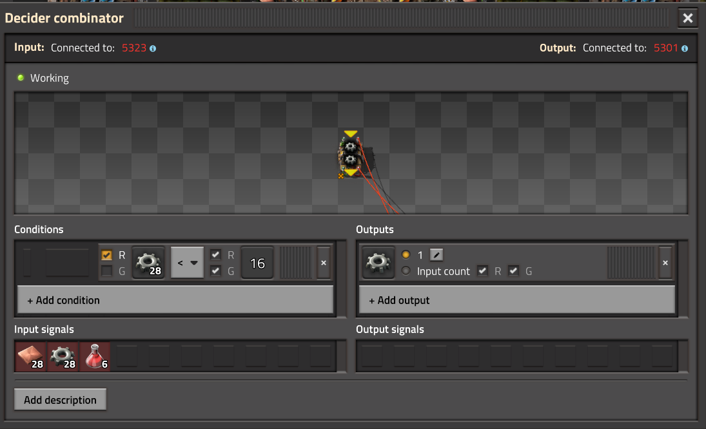
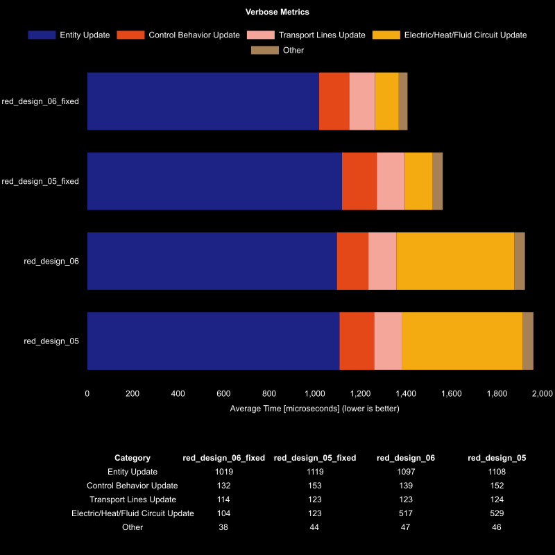
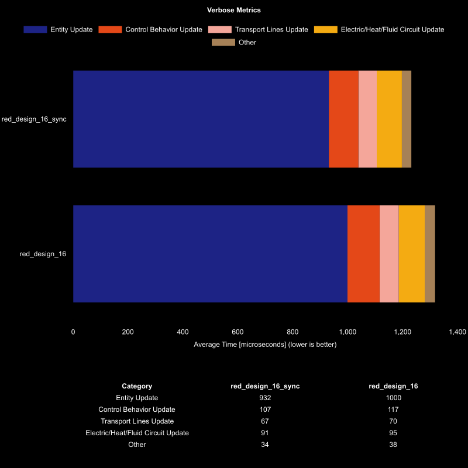
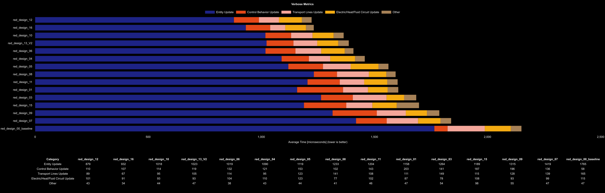
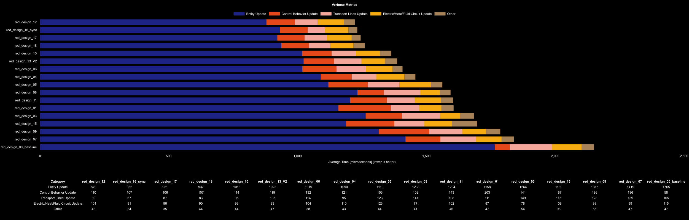

# 2025 Q1 Nauvis Science Competition: Automation Science

## Table of Contents
- [2025 Q1 Nauvis Science Competition: Automation Science](#2025-q1-nauvis-science-competition-automation-science)
  - [Table of Contents](#table-of-contents)
  - [Automation Science Entries](#automation-science-entries)
    - [Competition Entries](#competition-entries)
    - [Modified Designs / Save Files for Testing Purposes](#modified-designs--save-files-for-testing-purposes)
    - [Alternatives Designs](#alternatives-designs)
  - [Test Maps](#test-maps)
  - [Preliminary Results](#preliminary-results)
  - [Analysis from Preliminary Results](#analysis-from-preliminary-results)
    - [Off By 1 Lead Follower Control](#off-by-1-lead-follower-control)
    - [Power Poles Not Connected to Global Network](#power-poles-not-connected-to-global-network)
    - [Benchmarking Best Practices](#benchmarking-best-practices)
  - [Final Results](#final-results)
    - [Original Submissions](#original-submissions)
    - [All Maps Including Alternative Designs](#all-maps-including-alternative-designs)
    - [Alternative Designs](#alternative-designs)
    - [Verbose Data and Runs](#verbose-data-and-runs)
  - [Conclusion](#conclusion)

## Automation Science Entries
### Competition Entries
| Science Type | Author     | Design Index | Tags                                                   | Output | Notes                                    | Blueprint                                                               | Save File                                                     |
| ------------ | ---------- | ------------ | ------------------------------------------------------ | ------ | ---------------------------------------- | ----------------------------------------------------------------------- | ------------------------------------------------------------- |
| Automation   | N / A      | 00           | `Belt Fed`                                             | 240/s  |                                          | [blueprint](blueprints/automation-science-240-baseline.txt)             | [red_design_00_baseline.zip](maps/red_design_00_baseline.zip) |
| Automation   | jaden0303  | 01           | `DI`, `Recipe Switching`, `Fluid Bus`                  | 480/s  | must be running constantly, hard to test | [blueprint](blueprints/automation-science-480-jaden0303.txt)            | [red_design_01.zip](maps/red_design_01.zip)                   |
| Automation   | Ashtroboy  | 02           | `DI`, `LDS Shuffle`                                    | 720/s  |                                          | [blueprint](blueprints/automation-science-720-ashtroboy.txt)            | [red_design_02.zip](maps/red_design_02.zip)                   |
| Automation   | reja       | 03           | `Fluid Bus`, `Lead Follow`                             | 960/s  |                                          | [blueprint](blueprints/automation-science-960-reja.txt)                 | [red_design_03.zip](maps/red_design_03.zip)                   |
| Automation   | Zepher24   | 04           | `Fluid Bus`, `Clocked Inserter`, `Staggered Inserters` | 480/s  | 7 Beacon                                 | [blueprint](blueprints/automation-science-480-zepher24.txt)             | [red_design_04.zip](maps/red_design_04.zip)                   |
| Automation   | MCMayhem57 | 05           | `DI`, `Ore Bus`                                        | 480/s  | 8 Beacon                                 | [blueprint](blueprints/automation-science-480-ore-bus-mcmayhem57.txt)   | [red_design_05.zip](maps/red_design_05.zip)                   |
| Automation   | MCMayhem57 | 06           | `DI`, `Fluid Bus`, `Lead Follower`                     | 480/s  | 8 Beacon                                 | [blueprint](blueprints/automation-science-480-fluid-bus-mcmayhem57.txt) | [red_design_06.zip](maps/red_design_06.zip)                   |
| Automation   | MCMayhem57 | 07           | `Lead Follower`, `Ore Bus`                             | 480/s  | 12 Beacon                                | [blueprint](blueprints/automation-science-480-ore-belt-mcmayhem57.txt)  | [red_design_07.zip](maps/red_design_07.zip)                   |
| Automation   | Camrade    | 08           | `Lead Follower`, `Fluid Bus`                           | 960/s  | 12 Beacon                                | [blueprint](blueprints/automation-science-960-camrade.txt)              | [red_design_08.zip](maps/red_design_08.zip)                   |
| Automation   | Cubes      | 09           | `Threshold`, `Fluid Bus`                               | 240/s  | 12 Beacon                                | [blueprint](blueprints/automation-science-240-fluid-bus-cubes.txt)      | [red_design_09.zip](maps/red_design_09.zip)                   |
| Automation   | Jobo       | 10           | `Inserter Pulse`, `Fluid Bus`                          | 240/s  | 7 Beacon                                 | [blueprint](blueprints/automation-science-240-fluid-bus-jobo.txt)       | [red_design_10.zip](maps/red_design_10.zip)                   |
| Automation   | Lkron      | 11           | `Threshold`, `Ore Bus`                                 | 480/s  | 8 Beacon                                 | [blueprint](blueprints/automation-science-480-lkron.txt)                | [red_design_11.zip](maps/red_design_11.zip)                   |
| Automation   | phlap      | 12           | `DI`, `Lead Follower`, `Fluid Bus`                     | 240/s  | 8 Beacon                                 | [blueprint](blueprints/automation-science-240-phlap.txt)                | [red_design_12.zip](maps/red_design_12.zip)                   |
| Automation   | Geist      | 13           | `Lead Follower`, `Fluid Bus`                           | 480/s  | 8 Beacon                                 | [blueprint](blueprints/automation-science-480-fluid-bus-geist.txt)      | [red_design_13.zip](maps/red_design_13.zip)                   |
| Automation   | Tenebris   | 14           | `Ore Bus`, `Electric Furnace`, `DI`                    | 240/s  | 8 Beacon                                 | [blueprint](blueprints/automation-science-240-ore-bus-tenebris.txt)     | [red_design_14.zip](maps/red_design_14.zip)                   |
| Automation   | Ztirom22   | 15           | `Fluid Bus`, `Lead Follower`                           | 240/s  | 5 Beacon                                 | [blueprint](blueprints/automation-science-240-fluid-bus-ztirom22.txt)   | [red_design_15.zip](maps/red_design_15.zip)                   |
| Automation   | The End    | 16           | `Fluid Bus`, `Multi Stage Build`                       | 480/s  | 7 Beacon, hard to test                   | [blueprint](blueprints/automation-science-480-fluid-bus-theend.txt)     | [red_design_16.zip](maps/red_design_16.zip)                   |

### Modified Designs / Save Files for Testing Purposes

| Original Design Index | Change Notes                                                                                    | Blueprint                         | Save File                                               |
| --------------------- | ----------------------------------------------------------------------------------------------- | --------------------------------- | ------------------------------------------------------- |
| 05                    | Corrected missing copper wires isolating power poles (large electric network overhead)          |                                   | [red_design_05_fixed.zip](maps/red_design_05_fixed.zip) |
| 06                    | Corrected missing copper wires isolating power poles (large electric network overhead)          |                                   | [red_design_06_fixed.zip](maps/red_design_06_fixed.zip) |
| 13                    | Corrected off by one lead follower error to test impact, called 13_V2                           | [blueprint](blueprints/13-v2.txt) | [red_design_13_V2.zip](maps/red_design_13_V2.zip)       |
| 16                    | Corrected issues with the original save file caused by not starting all builds at the same tick |                                   | [red_design_16_sync.zip](maps/red_design_16_sync.zip)   |

### Alternatives Designs
These are designs that were created after the initial competition entries as alternatives to the one of the top designs made by phlap which was inspired by Syvkal.
These designs build upon the 240/s design and extend the length to create 480/s, making it easier to get around the pipeline length constraints when copying multiple copies next to each other.

| Science Type | Author                   | Design Index | Tags                               | Output | Notes    | Blueprint                                       | Save File                                   |
| ------------ | ------------------------ | ------------ | ---------------------------------- | ------ | -------- | ----------------------------------------------- | ------------------------------------------- |
| Automation   | Syvkal, phlap, abucnasty | 17           | `DI`, `Fluid Bus`, `Lead Follower` | 480/s  | 8 Beacon | [blueprint](blueprints/automation-science-17) | [red_design_17.zip](maps/red_design_17.zip) |
| Automation   | Syvkal, phlap, abucnasty | 18           | `DI`, `Fluid Bus`, `Lead Follower` | 480/s  | 8 Beacon | [blueprint](blueprints/automation-science-18) | [red_design_18.zip](maps/red_design_18.zip) |

## Test Maps
- Designs submitted make 1, 2, 3, or 4 fully stacked lanes of science. 
  - The least common multiple is 12 so we will need to have a final combination that creates at least 12 lanes of science for all builds to produce the same output.
- Each save file produces 5_529_600 red science per minute (384 lanes stacked)

## Preliminary Results

Results generated from the first benchmark run of 36000 ticks and 3 runs for each save file.

| Metric            | Description                           |
| ----------------- | ------------------------------------- |
| **Mean UPS**      | Updates per second - higher is better |
| **Mean Avg (ms)** | Average frame time - lower is better  |
| **Mean Min (ms)** | Minimum frame time - lower is better  |
| **Mean Max (ms)** | Maximum frame time - lower is better  |

| Save        | Avg (ms) | Min (ms) | Max (ms) | UPS     | Execution Time (ms) | % Difference from worst |
| ----------- | -------- | -------- | -------- | ------- | ------------------- | ----------------------- |
| 14          | 2.706    | 0.983    | 9.304    | 369     | 292217              | 0.00%                   |
| 02          | 2.385    | 0.731    | 11.963   | 419     | 257551              | 13.49%                  |
| 00_baseline | 2.144    | 1.269    | 5.478    | 466     | 231607              | 26.27%                  |
| 05          | 2.078    | 1.507    | 4.505    | 481     | 224368              | 30.25%                  |
| 06          | 1.948    | 1.448    | 4.184    | 513     | 210392              | 38.90%                  |
| 07          | 1.941    | 0.922    | 4.635    | 515     | 209622              | 39.40%                  |
| 09          | 1.792    | 1.118    | 5.704    | 558     | 193457              | 51.05%                  |
| 15          | 1.774    | 0.726    | 7.451    | 563     | 191569              | 52.54%                  |
| 03          | 1.709    | 0.931    | 4.224    | 585     | 184563              | 58.40%                  |
| 08          | 1.643    | 0.686    | 6.839    | 608     | 177465              | 64.67%                  |
| 11          | 1.593    | 0.693    | 6.181    | 627     | 172027              | 69.87%                  |
| 01          | 1.576    | 0.612    | 5.336    | 634     | 170194              | 71.70%                  |
| 13          | 1.435    | 0.558    | 5.019    | 696     | 154983              | 88.54%                  |
| 04          | 1.427    | 0.562    | 3.604    | 701     | 154107              | 89.75%                  |
| 10          | 1.411    | 0.483    | 5.940    | 708     | 152352              | 91.81%                  |
| 16          | 1.327    | 0.720    | 4.203    | 753     | 143366              | 103.83%                 |
| 12          | 1.272    | 0.385    | 7.174    | **785** | 137436              | 112.62%                 |

## Analysis from Preliminary Results
A few observations were noted from comparing the differences in performance between the builds.

### Off By 1 Lead Follower Control
Many of the builds suffered from an off by one issue in their lead follower circuit control combinators.

There were two cases this would happen.

In the first scenario, the automated insertion limit was 15 so naturally the decision was to insert into the assembler
when the value in the lead falls below this value. So commonly, many of the designs would set the condition to be less
than 16. As shown in the following screenshots.

Notice however that the lead does not have the "Include in crafting" checked. This would cause the inserters on the followers
to be active for longer than they needed to be since they would have to rely on wake lists until the copper / gear value in the 
assembly machine dropped below 15.

The simplest way to work around this is to just set the condition much lower to something well under the automated insertion limit (e.g. 10 in this case). 
The value can be too low however and it should be high enough to ensure that the amount in the assembly machine is not fully consumed before the inserter can insert into the assembly machine.

### Power Poles Not Connected to Global Network
There were two builds that had isolated power poles to bridge signals between inserters (design 05 and design 06). Upon looking deeper into the verbose metrics, this was uncovered and corrected to have all power poles connected by at least 1 copper wire to form a single network.

The difference in the electric network update time can be seen below.

Keeping per surface 1 electric network is the best practice as can be seen here. It was amplified due to 4992 medium power poles were isolated and thus there were 4993 electric networks in these save files.

### Benchmarking Best Practices
During discussions, it was proven that the save file for design 16 had some issues. When region cloning the design, it was difficult to get them all to line up and swing at the same time and was causing desyncing issues for this particular build.

The strategy on how to generate it was changed and a new save file `16_sync` was created where the game was paused, stage 1 of the design was copied into the map and then region cloned. 
The game was then paused and stage 2 was copied to all clones. Game was resumed for 60 ticks and then paused again and the final stage 3 was force placed over each clone. 
The game was resumed after that.

This process ensured that it followed the same cloning process as all the other builds to keep the results consistent and it removed a lot of the noise from the benchmark to keep it more in line with the rest of the save files. The difference for strictly benchmarking purposes can be seen below:

## Final Results

### Original Submissions
For clarity, the details of the save files and their fixes have been removed from chart below. The following depicts the performance of all designs that performed above the baseline.

### All Maps Including Alternative Designs

The top designs (starting at 05 and those that performed better) were all direct insertion designs.

### Alternative Designs

Based on phlap's submission, two alternative designs were created that produce 480/s. Here is their performance compared to the top two designs:

They perform slightly worse but are easier to copy next to each and avoid pipeline extent limitations.

### Verbose Data and Runs
Outside of this summary analysis, there are multiple results folders:
1. [results](results/results.md) - the original test runs
2. [results_verbose](results_verbose) - verbose data for all save files
3. [results_alternatives](results_alternatives/results.md) - comparison to alternative designs
4. [results_top_5](results_top_5/results.md) - longer benchmark of 72k ticks and 3 runs per save
5. [results_top_3](results_top_3/results.md) - longer benchmark of 108k ticks and 10 runs per save

## Conclusion

In my view, the designs by phlap (12) and The End (16) are effectively equal in performance.

If I were deciding which one to use in my own base, here’s how I’d break it down:

- **Ease of integration**: Phlap’s design is simpler to drop into a live base—you can paste the blueprint and let the bots handle it without much supervision. A small quality-of-life advantage, but worth noting.
- **Materials used**: Phlap’s version uses all legendary-grade materials, while The End’s requires a few Q2 Speed 2 modules to fine-tune assembly output to exactly 20/s. I don’t typically produce Q2 modules in my base, so that’s a personal downside.

In short, performance-wise they’re virtually tied, but phlap’s build is easier to setup.