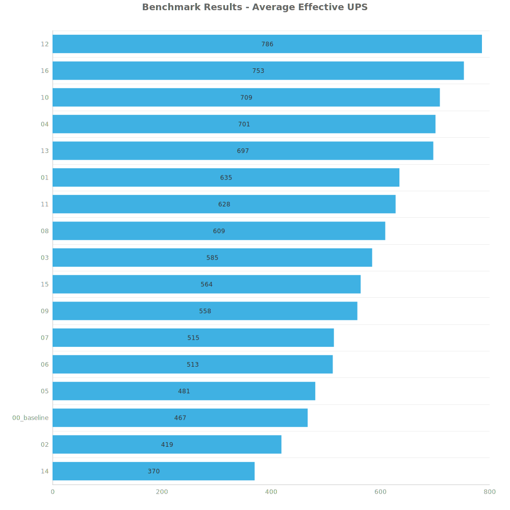
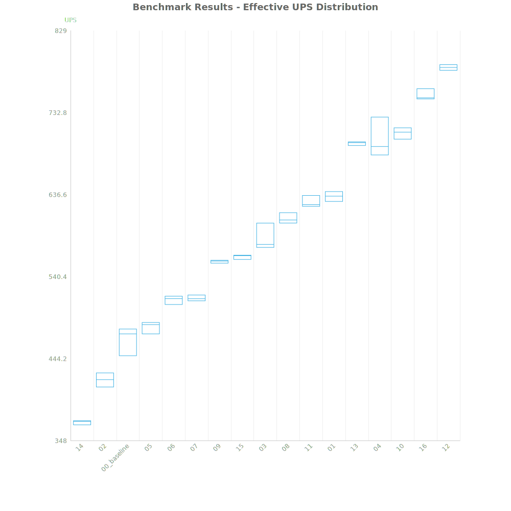
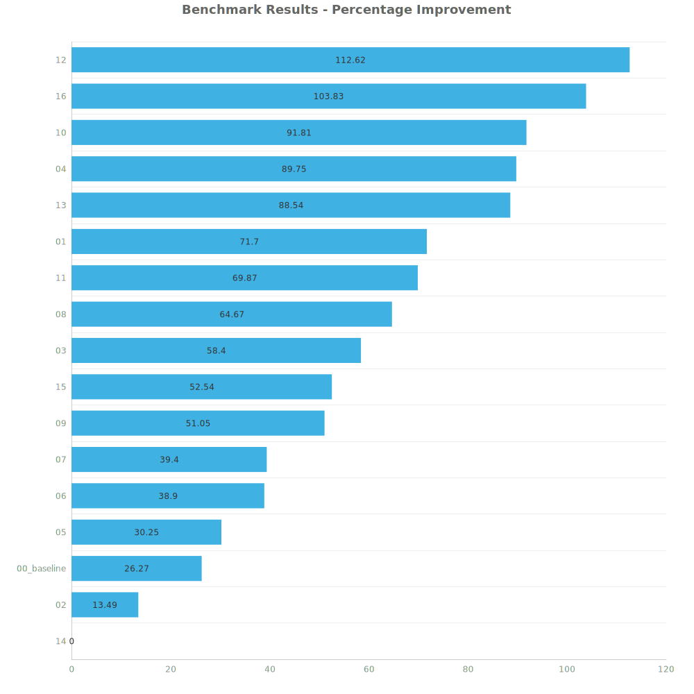

## Automation Science Entries

| Science Type | Author     | Design Index | Tags                                                   | Output | Notes                                    | Blueprint                                                               | Save File                                                     |
| ------------ | ---------- | ------------ | ------------------------------------------------------ | ------ | ---------------------------------------- | ----------------------------------------------------------------------- | ------------------------------------------------------------- |
| Automation   | N / A      | 00           |                                                        | 240/s  |                                          | [blueprint](blueprints/automation-science-240-baseline.txt)             | [red_design_00_baseline.zip](maps/red_design_00_baseline.zip) |
| Automation   | jaden0303  | 01           | `DI`, `Recipe Switching`, `Fluid Bus`                  | 480/s  | must be running constantly, hard to test | [blueprint](blueprints/automation-science-480-jaden0303.txt)            | [red_design_01.zip](maps/red_design_01.zip)                   |
| Automation   | Ashtroboy  | 02           | `DI`, `LDS Shuffle`                                    | 720/s  |                                          | [blueprint](blueprints/automation-science-720-ashtroboy.txt)            | [red_design_02.zip](maps/red_design_02.zip)                   |
| Automation   | reja       | 03           | `Fluid Bus`, `Lead Follow`                             | 960/s  |                                          | [blueprint](blueprints/automation-science-960-reja.txt)                 | [red_design_03.zip](maps/red_design_03.zip)                   |
| Automation   | Zepher24   | 04           | `Fluid Bus`, `Clocked Inserter`, `Staggered Inserters` | 480/s  | 7 Beacon                                 | [blueprint](blueprints/automation-science-480-zepher24.txt)             | [red_design_04.zip](maps/red_design_04.zip)                   |
| Automation   | MCMayhem57 | 05           | `DI`, `Ore Bus`                                        | 480/s  | 8 Beacon                                 | [blueprint](blueprints/automation-science-480-ore-bus-mcmayhem57.txt)   | [red_design_05.zip](maps/red_design_05.zip)                   |
| Automation   | MCMayhem57 | 06           | `DI`, `Fluid Bus`, `Lead Follower`                     | 480/s  | 8 Beacon                                 | [blueprint](blueprints/automation-science-480-fluid-bus-mcmayhem57.txt) | [red_design_06.zip](maps/red_design_06.zip)                   |
| Automation   | MCMayhem57 | 07           | `Lead Follower`, `Ore Bus`                             | 480/s  | 12 Beacon                                | [blueprint](blueprints/automation-science-480-ore-belt-mcmayhem57.txt)  | [red_design_07.zip](maps/red_design_07.zip)                   |
| Automation   | Camrade    | 08           | `Lead Follower`, `Fluid Bus`                           | 960/s  | 12 Beacon                                | [blueprint](blueprints/automation-science-960-camrade.txt)              | [red_design_08.zip](maps/red_design_08.zip)                   |
| Automation   | Cubes      | 09           | `Threshold`, `Fluid Bus`                               | 240/s  | 12 Beacon                                | [blueprint](blueprints/automation-science-240-fluid-bus-cubes.txt)      | [red_design_09.zip](maps/red_design_09.zip)                   |
| Automation   | Jobo       | 10           | `Inserter Pulse`, `Fluid Bus`                          | 240/s  | 7 Beacon                                 | [blueprint](blueprints/automation-science-240-fluid-bus-jobo.txt)       | [red_design_10.zip](maps/red_design_10.zip)                   |
| Automation   | Lkron      | 11           | `Threshold`, `Ore Bus`                                 | 480/s  | 8 Beacon                                 | [blueprint](blueprints/automation-science-480-lkron.txt)                | [red_design_11.zip](maps/red_design_11.zip)                   |
| Automation   | phlap      | 12           | `DI`, `Lead Follower`, `Fluid Bus`                     | 240/s  | 8 Beacon                                 | [blueprint](blueprints/automation-science-240-phlap.txt)                | [red_design_12.zip](maps/red_design_12.zip)                   |
| Automation   | Geist      | 13           | `Lead Follower`, `Fluid Bus`                           | 480/s  | 8 Beacon                                 | [blueprint](blueprints/automation-science-480-fluid-bus-geist.txt)      | [red_design_13.zip](maps/red_design_13.zip)                   |
| Automation   | Tenebris   | 14           | `Ore Bus`, `Electric Furnace`, `DI`                    | 240/s  | 8 Beacon                                 | [blueprint](blueprints/automation-science-240-ore-bus-tenebris.txt)     | [red_design_14.zip](maps/red_design_14.zip)                   |
| Automation   | Ztirom22   | 15           | `Fluid Bus`, `Lead Follower`                           | 240/s  | 5 Beacon                                 | [blueprint](blueprints/automation-science-240-fluid-bus-ztirom22.txt)   | [red_design_15.zip](maps/red_design_15.zip)                   |
| Automation   | The End    | 16           | `Fluid Bus`, `Multi Stage Build`                       | 480/s  | 7 Beacon, hard to test                   | [blueprint](blueprints/automation-science-480-fluid-bus-theend.txt)     | [red_design_16.zip](maps/red_design_16.zip)                   |

## Test Maps
- Designs submitted make 1, 2, 3, or 4 fully stacked lanes of science. 
  - The least common multiple is 12 so we will need to have a final combination that creates at least 12 lanes of science for all builds to produce the same output.
- Each save is executed for 36000 ticks and for 3 runs each
- Each save file produces 5_529_600 red science per minute (384 lanes stacked)

## Results
| Metric            | Description                           |
| ----------------- | ------------------------------------- |
| **Mean UPS**      | Updates per second - higher is better |
| **Mean Avg (ms)** | Average frame time - lower is better  |
| **Mean Min (ms)** | Minimum frame time - lower is better  |
| **Mean Max (ms)** | Maximum frame time - lower is better  |

| Save        | Avg (ms) | Min (ms) | Max (ms) | UPS     | Execution Time (ms) |
| ----------- | -------- | -------- | -------- | ------- | ------------------- |
| 14          | 2.706    | 0.983    | 9.304    | 369     | 292217              |
| 02          | 2.385    | 0.731    | 11.963   | 419     | 257551              |
| 00_baseline | 2.144    | 1.269    | 5.478    | 466     | 231607              |
| 05          | 2.078    | 1.507    | 4.505    | 481     | 224368              |
| 06          | 1.948    | 1.448    | 4.184    | 513     | 210392              |
| 07          | 1.941    | 0.922    | 4.635    | 515     | 209622              |
| 09          | 1.792    | 1.118    | 5.704    | 558     | 193457              |
| 15          | 1.774    | 0.726    | 7.451    | 563     | 191569              |
| 03          | 1.709    | 0.931    | 4.224    | 585     | 184563              |
| 08          | 1.643    | 0.686    | 6.839    | 608     | 177465              |
| 11          | 1.593    | 0.693    | 6.181    | 627     | 172027              |
| 01          | 1.576    | 0.612    | 5.336    | 634     | 170194              |
| 13          | 1.435    | 0.558    | 5.019    | 696     | 154983              |
| 04          | 1.427    | 0.562    | 3.604    | 701     | 154107              |
| 10          | 1.411    | 0.483    | 5.940    | 708     | 152352              |
| 16          | 1.327    | 0.720    | 4.203    | 753     | 143366              |
| 12          | 1.272    | 0.385    | 7.174    | **785** | 137436              |

Box and Whisker Plot:

| Save        | % Difference from base |
| ----------- | ---------------------- |
| 14          | 0.00%                  |
| 02          | 13.49%                 |
| 00_baseline | 26.27%                 |
| 05          | 30.25%                 |
| 06          | 38.90%                 |
| 07          | 39.40%                 |
| 09          | 51.05%                 |
| 15          | 52.54%                 |
| 03          | 58.40%                 |
| 08          | 64.67%                 |
| 11          | 69.87%                 |
| 01          | 71.70%                 |
| 13          | 88.54%                 |
| 04          | 89.75%                 |
| 10          | 91.81%                 |
| 16          | 103.83%                |
| 12          | 112.62%                |

