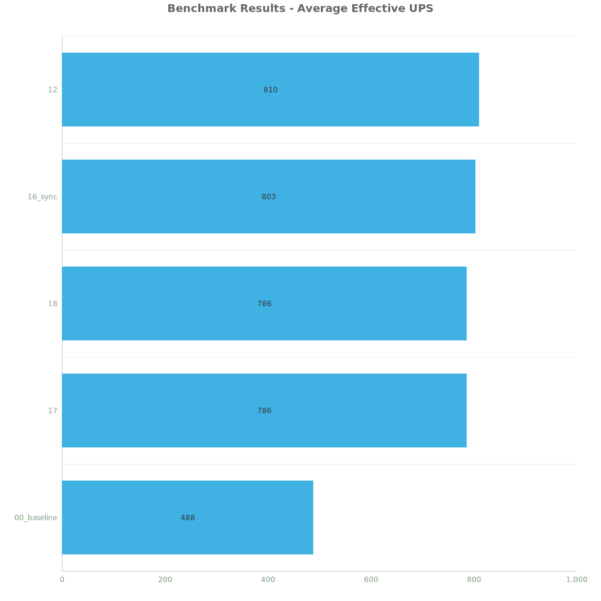
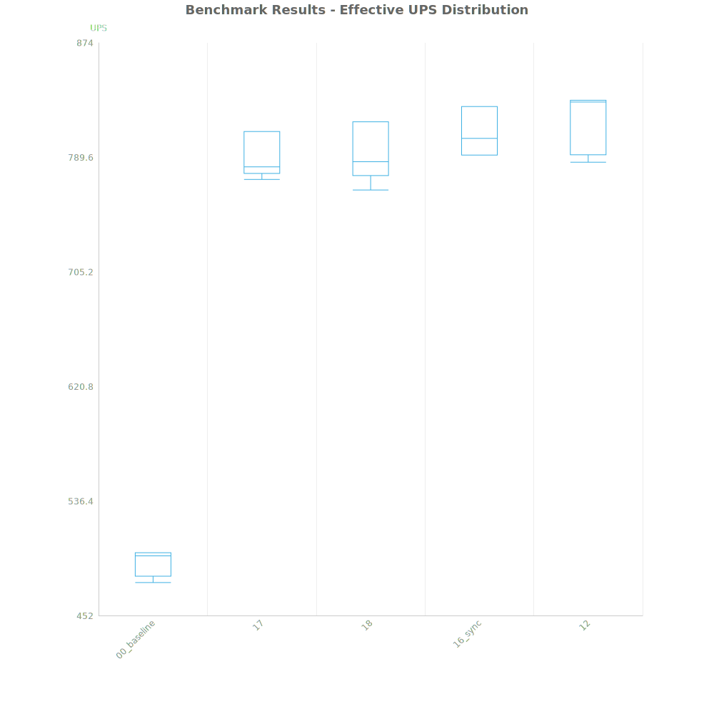
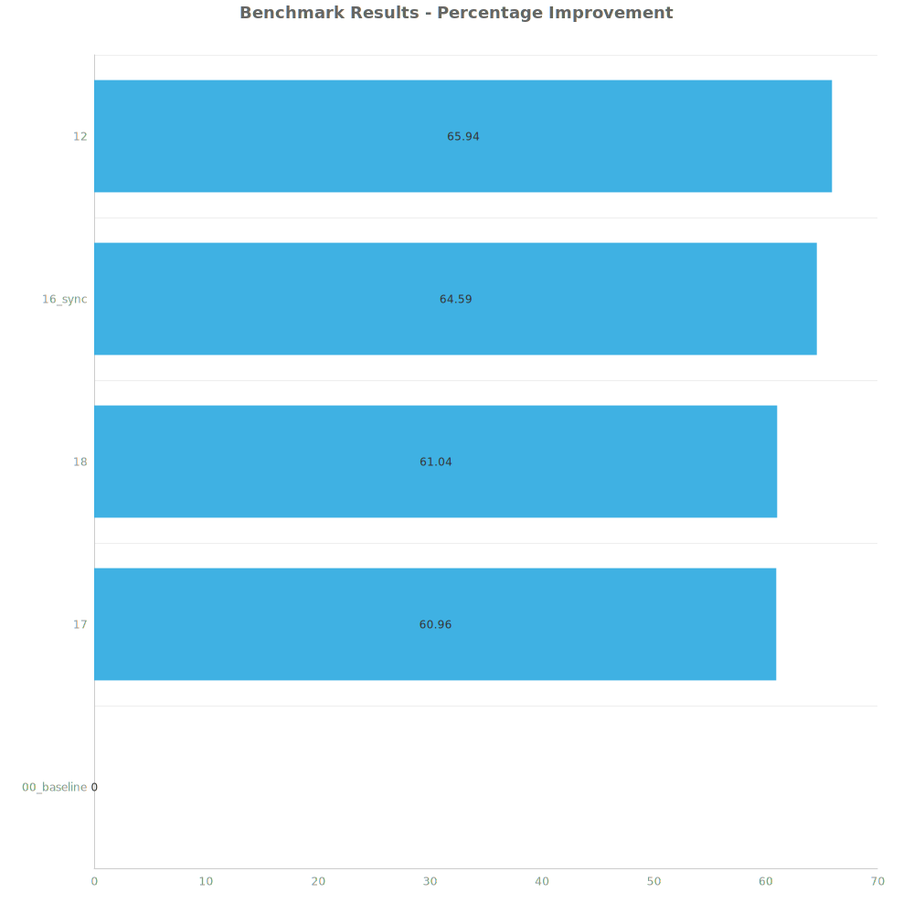
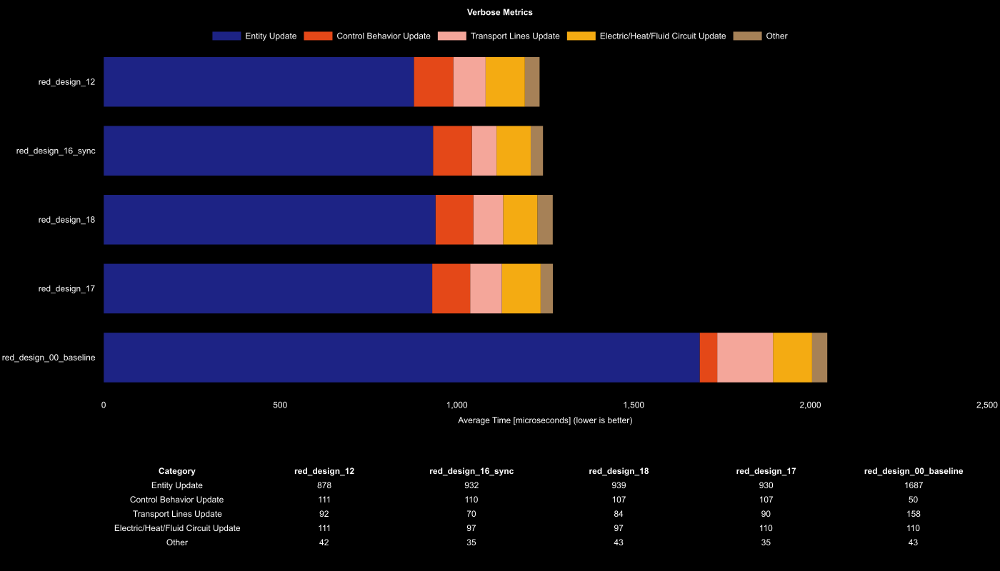

# Factorio Benchmark Results

**Platform:** windows-x86_64  
**Factorio Version:** 2.0.64  

## Scenario
* Each save was tested for 20000 tick(s) and 4 run(s)

## Results
| Metric            | Description                           |
| ----------------- | ------------------------------------- |
| **Mean UPS**      | Updates per second - higher is better |
| **Mean Avg (ms)** | Average frame time - lower is better  |
| **Mean Min (ms)** | Minimum frame time - lower is better  |
| **Mean Max (ms)** | Maximum frame time - lower is better  |

| Save        | Avg (ms) | Min (ms) | Max (ms) | UPS     | Execution Time (ms) |
| ----------- | -------- | -------- | -------- | ------- | ------------------- |
| 00_baseline | 2.050    | 1.256    | 5.050    | 488     | 163963              |
| 17          | 1.273    | 0.410    | 6.091    | 785     | 101857              |
| 18          | 1.273    | 0.548    | 7.760    | 786     | 101832              |
| 16_sync     | 1.245    | 0.415    | 6.206    | 803     | 99613               |
| 12          | 1.235    | 0.354    | 7.203    | **809** | 98839               |

Box and Whisker Plot:

| Save        | % Difference from base |
| ----------- | ---------------------- |
| 00_baseline | 0.00%                  |
| 17          | 60.96%                 |
| 18          | 61.04%                 |
| 16_sync     | 64.59%                 |
| 12          | 65.94%                 |

## Conclusion