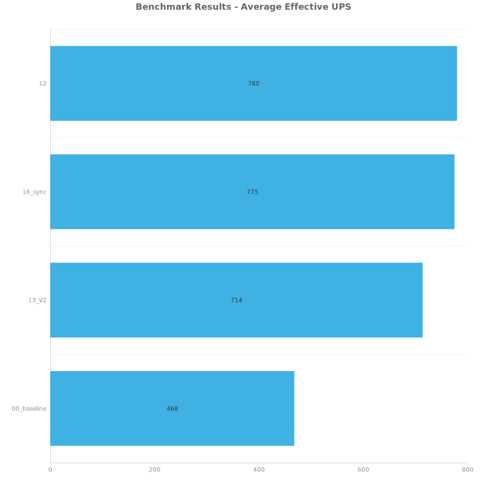
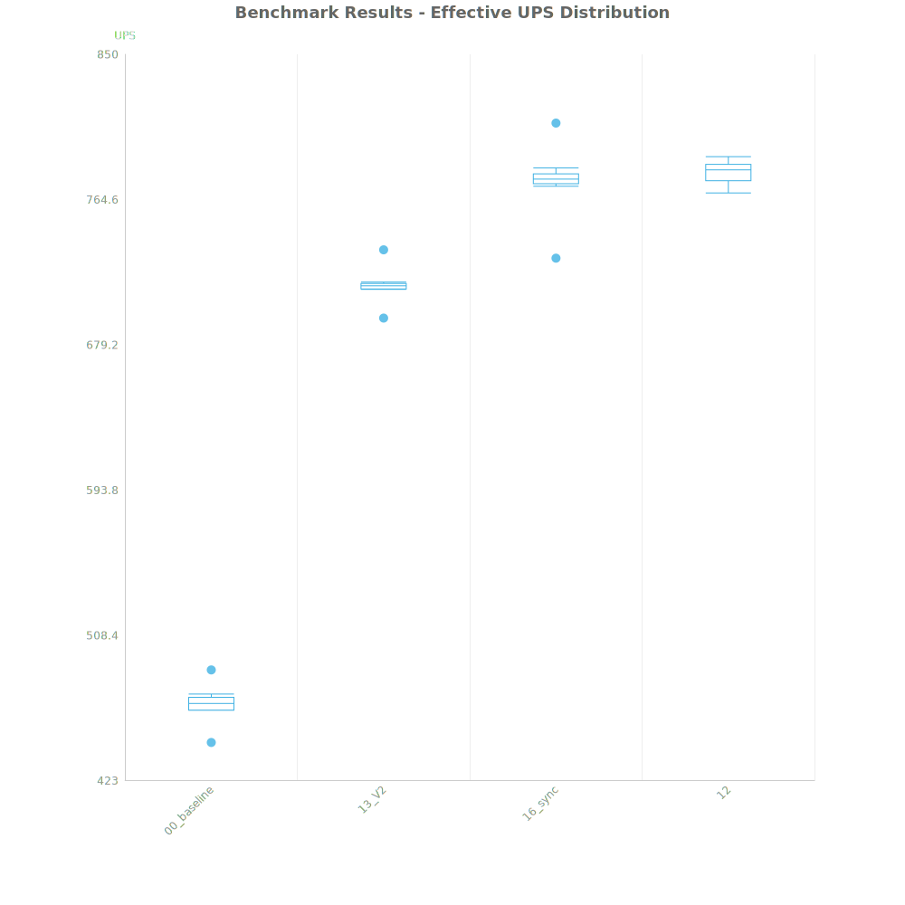
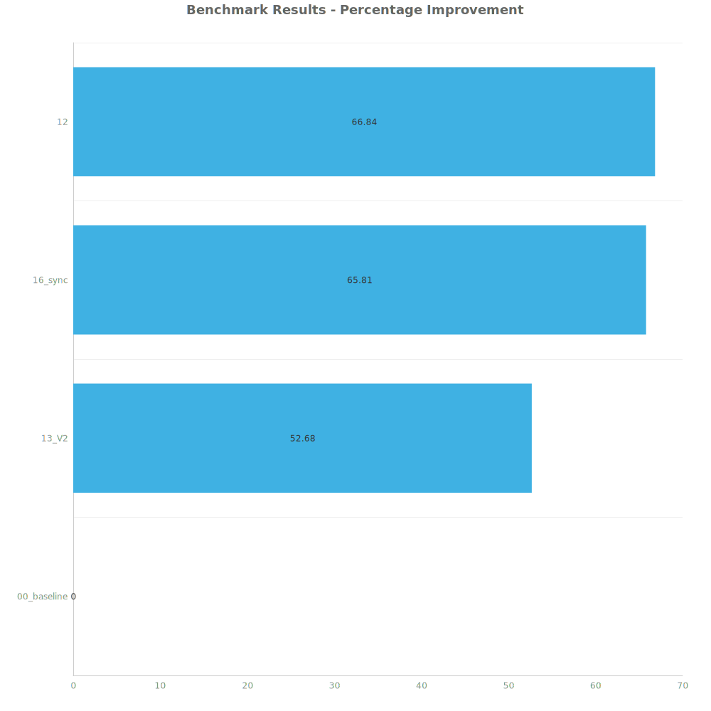

# Factorio Benchmark Results

**Platform:** windows-x86_64  
**Factorio Version:** 2.0.64  

## Scenario
* Each save was tested for 108000 tick(s) and 10 run(s)

## Results
| Metric            | Description                           |
| ----------------- | ------------------------------------- |
| **Mean UPS**      | Updates per second - higher is better |
| **Mean Avg (ms)** | Average frame time - lower is better  |
| **Mean Min (ms)** | Minimum frame time - lower is better  |
| **Mean Max (ms)** | Maximum frame time - lower is better  |

| Save | Avg (ms) | Min (ms) | Max (ms) | UPS | Execution Time (ms) |
|------|----------|----------|----------|-----|---------------------|
| 00_baseline | 2.139 | 1.269 | 6.556 | 467 | 2310650 |
| 13_V2 | 1.401 | 0.538 | 7.889 | 713 | 1512929 |
| 16_sync | 1.291 | 0.406 | 8.292 | 775 | 1393686 |
| 12 | 1.282 | 0.381 | 8.773 | **780** | 1384367 |

Box and Whisker Plot:

| Save | % Difference from base |
|------|------------------------|
| 00_baseline | 0.00% |
| 13_V2 | 52.68% |
| 16_sync | 65.81% |
| 12 | 66.84% |

## Conclusion