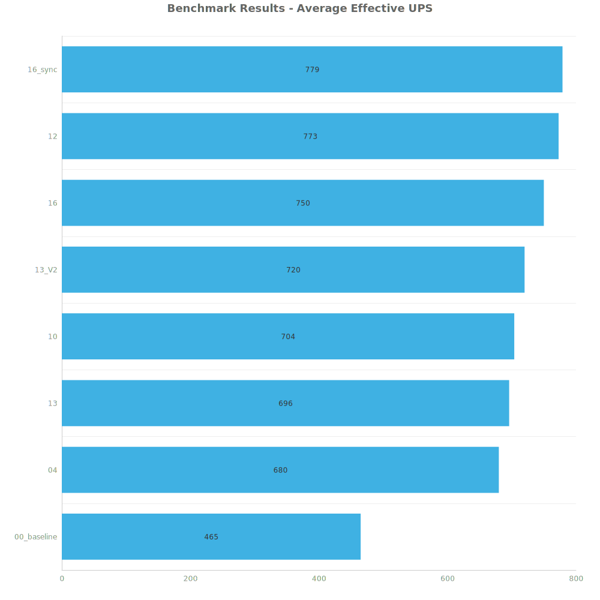
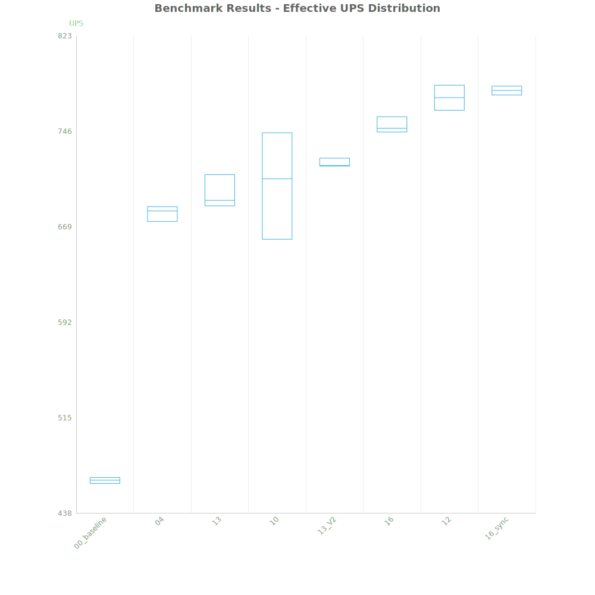
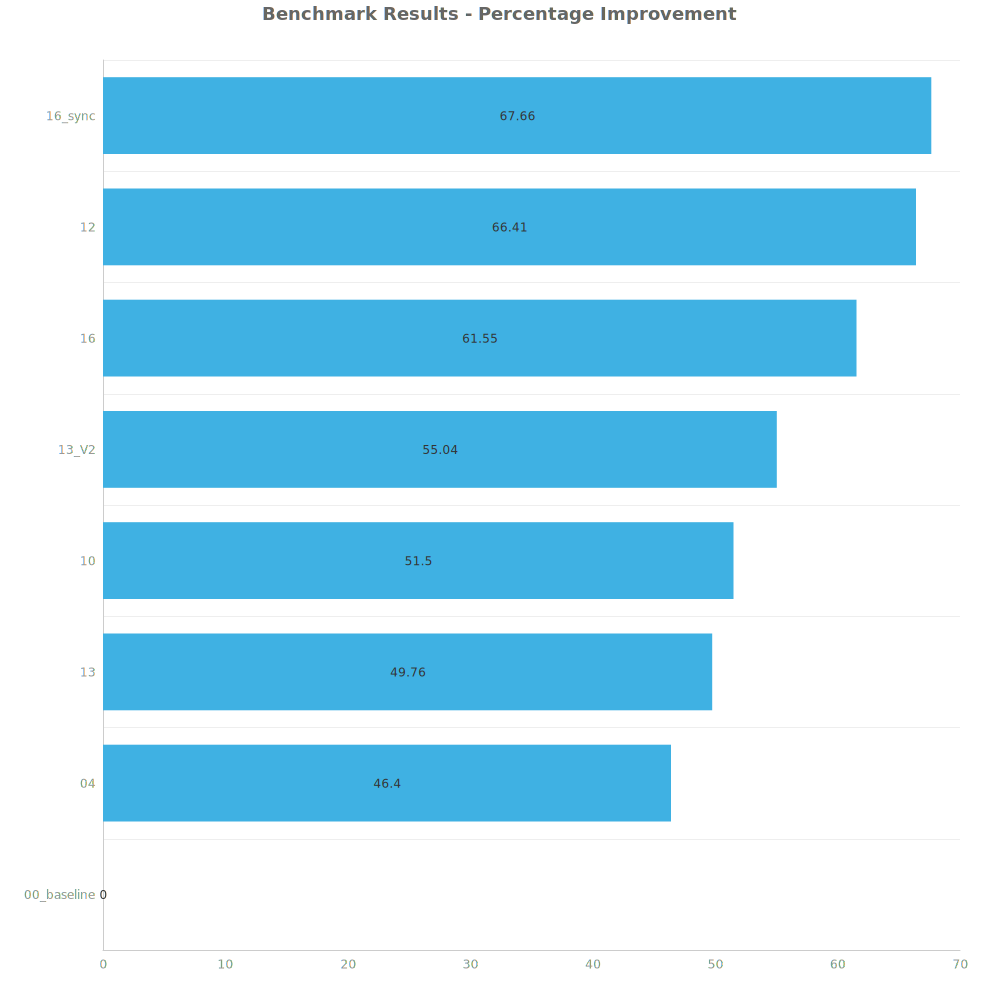

# Factorio Benchmark Results

**Platform:** windows-x86_64  
**Factorio Version:** 2.0.64  

## Scenario
* Each save was tested for 72000 tick(s) and 3 run(s)

## Results
| Metric            | Description                           |
| ----------------- | ------------------------------------- |
| **Mean UPS**      | Updates per second - higher is better |
| **Mean Avg (ms)** | Average frame time - lower is better  |
| **Mean Min (ms)** | Minimum frame time - lower is better  |
| **Mean Max (ms)** | Maximum frame time - lower is better  |

| Save | Avg (ms) | Min (ms) | Max (ms) | UPS | Execution Time (ms) |
|------|----------|----------|----------|-----|---------------------|
| 00_baseline | 2.153 | 1.295 | 5.335 | 464 | 465007 |
| 04 | 1.470 | 0.522 | 4.795 | 680 | 317644 |
| 13 | 1.438 | 0.538 | 5.744 | 695 | 310569 |
| 10 | 1.425 | 0.448 | 5.655 | 703 | 307695 |
| 13_V2 | 1.389 | 0.529 | 4.306 | 720 | 299929 |
| 16 | 1.333 | 0.718 | 4.479 | 750 | 287841 |
| 12 | 1.294 | 0.382 | 8.056 | 772 | 279463 |
| 16_sync | 1.284 | 0.426 | 7.102 | **778** | 277350 |

Box and Whisker Plot:

| Save | % Difference from base |
|------|------------------------|
| 00_baseline | 0.00% |
| 04 | 46.40% |
| 13 | 49.76% |
| 10 | 51.50% |
| 13_V2 | 55.04% |
| 16 | 61.55% |
| 12 | 66.41% |
| 16_sync | 67.66% |

## Conclusion