# 2025 Q1 Nauvis Science Competition: Chemical Science

## Table of Contents
- [2025 Q1 Nauvis Science Competition: Chemical Science](#2025-q1-nauvis-science-competition-chemical-science)
  - [Table of Contents](#table-of-contents)
  - [Chemical Science Entries](#chemical-science-entries)
    - [Validation](#validation)
    - [Designs that Passed Tests ✅](#designs-that-passed-tests-)
    - [Designs that Failed Tests ❌](#designs-that-failed-tests-)
    - [Design Alterations](#design-alterations)
      - [05\_derantrix](#05_derantrix)
      - [28\_geist](#28_geist)
      - [29\_geist](#29_geist)
      - [34\_osboz](#34_osboz)
  - [Save Files](#save-files)

## Chemical Science Entries
### Validation
All designs must be able to pass my acceptance criteria which is as follows:

All tests must reach a stable state and have fully saturated belts for 5 min after becoming stable:
1. cold start until science belt is fully saturated
2. Run until belts are backed up then release into infinity loaders
3. Remove one input and add it back
4. Cut off all inputs and add it back

I do this for all my builds. These issues happen commonly in real bases so it’s worth testing these things.
It also ensures that when I run a 36k+ tick benchmark, they will continue to produce science throughout the
test without any hiccups.  

Additionally, since there are many RS latches in these designs, longer benchmarks will need to be run for 
the final bracket. Therefore:
5. each design must produce at 240/s continuously for 1 hour (216k ticks).
  

### Designs that Passed Tests ✅

| Author                | Design Index             | Science Per Second | Design Tags                                                                                                      | Screenshot                                                                                                                                                                     | Blueprint                                                                         | Save File                                                                       |
| --------------------- | ------------------------ | ------------------ | ---------------------------------------------------------------------------------------------------------------- | ------------------------------------------------------------------------------------------------------------------------------------------------------------------------------ | --------------------------------------------------------------------------------- | ------------------------------------------------------------------------------- |
| abucnasty             | 00_baseline              | 240/s              |                                                                                                                  | <a href="design_screenshot/00_baseline.png">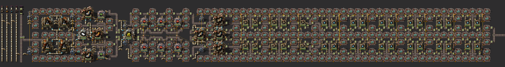</a>                                        | [design_00_baseline](blueprints/design_00_baseline.txt)                           | [design_00_baseline.zip](maps/design_00_baseline.zip)                           |
| undertow              | 01_undertow              | 480/s              | Direct Insertion, Molten Fluid Bus, Basic Oil                                                                    | <a href="design_screenshot/01_undertow.png">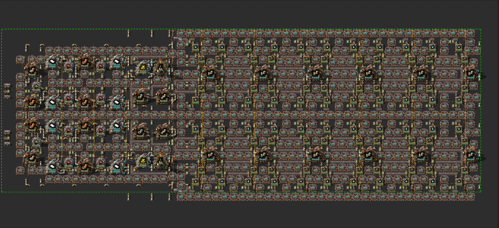</a>                                        | [design_01_undertow](blueprints/design_01_undertow.txt)                           | [design_01_undertow.zip](maps/design_01_undertow.zip)                           |
| SwiftDeath007         | 03_swiftdeath007         | 240/s              | Direct Insertion, Molten Fluid Bus, Basic Oil, 6 Beacon Science                                                  | <a href="design_screenshot/03_swiftdeath007.png">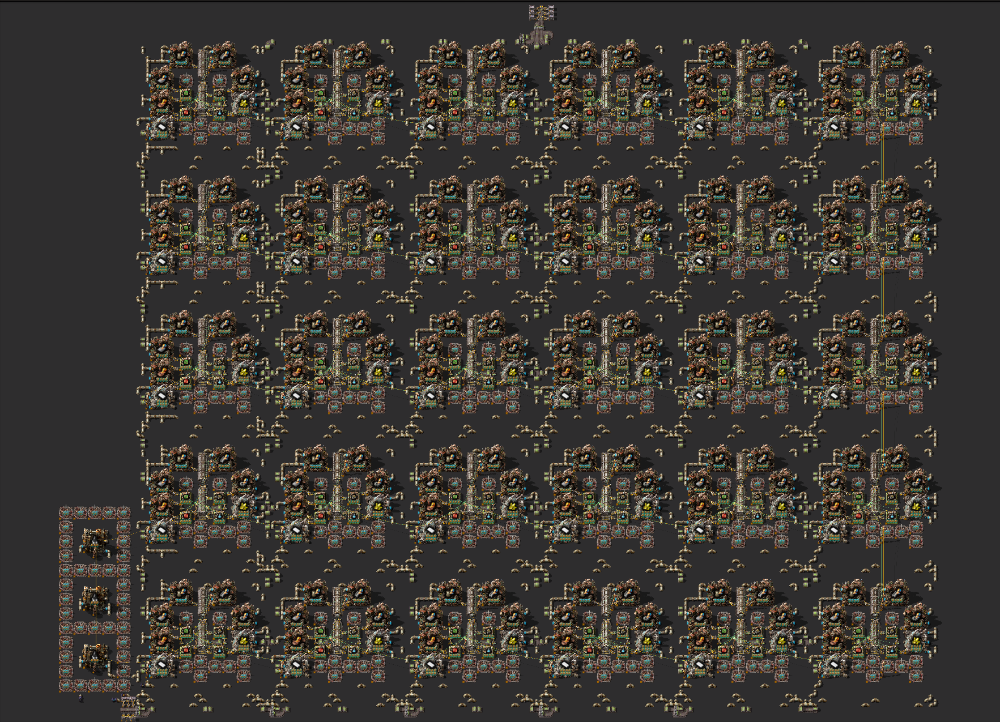</a>                         | [design_03_swiftdeath007](blueprints/design_03_swiftdeath007.txt)                 | [design_03_swiftdeath007.zip](maps/design_03_swiftdeath007.zip)                 |
| SwiftDeath007         | 04_swiftdeath007         | 240/s              | Direct Insertion, Molten Fluid Bus, Basic Oil, 12 Beacon Science                                                 | <a href="design_screenshot/04_swiftdeath007.png">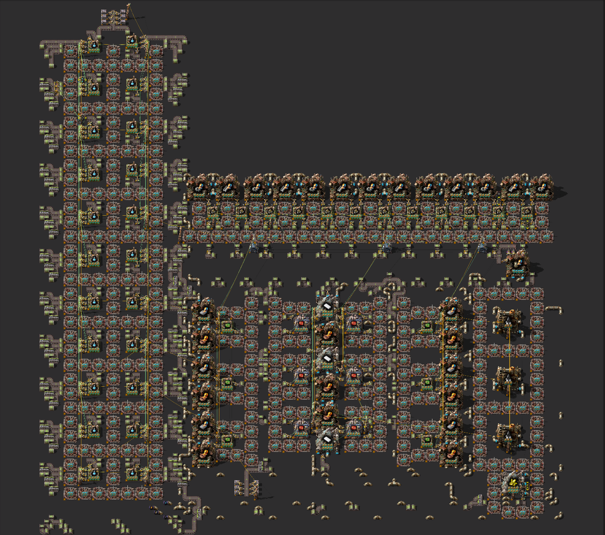</a>                         | [design_04_swiftdeath007](blueprints/design_04_swiftdeath007.txt)                 | [design_04_swiftdeath007.zip](maps/design_04_swiftdeath007.zip)                 |
| DerAntrix             | 05_derantrix             | 480/s              | Direct Insertion, Molten Fluid Bus, Basic Oil, 9 Beacon Science                                                  | <a href="design_screenshot/05_derantrix.png">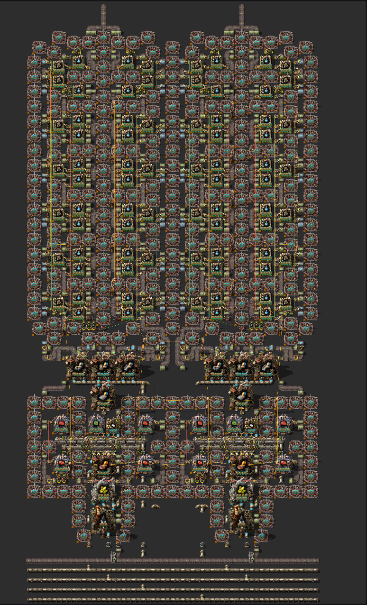</a>                                     | [design_05_derantrix](blueprints/design_05_derantrix.txt)                         | [design_05_derantrix.zip](maps/design_05_derantrix.zip)                         |
| imp                   | 06_imp                   | 240/s              | Direct Insertion, Basic Oil, 10 Beacon Science                                                                   | <a href="design_screenshot/06_imp.png">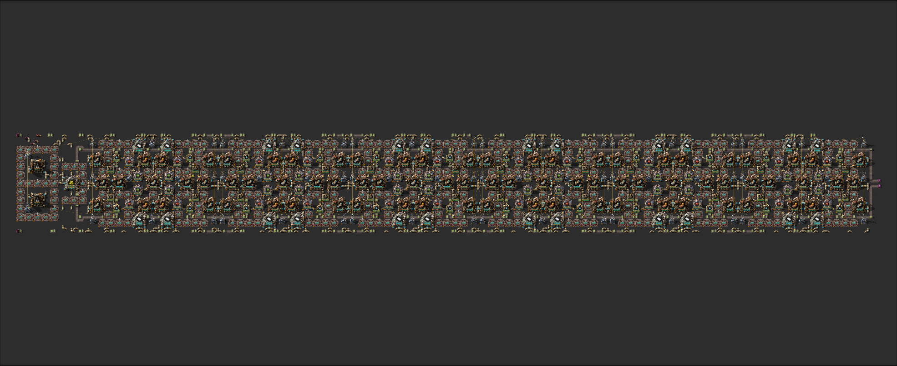</a>                                                       | [design_06_imp](blueprints/design_06_imp.txt)                                     | [design_06_imp.zip](maps/design_06_imp.zip)                                     |
| lady_meyneth          | 08_lady_meyneth          | 240/s              | Direct Insertion, Molten Fluid Bus, Basic Oil, Coal Direct Insertion Mining, CARGO WAGONS FTW, 11 Beacon Science | <a href="design_screenshot/08_lady_meyneth.png">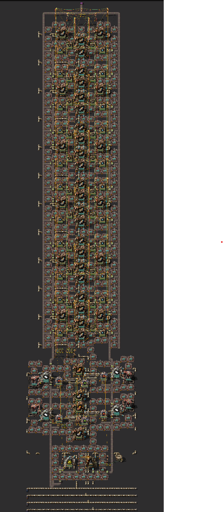</a>                            | [design_08_lady_meyneth](blueprints/design_08_lady_meyneth.txt)                   | [design_08_lady_meyneth.zip](maps/design_08_lady_meyneth.zip)                   |
| Jobo                  | 09_jobo                  | 240/s              | Direct Insertion, Recipe Switching, Molten Fluid Bus, Basic Oil, Requires backpressure at all times,             | <a href="design_screenshot/09_jobo.png">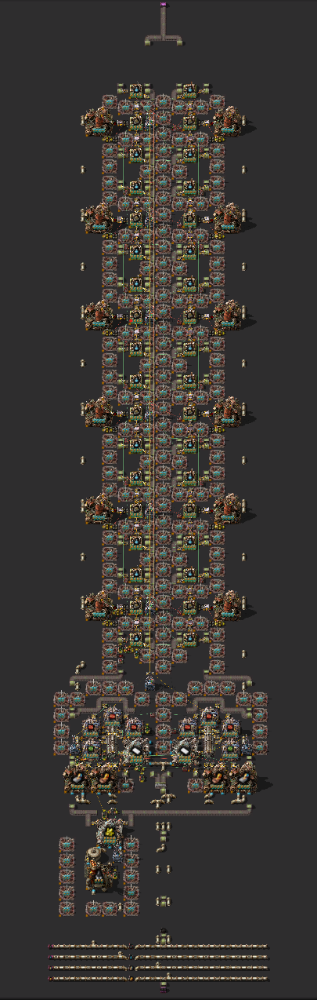</a>                                                    | [design_09_jobo](blueprints/design_09_jobo.txt)                                   | [design_09_jobo.zip](maps/design_09_jobo.zip)                                   |
| TheFlyingCurryFish154 | 11_theflyingcurryfish154 | 960/s              | Molten Fluid Bus, Basic Oil, Mix of Direct Insertion and Belts                                                   | <a href="design_screenshot/11_theflyingcurryfish154.png">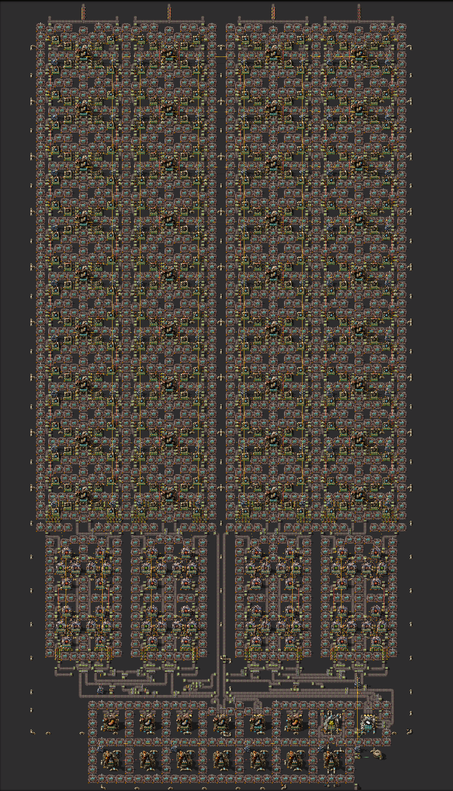</a> | [design_11_theflyingcurryfish154](blueprints/design_11_theflyingcurryfish154.txt) | [design_11_theflyingcurryfish154.zip](maps/design_11_theflyingcurryfish154.zip) |
| phlap                 | 12_phlap                 | 240/s              | Direct Insertion, Molten Fluid Bus, Basic Oil                                                                    | <a href="design_screenshot/12_phlap.png">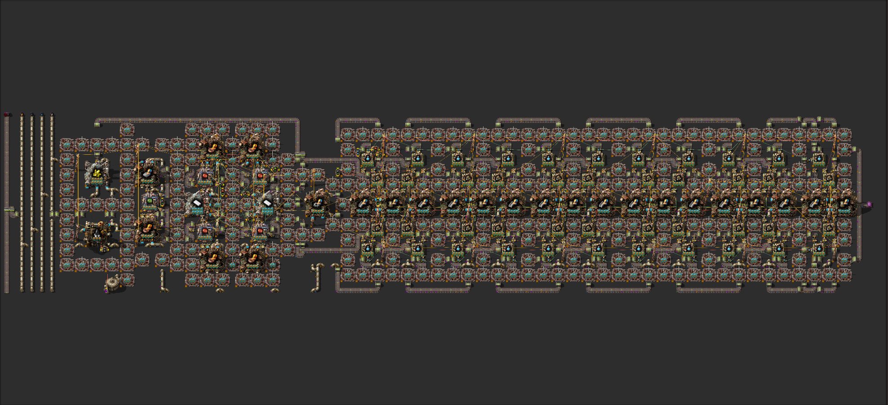</a>                                                 | [design_12_phlap](blueprints/design_12_phlap.txt)                                 | [design_12_phlap.zip](maps/design_12_phlap.zip)                                 |
| phlap                 | 13_phlap                 | 240/s              | Recipe Switching, Basic Oil                                                                                      | <a href="design_screenshot/13_phlap.png">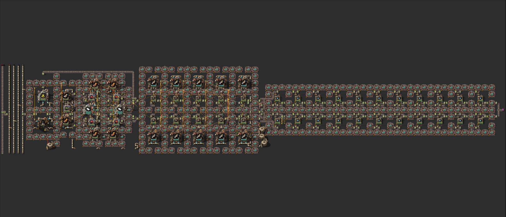</a>                                                 | [design_13_phlap](blueprints/design_13_phlap.txt)                                 | [design_13_phlap.zip](maps/design_13_phlap.zip)                                 |
| abucnasty             | 14_abucnasty             | 240/s              | Direct Insertion, Recipe Switching, Molten Fluid Bus, Basic Oil                                                  | <a href="design_screenshot/14_abucnasty.png">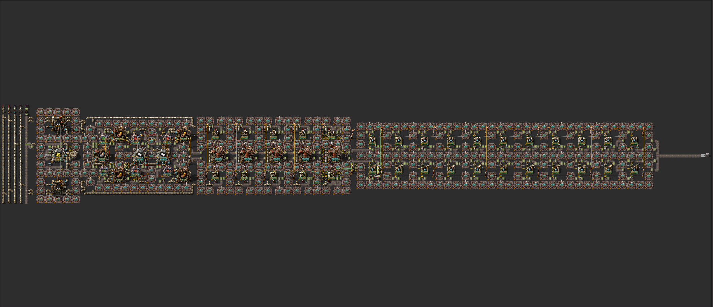</a>                                     | [design_14_abucnasty](blueprints/design_14_abucnasty.txt)                         | [design_14_abucnasty.zip](maps/design_14_abucnasty.zip)                         |
| Yuu                   | 16_yuu                   | 240/s              | Direct Insertion, Recipe Switching, Molten Fluid Bus, Basic Oil, Silo                                            | <a href="design_screenshot/16_yuu.png">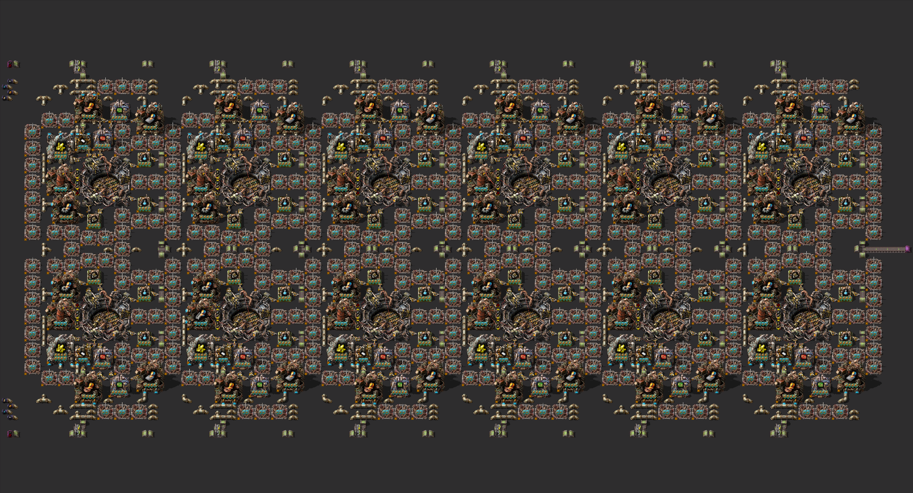</a>                                                       | [design_16_yuu](blueprints/design_16_yuu.txt)                                     | [design_16_yuu.zip](maps/design_16_yuu.zip)                                     |
| HenryJk               | 17_henryjk               | 240/s              |                                                                                                                  | <a href="design_screenshot/17_henryjk.png">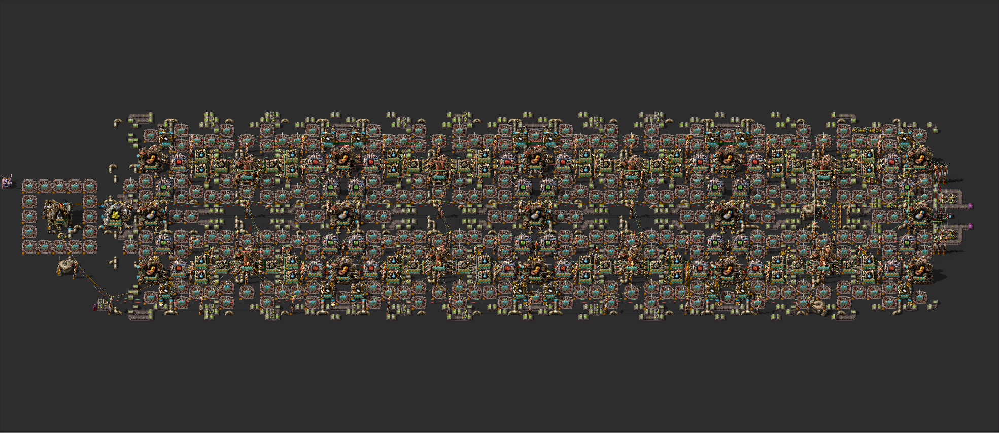</a>                                           | [design_17_henryjk](blueprints/design_17_henryjk.txt)                             | [design_17_henryjk.zip](maps/design_17_henryjk.zip)                             |
| lady_meyneth          | 18_lady_meyneth          | 240/s              | Direct Insertion, Molten Fluid Bus, Basic Oil, CARGO WAGONS!!!, 11 Beacon Science                                | <a href="design_screenshot/18_lady_meyneth.png">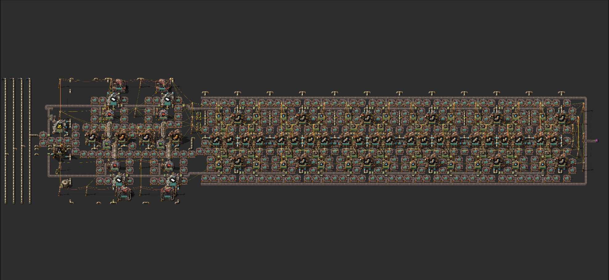</a>                            | [design_18_lady_meyneth](blueprints/design_18_lady_meyneth.txt)                   | [design_18_lady_meyneth.zip](maps/design_18_lady_meyneth.zip)                   |
| Werezwolf             | 19_werezwolf             | 240/s              |                                                                                                                  | <a href="design_screenshot/19_werezwolf.png">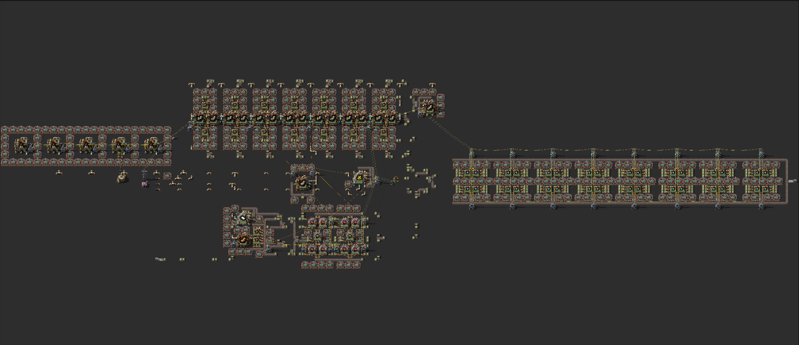</a>                                     | [design_19_werezwolf](blueprints/design_19_werezwolf.txt)                         | [design_19_werezwolf.zip](maps/design_19_werezwolf.zip)                         |
| Toda1                 | 20_toda1                 | 240/s              | Direct Insertion, Molten Fluid Bus, Advanced Oil                                                                 | <a href="design_screenshot/20_toda1.png">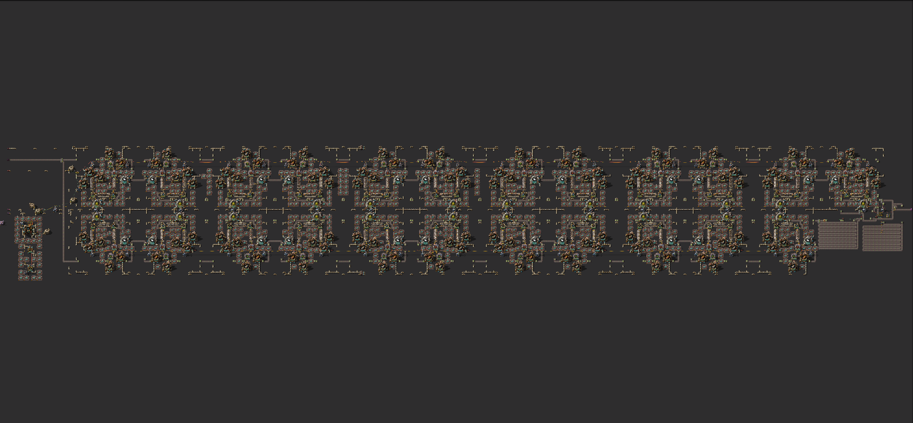</a>                                                 | [design_20_toda1](blueprints/design_20_toda1.txt)                                 | [design_20_toda1.zip](maps/design_20_toda1.zip)                                 |
| MCMayhem57            | 22_mcmayhem57            | 240/s              | Direct Insertion, Molten Fluid Bus, Basic Oil, Requires input synchronization                                    | <a href="design_screenshot/22_mcmayhem57.png">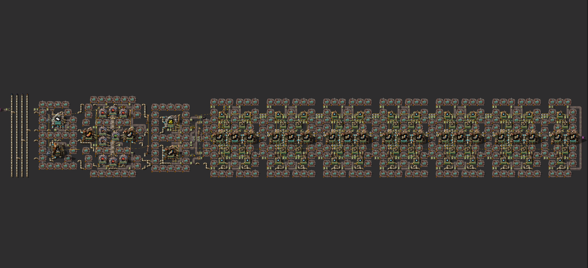</a>                                  | [design_22_mcmayhem57](blueprints/design_22_mcmayhem57.txt)                       | [design_22_mcmayhem57.zip](maps/design_22_mcmayhem57.zip)                       |
| MCMayhem57            | 23_mcmayhem57            | 240/s              | Direct Insertion, Molten Fluid Bus, Basic Oil, Requires input synchronization                                    | <a href="design_screenshot/23_mcmayhem57.png">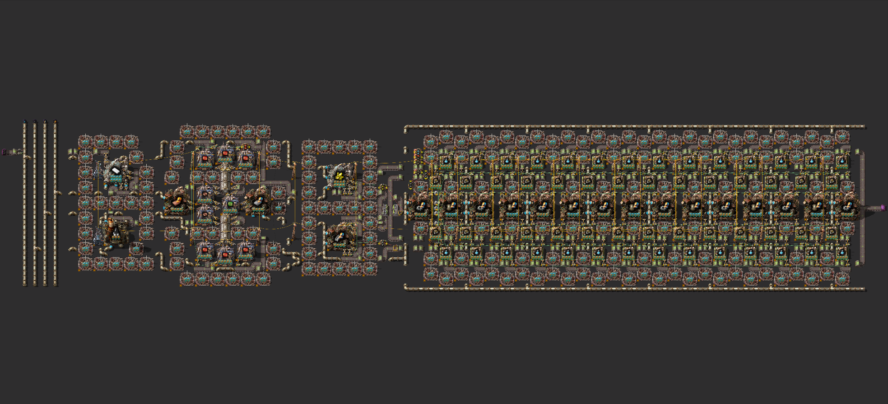</a>                                  | [design_23_mcmayhem57](blueprints/design_23_mcmayhem57.txt)                       | [design_23_mcmayhem57.zip](maps/design_23_mcmayhem57.zip)                       |
| MrCooki4              | 26_mrcooki4              | 480/s              | Direct Insertion, Basic Oil, Metal Ore Inputs                                                                    | <a href="design_screenshot/26_mrcooki4.png">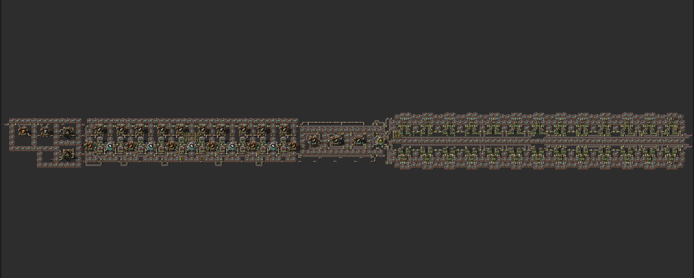</a>                                        | [design_26_mrcooki4](blueprints/design_26_mrcooki4.txt)                           | [design_26_mrcooki4.zip](maps/design_26_mrcooki4.zip)                           |
| Geist                 | 27_geist                 | 480/s              | Direct Insertion, Molten Fluid Bus, Basic Oil, Engine DI                                                         | <a href="design_screenshot/27_geist.png">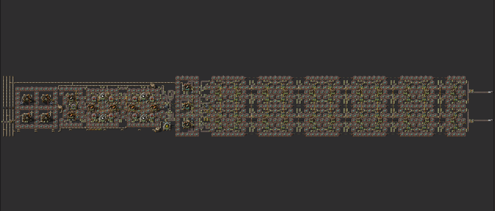</a>                                                 | [design_27_geist](blueprints/design_27_geist.txt)                                 | [design_27_geist.zip](maps/design_27_geist.zip)                                 |
| Geist                 | 28_geist                 | 480/s              | Direct Insertion, Recipe Switching, Molten Fluid Bus, Basic Oil                                                  | <a href="design_screenshot/28_geist.png">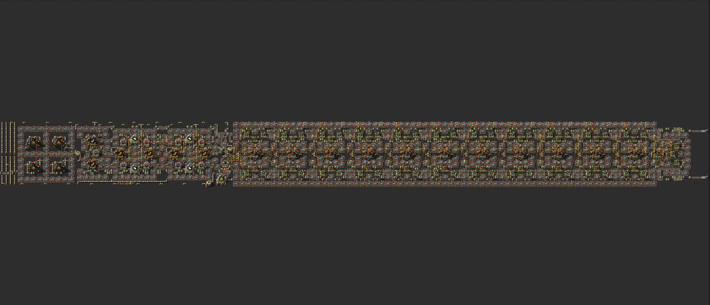</a>                                                 | [design_28_geist](blueprints/design_28_geist.txt)                                 | [design_28_geist.zip](maps/design_28_geist.zip)                                 |
| Geist                 | 29_geist                 | 480/s              | Direct Insertion, Recipe Switching, Molten Fluid Bus, Basic Oil, Red Circ/Sulfur DI                              | <a href="design_screenshot/29_geist.png">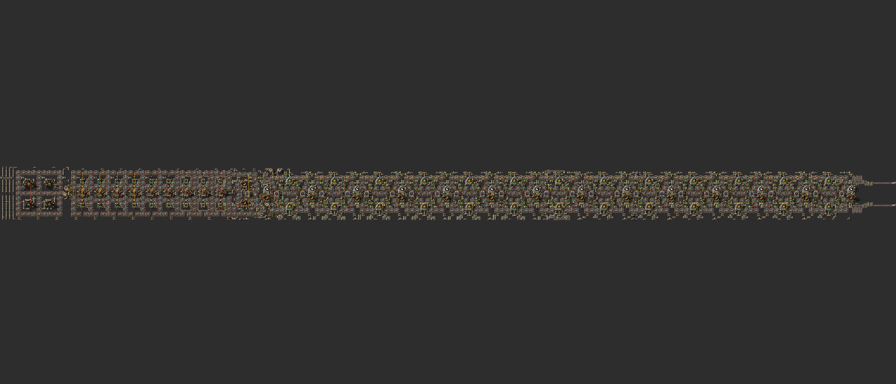</a>                                                 | [design_29_geist](blueprints/design_29_geist.txt)                                 | [design_29_geist.zip](maps/design_29_geist.zip)                                 |
| reja                  | 30_reja                  | 240/s              | Molten Fluid Bus, Basic Oil, belt based                                                                          | <a href="design_screenshot/30_reja.png">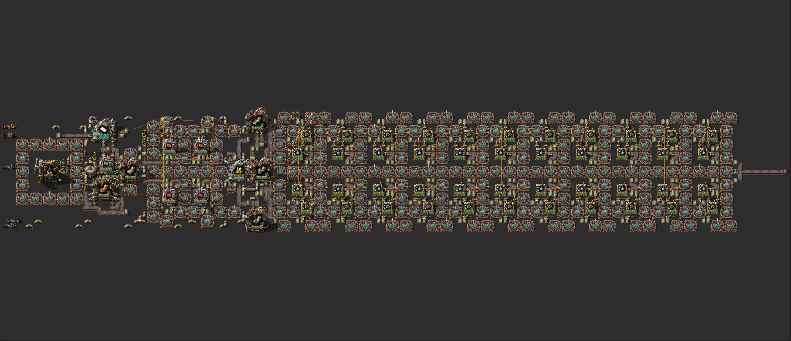</a>                                                    | [design_30_reja](blueprints/design_30_reja.txt)                                   | [design_30_reja.zip](maps/design_30_reja.zip)                                   |
| Minebuilder           | 31_minebuilder           | 240/s              | Basic Oil, Metal Ore Inputs, Buner Inserters, Stone Furnaces                                                     | <a href="design_screenshot/31_minebuilder.png">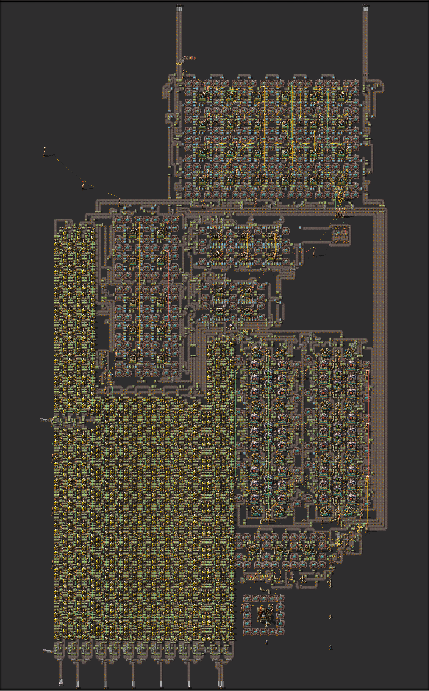</a>                               | [design_31_minebuilder](blueprints/design_31_minebuilder.txt)                     | [design_31_minebuilder.zip](maps/design_31_minebuilder.zip)                     |
| reja                  | 32_reja                  | 240/s              | Molten Fluid Bus, Basic Oil, belt based, Improvemenets on Design 30                                              | <a href="design_screenshot/32_reja.png">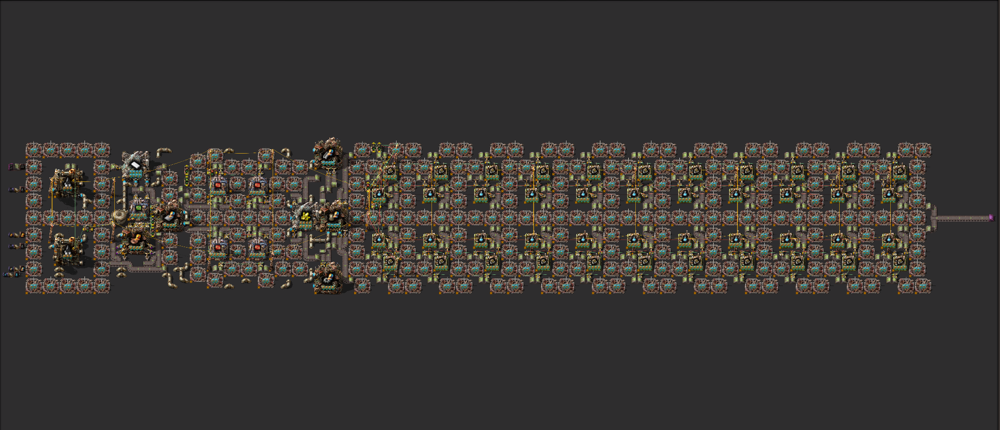</a>                                                    | [design_32_reja](blueprints/design_32_reja.txt)                                   | [design_32_reja.zip](maps/design_32_reja.zip)                                   |
| Osboz                 | 34_osboz                 | 480/s              | Basic Oil, Metal Ore Inputs                                                                                      | <a href="design_screenshot/34_osboz.png">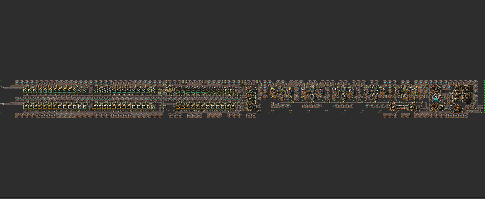</a>                                                 | [design_34_osboz](blueprints/design_34_osboz.txt)                                 | [design_34_osboz.zip](maps/design_34_osboz.zip)                                 |
| HenryJk               | 35_henryjk               | 240/s              | Direct Insertion, Recipe Switching, Molten Fluid Bus, Basic Oil                                                  | <a href="design_screenshot/35_henryjk.png">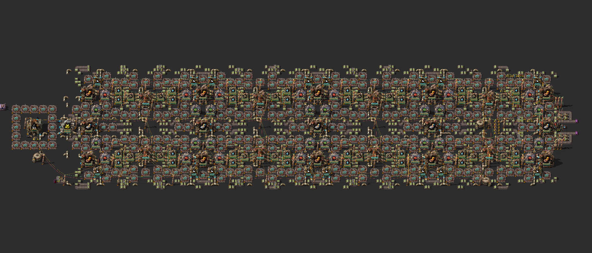</a>                                           | [design_35_henryjk](blueprints/design_35_henryjk.txt)                             | [design_35_henryjk.zip](maps/design_35_henryjk.zip)                             |

**Notes**
- `16_yuu` uses rocket silo chesting, so two versions were created. One with a realistic scenario with 5 ships over Nauvis and one without any ships.
  - for the first round it is only competing against the baseline, so 16_yuu will go up against 00_baseline as there are no ships overhead
  - `16_yuu_with_ships` will be run independently against `00_baseline_with_ships`
  - if the design performs above the baseline in both scenarios, 5 ships will need to be created above orbit for all designs that previously passed tests.
- `27_geist` cannot be flipped
- `28_geist` cannot be flipped
- `29_geist` has an issue starting up if coal is not instantly supplied to the input belt. Not necessarily a test failure as there isn't a test case for this at the time of submission, but makes it difficult to supply from a single belt until everything is fully saturated.
- `31_minebuilder` with full 96 copies was running at over 17 ms of update time so since it passed the tests it is included, but for the sake of abucnasty's computer and time, it is only 1/12 the scale of all other builds producing only 8 stacked lanes worth of science.


### Designs that Failed Tests ❌

| Author        | Design Index     | Science Per Second | Blueprint                                                         | Failure Reason                                                                                             |
| ------------- | ---------------- | ------------------ | ----------------------------------------------------------------- | ---------------------------------------------------------------------------------------------------------- |
| SwiftDeath007 | 02_swiftdeath007 | 240/s              | [design_02_swiftdeath007](blueprints/design_02_swiftdeath007.txt) | Failed losing molten iron (test 3)                                                                         |
| Osboz         | 07_osboz         | 480/s              | [design_07_osboz](blueprints/design_07_osboz.txt)                 | Failed upon losing coal, deadlock on lead assembler stuck at 8 science (test 3)                            |
| Ztirom22      | 10_ztirom22      | 240/s              | [design_10_ztirom22](blueprints/design_10_ztirom22.txt)           | Failed to produce 240/s consistently, waited for 216k ticks for it to stabilize but it never did. (test 1) |
| HenryJk       | 17_henryjk       | 240/s              | [design_17_henryjk](blueprints/design_17_henryjk.txt)             | Failed to startup (test 1)                                                                                 |
| Syvkal        | 21_syvkal        | 480/s              | [design_21_syvkal](blueprints/design_21_syvkal.txt)               | Failed losing molten iron (test 3)                                                                         |
| MCMayhem57    | 24_mcmayhem57    | 240/s              | [design_24_mcmayhem57](blueprints/design_24_mcmayhem57.txt)       | Eventually gets desynced being output blocked on engine production and never recovers (test 5)             |
| Ashtroboy     | 25_ashtroboy     | 240/s              | [design_25_ashtroboy](blueprints/design_25_ashtroboy.txt)         | Cannot be build in a real game only in an editor. Fails Test 2, 3, 4.                                      |
| Syvkal        | 33_syvkal        | 480/s              | [design_33_syvkal](blueprints/design_33_syvkal.txt)               | Failed starting stopping production and recovering (test 1)                                                |

### Design Alterations
Below are changes made by abucnasty while creating the save files from the original blueprints.


#### 05_derantrix
Moved corner beacons to all be in line with the rest of the beacons. No impact to the design, just allows them to tile perfectly and was a seemingly small change.
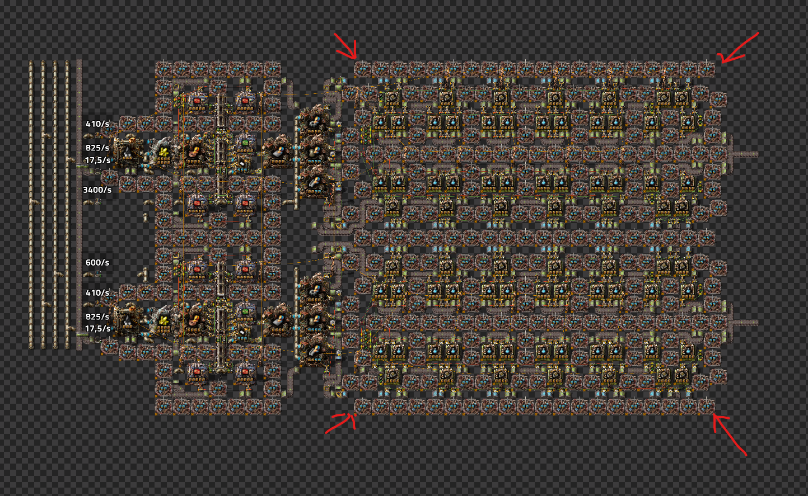

#### 28_geist
- missing molten copper pipe connection added
- missing water connection added

#### 29_geist
- missing prod modules in refinery added to not add excessive pump jacks (and for stability)

#### 34_osboz
- fixed instability on losing calcite by just extending the belt buffer on the last assemblers to 10 belts


## Save Files
- each save file consist of the same basic 
- each design is copied as a module of 8 lanes 12 times with region cloner
- total amount of science being produced per save file, unless called out as an exception below, creates at least **1_382_400** science per minute when looking at the 10 minute metrics

Below is a preview of the template map:
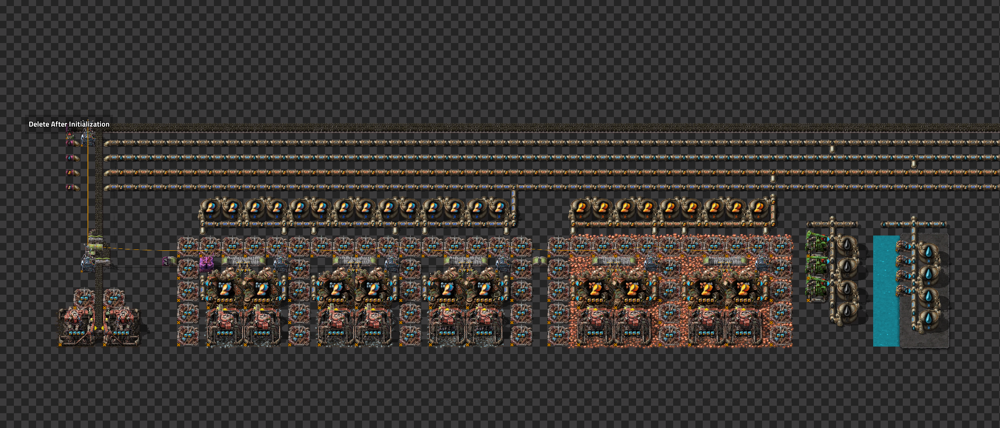

when building the save files, these are the steps performed:
  1. copy the design manually with no power on the map
     1. number of copies is 8 for 240/s, 4 for 480/s, etc.
  2. connect all inputs
  3. wait until the single coal belt saturates inputs for each copy
  4. remove infinity pipes
  5. add infinity accumulator and wait until output belts are saturated
  6. pause the game
     1. add infinity loaders to output belts
     2. copy all entities 12 times
     3. remove the original design
     4. unpause the game
     5. set game to 64x speed
     6. save

The exception to the above is if the design has multiple stages. If this is the case as noted
by the creator of the design, the steps will be performed after power is added to the map after 
step 5 but before step 6.

The only accepted runtime mod is editor extensions.

To keep the map files relatively consistent and prevent cloning problems during chunk generation, the following command is execute to reveal the width of the clone region vertically.
```

/c game.player.force.chart(game.player.surface, {{-466,477}, {-145, -4500}})

```
