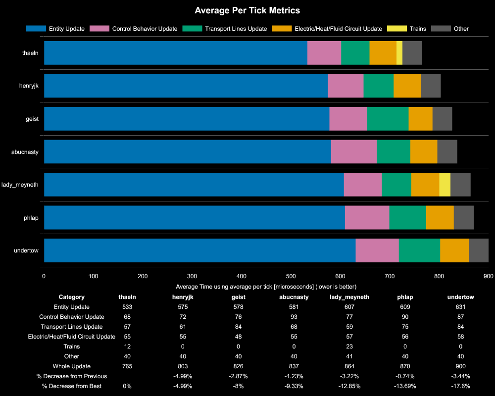
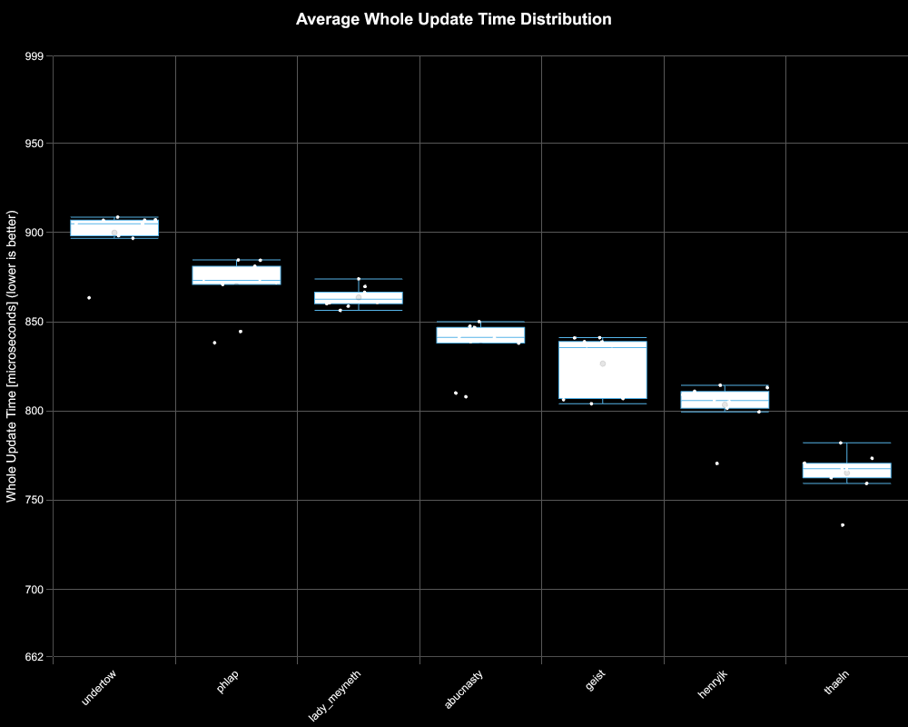

# Results for 360/s Red Circuit Production

**Platform:** windows-x86_64
**Factorio Version:** 2.0.66

## Scenario
* Each save was tested for 18000 tick(s) and 10 run(s)
* 100 copies of 320 per second red chips
* each blueprint by map name here [https://factoriobin.com/post/o7l03j](https://factoriobin.com/post/o7l03j)

## Results
| Metric            | Description                           |
| ----------------- | ------------------------------------- |
| **Mean UPS**      | Updates per second - higher is better |
| **Mean Avg (ms)** | Average frame time - lower is better  |
| **Mean Min (ms)** | Minimum frame time - lower is better  |
| **Mean Max (ms)** | Maximum frame time - lower is better  |

| Save         | Avg (ms) | Min (ms) | Max (ms) | UPS      | Execution Time (ms) | % Difference from Worst |
| ------------ | -------- | -------- | -------- | -------- | ------------------- | ----------------------- |
| undertow     | 0.902    | 0.362    | 2.368    | 1109     | 162315              | 0.00%                   |
| phlap        | 0.872    | 0.220    | 5.061    | 1147     | 156928              | 3.44%                   |
| lady_meyneth | 0.866    | 0.290    | 26.989   | 1155     | 155828              | 4.14%                   |
| abucnasty    | 0.838    | 0.197    | 4.263    | 1193     | 150855              | 7.61%                   |
| geist        | 0.829    | 0.280    | 3.523    | 1206     | 149223              | 8.79%                   |
| henryjk      | 0.806    | 0.227    | 3.332    | 1241     | 145002              | 11.94%                  |
| thaeln       | 0.767    | 0.221    | 3.247    | **1303** | 138115              | 17.52%                  |

## Reports
- [metric_correlations](metric_correlations.csv)