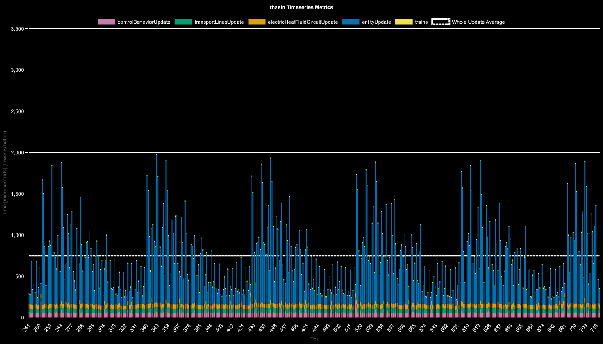
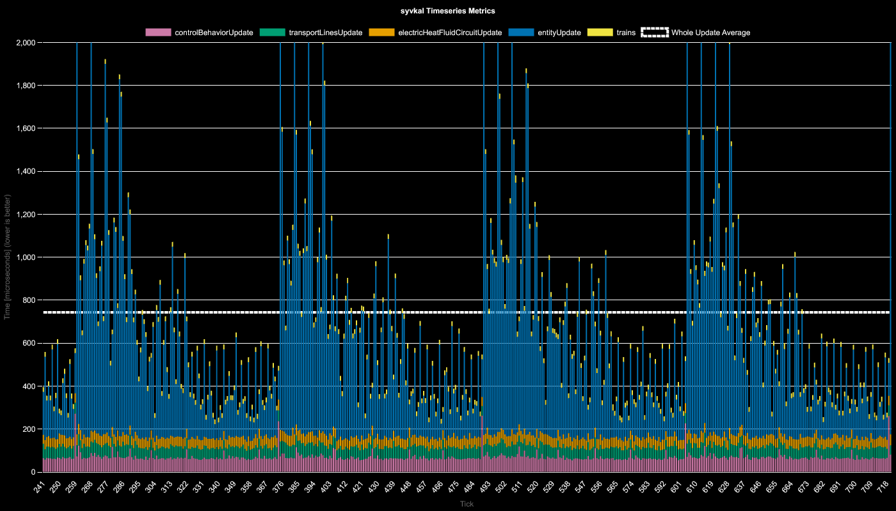
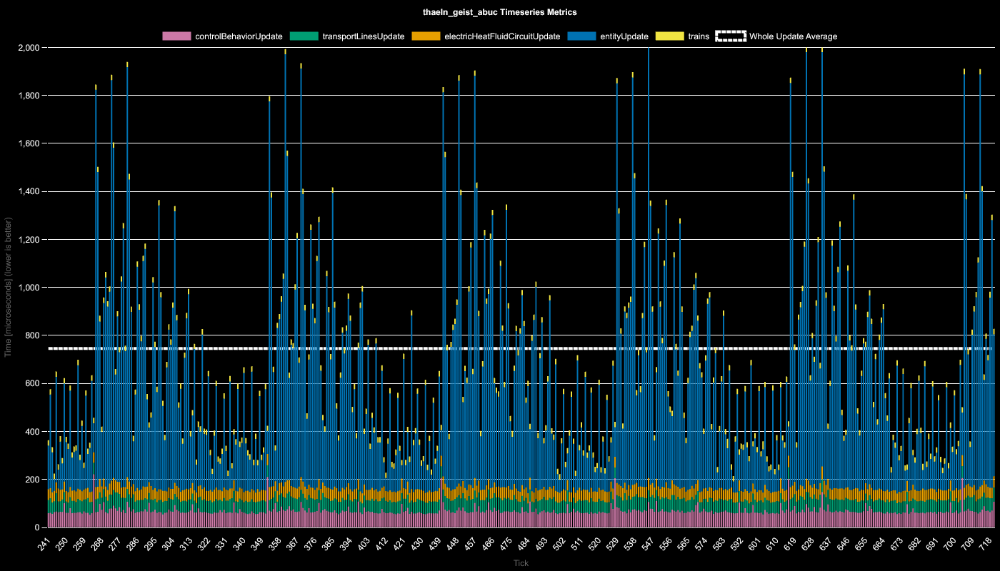
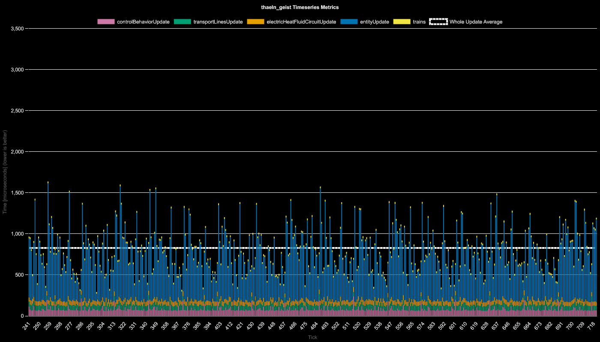

# Results for 360/s Red Circuit Production

**Platform:** windows-x86_64
**Factorio Version:** 2.0.66

## Scenario
* Each save was tested for 18000 tick(s) and 10 run(s)
* 100 copies of 320 per second red chips
* each blueprint by map name here [https://factoriobin.com/post/8nws1g](https://factoriobin.com/post/8nws1g)

## Charts Summary

## Charts Timeseries

**Thaeln 240 Ticks**

**Syvkal 240 Ticks**

**Thaeln / Geist / Abuc 240 Ticks**

**Thaeln / Geist 240 Ticks**

## Reports
- [Entity Counts CSV](entity_counts.csv)