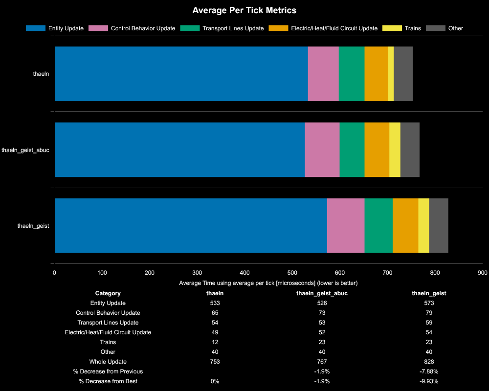
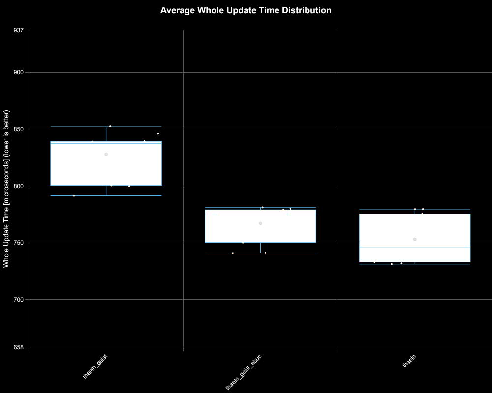

# Results for 360/s Red Circuit Production

**Platform:** windows-x86_64
**Factorio Version:** 2.0.66

## Scenario
* Each save was tested for 18000 tick(s) and 10 run(s)
* 100 copies of 320 per second red chips
* each blueprint by map name here [https://factoriobin.com/post/gdls7l](https://factoriobin.com/post/gdls7l)

## Results
| Metric            | Description                           |
| ----------------- | ------------------------------------- |
| **Mean UPS**      | Updates per second - higher is better |
| **Mean Avg (ms)** | Average frame time - lower is better  |
| **Mean Min (ms)** | Minimum frame time - lower is better  |
| **Mean Max (ms)** | Maximum frame time - lower is better  |

| Save | Avg (ms) | Min (ms) | Max (ms) | UPS | Execution Time (ms) | % Difference from Worst |
|------|----------|----------|----------|-----|---------------------| --- |
| thaeln_geist | 0.829 | 0.244 | 2.845 | 1206 | 149289 | 0.00% |
| thaeln_geist_abuc | 0.770 | 0.206 | 3.698 | 1299 | 138537 | 7.74% |
| thaeln | 0.755 | 0.209 | 3.871 | **1325** | 135882 | 9.87% |

## Reports
- [metric_correlations](metric_correlations.csv)