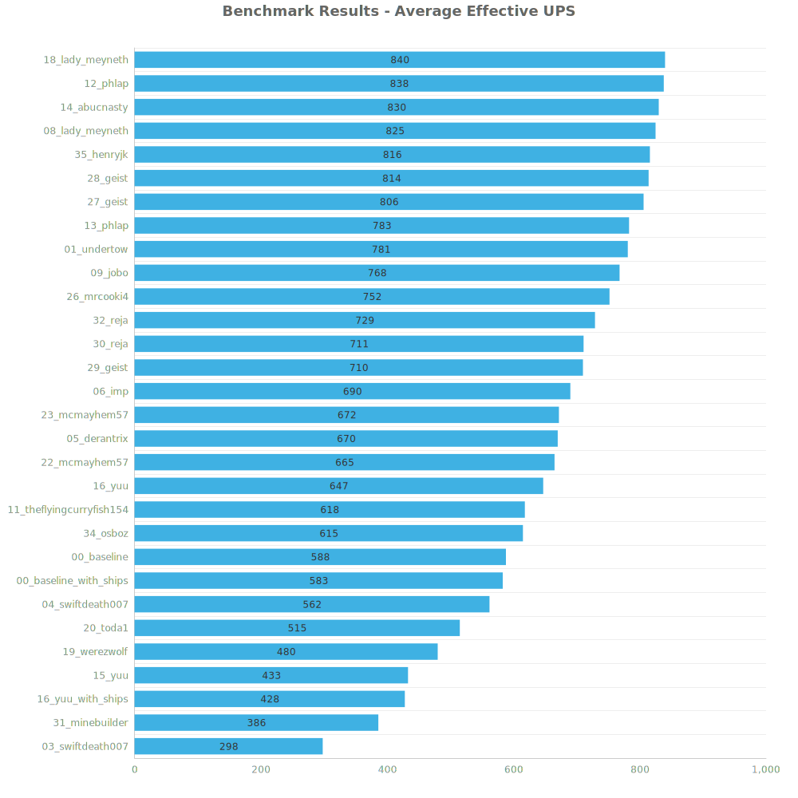
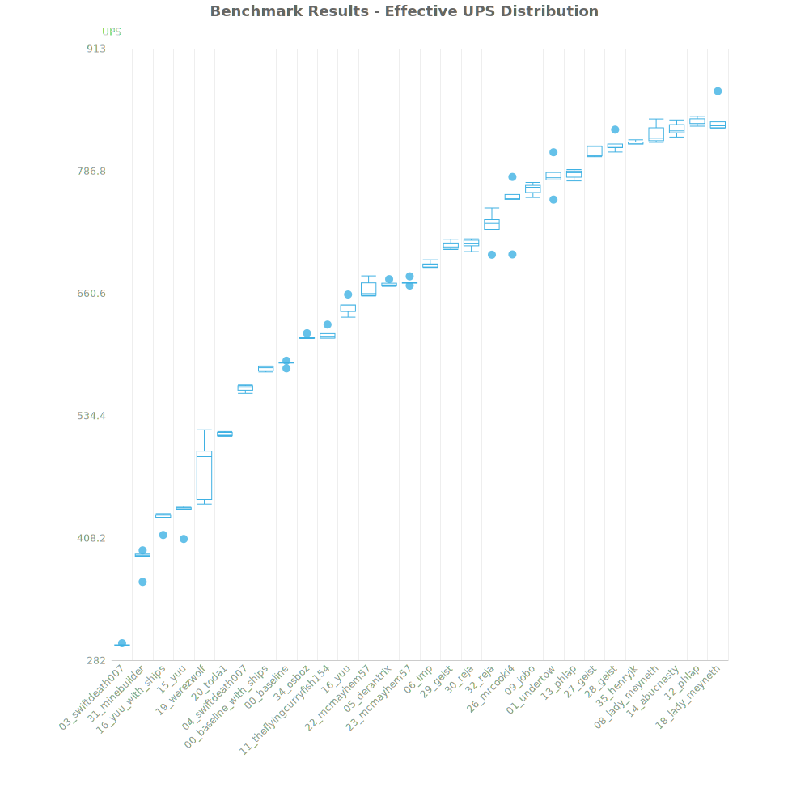
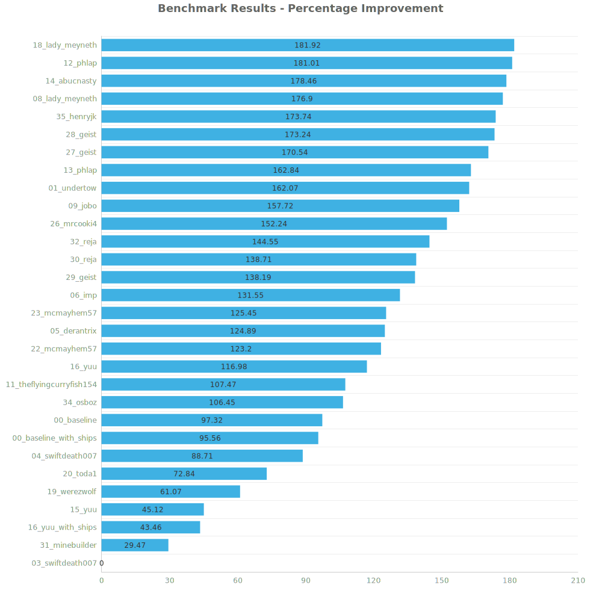

# Factorio Benchmark Results

**Platform:** windows-x86_64
**Factorio Version:** 2.0.66

## Scenario
* Each save was tested for 18000 tick(s) and 5 run(s)

## Results
| Metric            | Description                           |
| ----------------- | ------------------------------------- |
| **Mean UPS**      | Updates per second - higher is better |
| **Mean Avg (ms)** | Average frame time - lower is better  |
| **Mean Min (ms)** | Minimum frame time - lower is better  |
| **Mean Max (ms)** | Maximum frame time - lower is better  |

| Save                     | Avg (ms) | Min (ms) | Max (ms) | UPS     | Execution Time (ms) | % Difference from Worst |
| ------------------------ | -------- | -------- | -------- | ------- | ------------------- | ----------------------- |
| 03_swiftdeath007         | 3.355    | 1.550    | 26.859   | 298     | 301975              | 0.00%                   |
| 31_minebuilder           | 2.594    | 1.888    | 8.111    | 385     | 233463              | 29.47%                  |
| 16_yuu_with_ships        | 2.340    | 1.570    | 6.935    | 427     | 210577              | 43.46%                  |
| 15_yuu                   | 2.314    | 1.287    | 7.723    | 432     | 208276              | 45.12%                  |
| 19_werezwolf             | 2.091    | 1.294    | 19.536   | 480     | 188206              | 61.07%                  |
| 20_toda1                 | 1.941    | 0.915    | 12.738   | 515     | 174715              | 72.84%                  |
| 04_swiftdeath007         | 1.778    | 0.827    | 7.925    | 562     | 160029              | 88.71%                  |
| 00_baseline_with_ships   | 1.716    | 1.056    | 5.026    | 582     | 154417              | 95.56%                  |
| 00_baseline              | 1.701    | 1.057    | 5.663    | 588     | 153043              | 97.32%                  |
| 34_osboz                 | 1.625    | 1.129    | 4.245    | 615     | 146271              | 106.45%                 |
| 11_theflyingcurryfish154 | 1.617    | 1.004    | 7.102    | 618     | 145561              | 107.47%                 |
| 16_yuu                   | 1.547    | 0.822    | 5.702    | 646     | 139187              | 116.98%                 |
| 22_mcmayhem57            | 1.504    | 0.878    | 6.882    | 665     | 135313              | 123.20%                 |
| 05_derantrix             | 1.492    | 0.748    | 6.066    | 670     | 134276              | 124.89%                 |
| 23_mcmayhem57            | 1.488    | 0.804    | 4.922    | 671     | 133947              | 125.45%                 |
| 06_imp                   | 1.449    | 0.673    | 5.969    | 690     | 130415              | 131.55%                 |
| 29_geist                 | 1.409    | 0.675    | 5.776    | 709     | 126781              | 138.19%                 |
| 30_reja                  | 1.406    | 0.628    | 6.087    | 711     | 126509              | 138.71%                 |
| 32_reja                  | 1.373    | 0.536    | 5.492    | 728     | 123541              | 144.55%                 |
| 26_mrcooki4              | 1.332    | 0.761    | 4.722    | 751     | 119879              | 152.24%                 |
| 09_jobo                  | 1.302    | 0.590    | 6.572    | 768     | 117177              | 157.72%                 |
| 01_undertow              | 1.281    | 0.825    | 4.896    | 781     | 115271              | 162.07%                 |
| 13_phlap                 | 1.277    | 0.618    | 6.204    | 783     | 114892              | 162.84%                 |
| 27_geist                 | 1.240    | 0.652    | 5.524    | 806     | 111622              | 170.54%                 |
| 28_geist                 | 1.228    | 0.562    | 5.377    | 814     | 110526              | 173.24%                 |
| 35_henryjk               | 1.226    | 0.434    | 9.708    | 815     | 110312              | 173.74%                 |
| 08_lady_meyneth          | 1.212    | 0.514    | 8.809    | 825     | 109069              | 176.90%                 |
| 14_abucnasty             | 1.205    | 0.482    | 5.373    | 829     | 108448              | 178.46%                 |
| 12_phlap                 | 1.194    | 0.617    | 5.465    | 837     | 107462              | 181.01%                 |
| 18_lady_meyneth          | 1.190    | 0.503    | 15.982   | **840** | 107142              | 181.92%                 |

Box and Whisker Plot:

## Conclusion