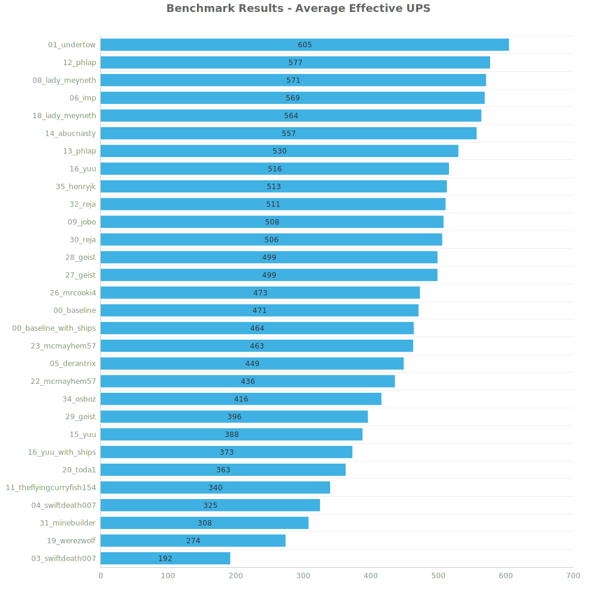
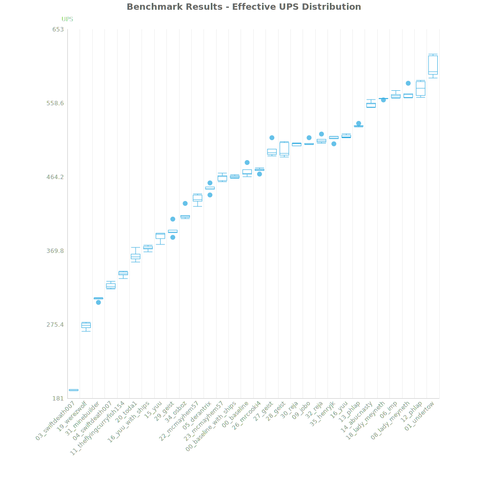
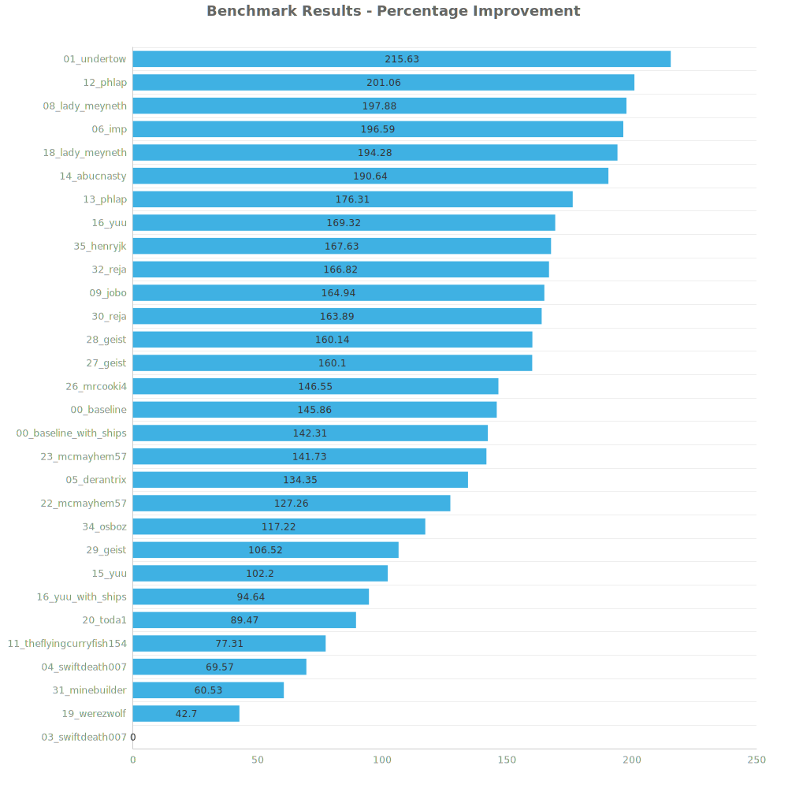

# Factorio Benchmark Results

**Platform:** windows-x86_64
**Factorio Version:** 2.0.66

## Scenario
* Each save was tested for 18000 tick(s) and 5 run(s)

## Results
| Metric | Description |
| ----------------- | ------------------------------------- |
| **Mean UPS** | Updates per second - higher is better |
| **Mean Avg (ms)** | Average frame time - lower is better |
| **Mean Min (ms)** | Minimum frame time - lower is better |
| **Mean Max (ms)** | Maximum frame time - lower is better |

| Save | Avg (ms) | Min (ms) | Max (ms) | UPS | Execution Time (ms) | % Difference from Worst |
|------|----------|----------|----------|-----|---------------------| --- |
| 03_swiftdeath007 | 5.217 | 2.997 | 32.129 | 191 | 469526 | 0.00% |
| 19_werezwolf | 3.657 | 2.679 | 10.918 | 273 | 329092 | 42.70% |
| 31_minebuilder | 3.250 | 2.419 | 12.706 | 307 | 292491 | 60.53% |
| 04_swiftdeath007 | 3.077 | 1.789 | 11.153 | 325 | 276922 | 69.57% |
| 11_theflyingcurryfish154 | 2.942 | 2.069 | 9.144 | 339 | 264828 | 77.31% |
| 20_toda1 | 2.754 | 1.539 | 18.897 | 363 | 247887 | 89.47% |
| 16_yuu_with_ships | 2.680 | 1.870 | 8.252 | 373 | 241239 | 94.64% |
| 15_yuu | 2.581 | 1.553 | 7.702 | 387 | 232250 | 102.20% |
| 29_geist | 2.527 | 1.446 | 8.845 | 395 | 227434 | 106.52% |
| 34_osboz | 2.402 | 1.821 | 6.236 | 416 | 216208 | 117.22% |
| 22_mcmayhem57 | 2.296 | 1.533 | 9.256 | 435 | 206637 | 127.26% |
| 05_derantrix | 2.227 | 1.323 | 7.312 | 449 | 200375 | 134.35% |
| 23_mcmayhem57 | 2.158 | 1.358 | 8.717 | 463 | 194247 | 141.73% |
| 00_baseline_with_ships | 2.153 | 1.411 | 10.205 | 464 | 193768 | 142.31% |
| 00_baseline | 2.122 | 1.409 | 6.810 | 471 | 191002 | 145.86% |
| 26_mrcooki4 | 2.116 | 1.400 | 6.484 | 472 | 190439 | 146.55% |
| 27_geist | 2.006 | 1.220 | 8.177 | 498 | 180567 | 160.10% |
| 28_geist | 2.006 | 1.157 | 7.758 | 498 | 180537 | 160.14% |
| 30_reja | 1.977 | 1.034 | 7.019 | 505 | 177924 | 163.89% |
| 09_jobo | 1.969 | 1.102 | 8.341 | 507 | 177223 | 164.94% |
| 32_reja | 1.955 | 0.964 | 7.793 | 511 | 175976 | 166.82% |
| 35_henryjk | 1.949 | 0.998 | 13.361 | 513 | 175443 | 167.63% |
| 16_yuu | 1.937 | 1.168 | 7.133 | 516 | 174335 | 169.32% |
| 13_phlap | 1.888 | 1.106 | 8.013 | 529 | 169926 | 176.31% |
| 14_abucnasty | 1.795 | 0.926 | 8.681 | 557 | 161551 | 190.64% |
| 18_lady_meyneth | 1.773 | 1.009 | 17.352 | 564 | 159548 | 194.28% |
| 06_imp | 1.759 | 0.936 | 6.003 | 568 | 158313 | 196.59% |
| 08_lady_meyneth | 1.752 | 1.015 | 10.632 | 570 | 157643 | 197.88% |
| 12_phlap | 1.733 | 1.088 | 6.190 | 577 | 155991 | 201.06% |
| 01_undertow | 1.654 | 1.135 | 5.983 | **605** | 148821 | 215.63% |

Box and Whisker Plot:

## Conclusion