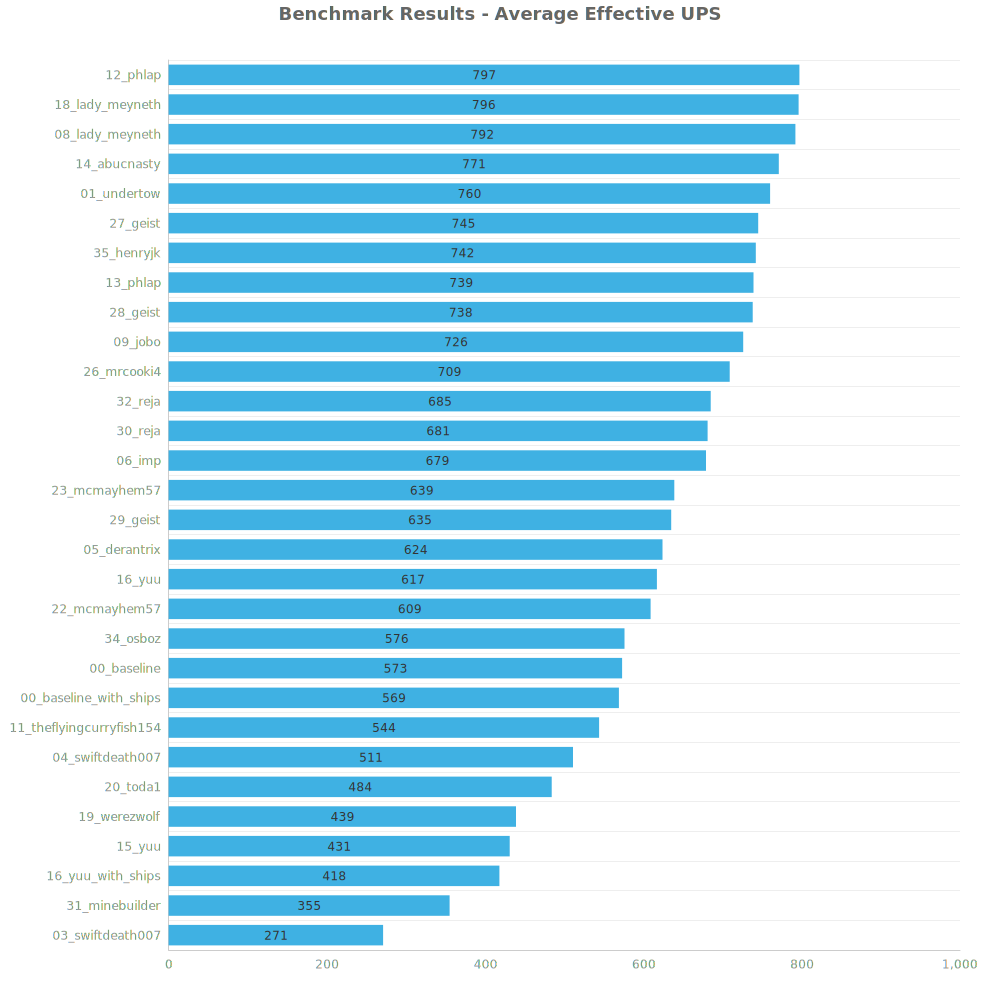
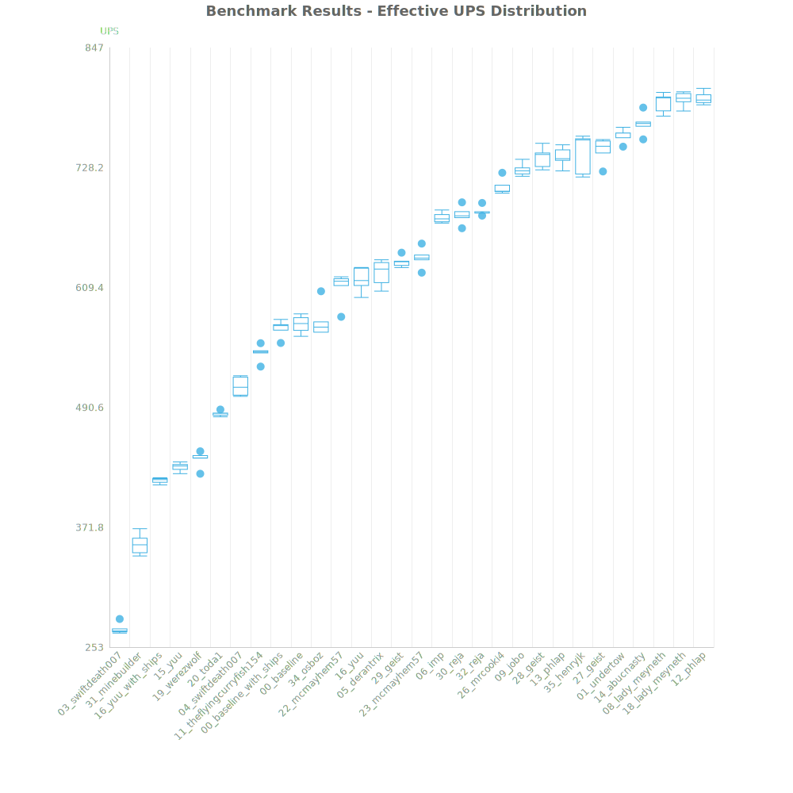
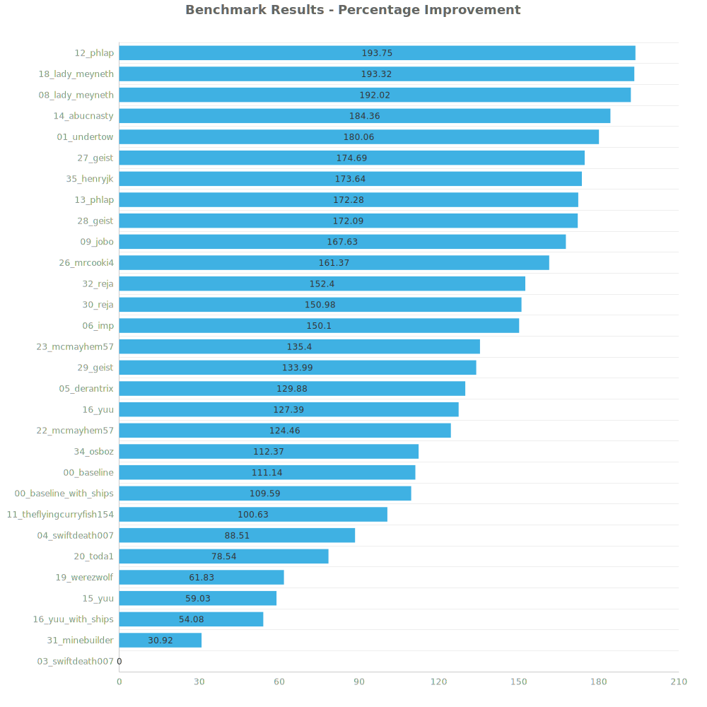

# Factorio Benchmark Results

**Platform:** windows-x86_64
**Factorio Version:** 2.0.66

## Scenario
* Each save was tested for 18000 tick(s) and 5 run(s)

## Results
| Metric | Description |
| ----------------- | ------------------------------------- |
| **Mean UPS** | Updates per second - higher is better |
| **Mean Avg (ms)** | Average frame time - lower is better |
| **Mean Min (ms)** | Minimum frame time - lower is better |
| **Mean Max (ms)** | Maximum frame time - lower is better |

| Save | Avg (ms) | Min (ms) | Max (ms) | UPS | Execution Time (ms) | % Difference from Worst |
|------|----------|----------|----------|-----|---------------------| --- |
| 03_swiftdeath007 | 3.687 | 1.778 | 25.403 | 271 | 331837 | 0.00% |
| 31_minebuilder | 2.817 | 2.037 | 9.340 | 355 | 253569 | 30.92% |
| 16_yuu_with_ships | 2.392 | 1.592 | 8.834 | 418 | 215304 | 54.08% |
| 15_yuu | 2.318 | 1.278 | 6.921 | 431 | 208607 | 59.03% |
| 19_werezwolf | 2.278 | 1.492 | 6.780 | 439 | 205054 | 61.83% |
| 20_toda1 | 2.064 | 0.971 | 17.929 | 484 | 185804 | 78.54% |
| 04_swiftdeath007 | 1.956 | 0.919 | 8.605 | 511 | 176023 | 88.51% |
| 11_theflyingcurryfish154 | 1.837 | 1.151 | 6.733 | 544 | 165375 | 100.63% |
| 00_baseline_with_ships | 1.759 | 1.065 | 5.034 | 568 | 158305 | 109.59% |
| 00_baseline | 1.746 | 1.079 | 5.958 | 572 | 157142 | 111.14% |
| 34_osboz | 1.737 | 1.190 | 3.598 | 576 | 156305 | 112.37% |
| 22_mcmayhem57 | 1.643 | 0.947 | 7.158 | 608 | 147880 | 124.46% |
| 16_yuu | 1.621 | 0.859 | 6.474 | 616 | 145930 | 127.39% |
| 05_derantrix | 1.604 | 0.795 | 6.449 | 623 | 144358 | 129.88% |
| 29_geist | 1.575 | 0.784 | 5.449 | 634 | 141777 | 133.99% |
| 23_mcmayhem57 | 1.566 | 0.839 | 5.404 | 638 | 140951 | 135.40% |
| 06_imp | 1.474 | 0.670 | 5.326 | 678 | 132646 | 150.10% |
| 30_reja | 1.469 | 0.687 | 5.689 | 680 | 132191 | 150.98% |
| 32_reja | 1.460 | 0.570 | 5.905 | 684 | 131436 | 152.40% |
| 26_mrcooki4 | 1.411 | 0.856 | 4.321 | 709 | 126931 | 161.37% |
| 09_jobo | 1.377 | 0.621 | 7.707 | 726 | 123958 | 167.63% |
| 28_geist | 1.355 | 0.624 | 5.596 | 738 | 121940 | 172.09% |
| 13_phlap | 1.354 | 0.663 | 5.491 | 738 | 121854 | 172.28% |
| 35_henryjk | 1.348 | 0.500 | 11.738 | 742 | 121299 | 173.64% |
| 27_geist | 1.342 | 0.700 | 5.873 | 745 | 120794 | 174.69% |
| 01_undertow | 1.316 | 0.840 | 4.202 | 759 | 118457 | 180.06% |
| 14_abucnasty | 1.296 | 0.524 | 5.171 | 771 | 116677 | 184.36% |
| 08_lady_meyneth | 1.262 | 0.541 | 10.831 | 792 | 113614 | 192.02% |
| 18_lady_meyneth | 1.257 | 0.554 | 16.701 | 795 | 113104 | 193.32% |
| 12_phlap | 1.255 | 0.633 | 5.033 | **796** | 112935 | 193.75% |

Box and Whisker Plot:

## Conclusion