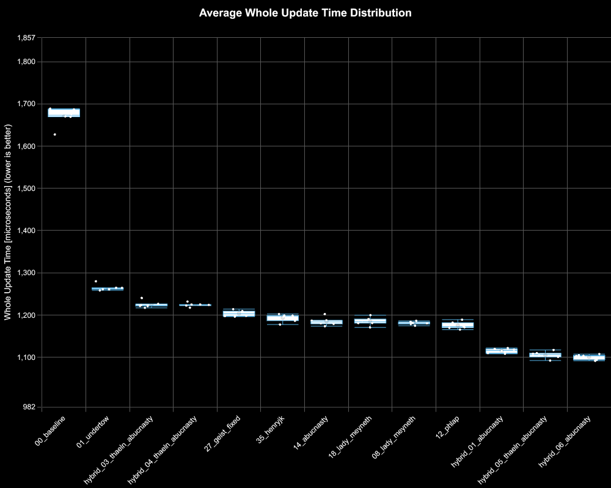
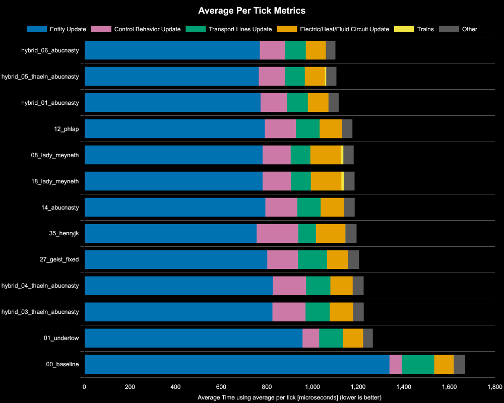
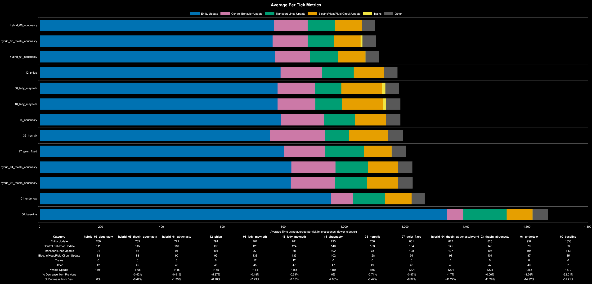

# Factorio Benchmark Results

**Platform:** windows-x86_64
**Factorio Version:** 2.0.66

## Scenario
* Each save was tested for 72000 tick(s) and 6 run(s)

## Results
| Metric            | Description                           |
| ----------------- | ------------------------------------- |
| **Mean UPS**      | Updates per second - higher is better |
| **Mean Avg (ms)** | Average frame time - lower is better  |
| **Mean Min (ms)** | Minimum frame time - lower is better  |
| **Mean Max (ms)** | Maximum frame time - lower is better  |

| Save                       | Avg (ms) | Min (ms) | Max (ms) | UPS | Execution Time (ms) |
| -------------------------- | -------- | -------- | -------- | --- | ------------------- |
| 00_baseline                | 1.672    | 0.988    | 5.345    | 598 | 722277              |
| 01_undertow                | 1.267    | 0.820    | 3.925    | 789 | 547201              |
| hybrid_03_thaeln_abucnasty | 1.227    | 0.652    | 6.568    | 814 | 530129              |
| hybrid_04_thaeln_abucnasty | 1.226    | 0.645    | 5.149    | 815 | 529561              |
| 27_geist_fixed             | 1.206    | 0.599    | 6.468    | 829 | 520887              |
| 35_henryjk                 | 1.196    | 0.409    | 9.753    | 836 | 516599              |
| 14_abucnasty               | 1.187    | 0.481    | 5.874    | 842 | 512707              |
| 18_lady_meyneth            | 1.187    | 0.507    | 21.252   | 842 | 512752              |
| 08_lady_meyneth            | 1.183    | 0.490    | 9.786    | 845 | 510917              |
| 12_phlap                   | 1.177    | 0.582    | 6.274    | 849 | 508584              |
| hybrid_01_abucnasty        | 1.117    | 0.375    | 7.378    | 895 | 482599              |
| hybrid_05_thaeln_abucnasty | 1.108    | 0.415    | 6.139    | 902 | 478542              |
| hybrid_06_abucnasty        | 1.102    | 0.399    | 4.807    | 907 | 476209              |

