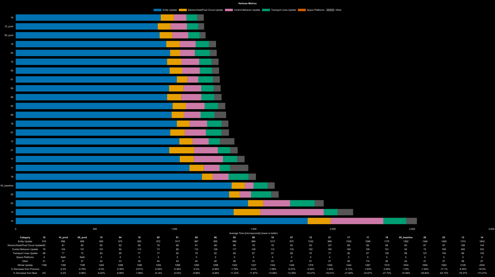

# 2025 Q1 Nauvis Science Competition: Logistic Science

## Table of Contents
- [2025 Q1 Nauvis Science Competition: Logistic Science](#2025-q1-nauvis-science-competition-logistic-science)
  - [Table of Contents](#table-of-contents)
  - [Logistic Science Entries](#logistic-science-entries)
    - [Competition Entries](#competition-entries)
    - [Thoughts from Competition Entry Participants](#thoughts-from-competition-entry-participants)
      - [Design 02 and 03](#design-02-and-03)
      - [Design 04](#design-04)
      - [Design 06 and 07](#design-06-and-07)
      - [Design 09 and 10](#design-09-and-10)
      - [Design 15](#design-15)
      - [Design 16](#design-16)
      - [Design 17](#design-17)
  - [Test Maps](#test-maps)
  - [Results](#results)
  - [Learnings](#learnings)
    - [Double Q4 Stack Inserters vs Double Q5 Stack Inserters](#double-q4-stack-inserters-vs-double-q5-stack-inserters)
    - [Preloading Assembly Machines to Bypass Desync Issues](#preloading-assembly-machines-to-bypass-desync-issues)

## Logistic Science Entries
### Competition Entries

| Science Type      | Author        | Design Index | Science Per Second | Design Tags                                                            | Blueprint                                                               | Save File                                             |
| ----------------- | ------------- | ------------ | ------------------ | ---------------------------------------------------------------------- | ----------------------------------------------------------------------- | ----------------------------------------------------- |
| Logistics Science | abucnasty     | 00_baseline  | 240/s              |                                                                        | [green_design_00_baseline.txt](blueprints/green_design_00_baseline.txt) | [design_00_baseline.zip](maps/design_00_baseline.zip) |
| Logistics Science | lady_meyneth  | 01           | 480/s              | Direct Insertion, Molten Fluid Bus, Requires backpressure at all times | [green_design_01.txt](blueprints/green_design_01.txt)                   | [design_01.zip](maps/design_01.zip)                   |
| Logistics Science | lady_meyneth  | 02           | 480/s              | Direct Insertion, Molten Fluid Bus, Requires backpressure at all times | [green_design_02.txt](blueprints/green_design_02.txt)                   | [design_02.zip](maps/design_02.zip)                   |
| Logistics Science | swiftdeath007 | 03           | 240/s              | Direct Insertion, Molten Fluid Bus                                     | [green_design_03.txt](blueprints/green_design_03.txt)                   | [design_03.zip](maps/design_03.zip)                   |
| Logistics Science | Geist         | 04           | 480/s              | Molten Fluid Bus, Requires backpressure at all times                   | [green_design_04.txt](blueprints/green_design_04.txt)                   | [design_04.zip](maps/design_04.zip)                   |
| Logistics Science | Geist         | 05           | 480/s              | Direct Insertion, Molten Fluid Bus                                     | [green_design_05.txt](blueprints/green_design_05.txt)                   | [design_05.zip](maps/design_05.zip)                   |
| Logistics Science | MCMayhem57    | 06           | 240/s              | Direct Insertion, Molten Fluid Bus                                     | [green_design_06.txt](blueprints/green_design_06.txt)                   | [design_06.zip](maps/design_06.zip)                   |
| Logistics Science | MCMayhem57    | 07           | 240/s              | Direct Insertion, Molten Fluid Bus                                     | [green_design_07.txt](blueprints/green_design_07.txt)                   | [design_07.zip](maps/design_07.zip)                   |
| Logistics Science | abucnasty     | 08           | 480/s              | Molten Fluid Bus, Wagon Tech                                           | [green_design_08.txt](blueprints/green_design_08.txt)                   | [design_08.zip](maps/design_08.zip)                   |
| Logistics Science | Syvkal        | 09           | 240/s              | Direct Insertion, Molten Fluid Bus                                     | [green_design_09.txt](blueprints/green_design_09.txt)                   | [design_09.zip](maps/design_09.zip)                   |
| Logistics Science | Syvkal        | 10           | 240/s              | Direct Insertion, Molten Fluid Bus, Latching Production                | [green_design_10.txt](blueprints/green_design_10.txt)                   | [design_10.zip](maps/design_10.zip)                   |
| Logistics Science | abucnasty     | 11           | 480/s              | Molten Fluid Bus, Wagon Tech                                           | [green_design_11.txt](blueprints/green_design_11.txt)                   | [design_11.zip](maps/design_11.zip)                   |
| Logistics Science | abucnasty     | 12           | 480/s              | Direct Insertion, Molten Fluid Bus, Wagon Tech                         | [green_design_12.txt](blueprints/green_design_12.txt)                   | [design_12.zip](maps/design_12.zip)                   |
| Logistics Science | Berg          | 13           | 480/s              | Direct Insertion, Recipe Switching, Molten Fluid Bus                   | [green_design_13.txt](blueprints/green_design_13.txt)                   | [design_13.zip](maps/design_13.zip)                   |
| Logistics Science | Tenebris      | 14           | 240/s              | Direct Insertion, Metal Ore Inputs, Electric Furnace                   | [green_design_14.txt](blueprints/green_design_14.txt)                   | [design_14.zip](maps/design_14.zip)                   |
| Logistics Science | phlap         | 15           | 240/s              | Molten Fluid Bus, Belt Only DI                                         | [green_design_15.txt](blueprints/green_design_15.txt)                   | [design_15.zip](maps/design_15.zip)                   |
| Logistics Science | The End       | 16           | 480/s              | Molten Fluid Bus, Partial Direct Insertion                             | [green_design_16.txt](blueprints/green_design_16.txt)                   | [design_16.zip](maps/design_16.zip)                   |
| Logistics Science | Cubes         | 17           | 240/s              | Molten Fluid Bus                                                       | [green_design_17.txt](blueprints/green_design_17.txt)                   | [design_17.zip](maps/design_17.zip)                   |
| Logistics Science | reja          | 18           | 960/s              | Molten Fluid Bus, belt based                                           | [green_design_18.txt](blueprints/green_design_18.txt)                   | [design_18.zip](maps/design_18.zip)                   |
| Logistics Science | Jobo          | 19           | 240/s              | Molten Fluid Bus, Read hands & filtering                               | [green_design_19.txt](blueprints/green_design_19.txt)                   | [design_19.zip](maps/design_19.zip)                   |
| Logistics Science | Jobo          | 20           | 960/s              | Molten Fluid Bus                                                       | [green_design_20.txt](blueprints/green_design_20.txt)                   | [design_20.zip](maps/design_20.zip)                   |
| Logistics Science | Cubes         | 21           | 240/s              | Direct Insertion, Molten Fluid Bus                                     | [green_design_21.txt](blueprints/green_design_21.txt)                   | [design_21.zip](maps/design_21.zip)                   |

All Designs in one blueprint book: https://factoriobin.com/post/gwr7my

### Thoughts from Competition Entry Participants

From abucnasty while testing:
- design 06 and design 07 are created to prove that more beacons doesn't necessarily mean more UPS
- design 03 has 4 iron ore melting foundries instead of 3 since it uses efficiency modules instead of productivity modules in foundries and requires more molten metals
- design 03: 25.2 GW / 192
- design 09: all speed beacons in iron and gear foundries for belts, no prod
- design 10: all speed beacons in iron and gear foundries for belts, no prod
- design 11: abuc what were you thinking... this is insane to chain this many cargo wagons
- design 13: on startup has half stacked lanes occasionally but goes away shortly after cold start
- design 15: on startup has half stacked lanes occasionally but goes away shortly after cold start
- design 17: inserter to belt controlled by reading contents of belt infront of it
- design 18: issues when flipped
- design 21: maximalist DI

From authors on their designs:

#### Design 02 and 03

From lady_meyneth:
> Design 02 (2step) needs to be running for a while (10-15mins) in order for all the belts to fully saturate
> Design 03 Uses direct insertion and it's probably significantly worse, but I did it earlier so I'm adding it for completeness, feel free to not test it if it performs badly.

#### Design 04

From Geist:
> My first submission and creation for 240 science/s.
> It takes roughly 1-2 min before it makes the full 240/s then afterwards can run the full 240/s for as long as you've the resources to do so.
> I've tried to compact the design as much as possible and as few combinators as possible. 
> I had to put in a random combinator to monitor inserters and once it sees inserters
> it'll let the belts move forward as I couldn't figure out how to stop the assembler inserting belts before the inserters were ready.
> So the combinator ensures that both items are inserted at around the same time. Interesting is that I use fast inserters and an electromagnetic plant in the design. 
> I don't expect my design to win, but I am excited to see the end result. thank you.

#### Design 06 and 07

From MCMayhem57:

> There are two blueprints: V2 and V3. 
My V1 had 8 beacons per assembler but had redundant gear/plate foundries, and V2 was compacted to share these foundries across belt foundries, which made it more UPS 
efficient than V1. V2 is faster than V3 from my testing, but it has 7 beacons vs V3's 8. I included V3 to prove a point that more beacons is not necessarily better, 
especially when it doesn't get you anything (V3 has the same number of assemblers). The V3 design came about after Geist looked at my V2 design and figured out a way 
to get the 8th beacon in it. We both figured out ways to reroute the pipes and refine the design, but we went down different paths after that (he went for a 480/s 
build and eventually reworked it into something that looks like Syvkal's layout, and I tested his design, and it beats my V2), and I went to work on V3. 
> 
> I can't exactly change my designs without effectively copying other people's work, so I am including these designs as-is, but it was really enjoyable 
collaborating with other people on the discord to just figure out which design wins.  What seems to have been the main driver of improvement in Geist's 
newer designs is that increasing the beacon count allows you to hit a breakpoint of reducing the number of assemblers at 480/s (it can at 240 as well, admittedly), 
and even though that design has more foundries, reducing the number of assemblers --which are running more often-- matters more to UPS.

#### Design 09 and 10

From Syvkal:
> 2 variations included. Wanted to test if there's any noticeable impact when using a latch for high speed recipes and some minor tweaks to the production of inserters. 
Startup is faster with a cold start, but it will eventually catch-up even without one.

#### Design 15

From phlap:

> 1454.6 molten iron/s, 131.0 molten copper/s
> 
> May output non-fully stacked belts when stopping/starting, not when running normally.
> 
> Doing DI belts because I'm convinced it's better
> 
> I mainly want to test some circuitry decisions (not clocking some ingredients, set filters on output inserters etc.), although I don't know how well it'll manifest

#### Design 16

From The End:

> Requires initial setup, and some non normal/legendary parts.  Supports fully independent output consumption rates, while UPS performance is only guaranteed at about 
> 3/4 consumption of each output lane. The initial setup can be omitted by setting the output condition to 7 or clocking the inserter by filters, which both come at a 
> UPS cost.

#### Design 17

From Cubes:

> I believe there are optimisation possible for the circuits of the build (i couldnt avoid to clock every assembler individually). 
> This is arguably the design that aimed to use the least machinery possible and having the simplest most compact ingredients for the science manufacturing

## Test Maps
- Designs submitted make 1, 2, or 4 fully stacked lanes of science.
- 192 lanes of science was chosen as the target benchmark since its a multiple of 1, 2, and 4 and creates enough of a load on the system to be close to be roughly 2 ms of update time on the baseline when not running headless
- Each save file produces 2_764_800 green science per minute

## Results

- Design 10 and 09 were corrected to add productivity to their foundries.
- Best design: designs by The End (16) and Syvkal (10) in first place
  - Winners are featured on main blueprint page
- Second place: designs by phlap (15) and Geist (04)
- Third Place: designs by Geist (05), lady_meyneth (01), and MCMayhem57 (06)

## Learnings

### Double Q4 Stack Inserters vs Double Q5 Stack Inserters

It was found that running two Q4 stack inserters when filling a half belt is superior over two legendary inserters. This is because legendary stack inserters output at 80 items / second and the belt capacity can only handle 120 items per second. Epic inserters can output exactly 60 items per second so they exactly match the pace of the belt and are naturally in sync due to this. This alone shouldn't matter that much as its effectively one extra inserter waiting to unload on a belt. The working theory is this impacts performance more due to the insterters not interacting with the assembly machine at the same time, leading to more belt scans / inventory checks.

An isolated benchmark was performed to compare these two and the findingings are posted here [results_insterter_production](./results_inserter_production/results.md)

### Preloading Assembly Machines to Bypass Desync Issues
- Preloading only 4 ingredients in logistics science helps to prevent desync
- this would have a preloaded state where there is 8 science in the assembly machine
- given that stack inserters always pick up 16 items, the end state of the assembly machine can only be output blocked with 24 items
- the next cycle, the inserter will grap 16 items and the assembly machine can immediantly start crafting again
- otherwise, if the preload is not done, the assembly machine can stack to 32 items on any assembly machine, in which case the assembly machine will be desynced from the lead for 1 cycle since it can only unload 16 items in the time the lead drops the same 16 items