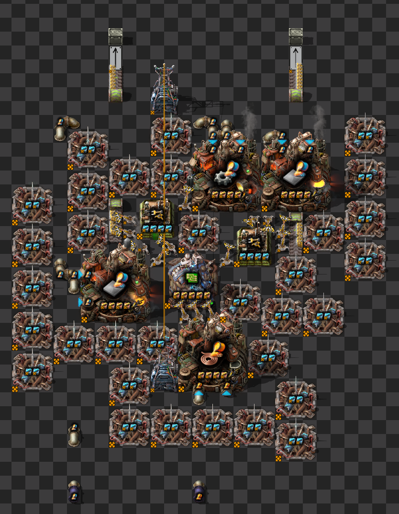
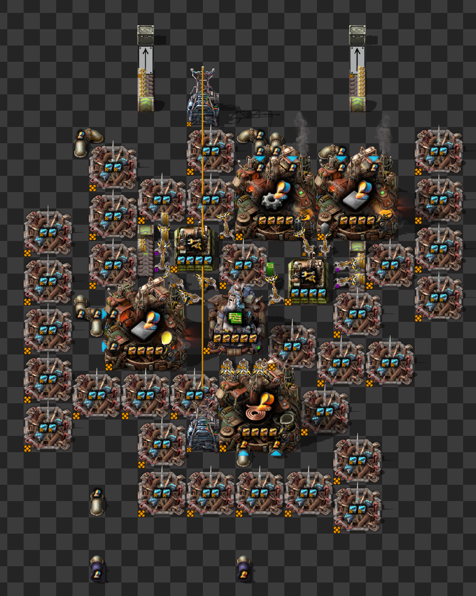
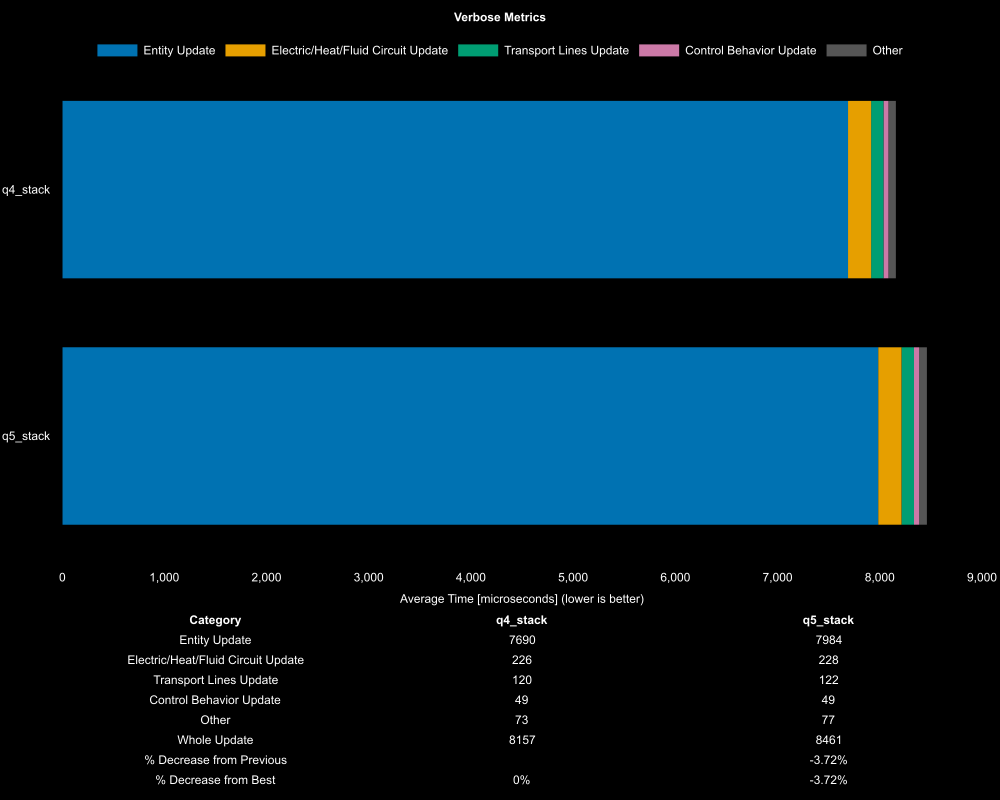
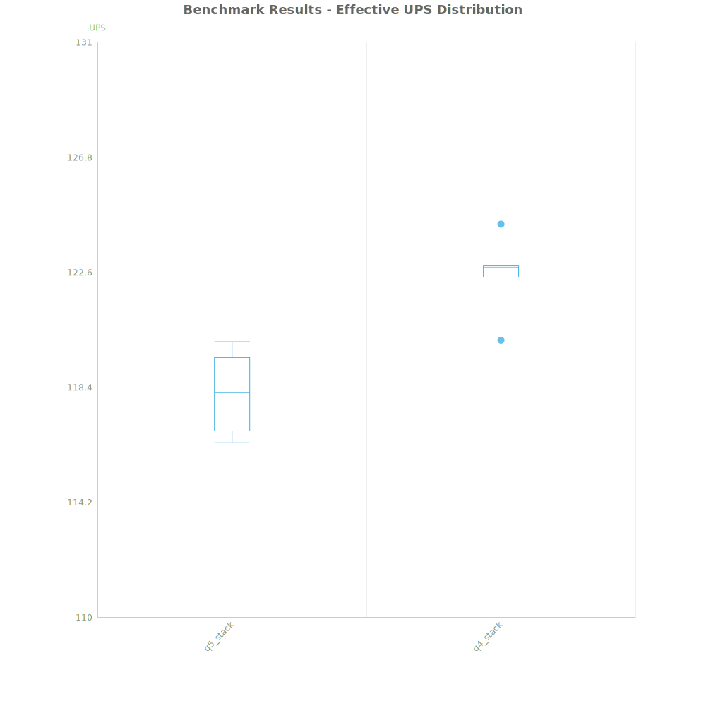

# Factorio Benchmark Results

**Platform:** windows-x86_64
**Factorio Version:** 2.0.64

## Scenario
* Each save was tested for 7200 tick(s) and 6 run(s)
* 2000 copies of each design

### q5_stack

### q4_stack

## Results
| Metric            | Description                           |
| ----------------- | ------------------------------------- |
| **Mean UPS**      | Updates per second - higher is better |
| **Mean Avg (ms)** | Average frame time - lower is better  |
| **Mean Min (ms)** | Minimum frame time - lower is better  |
| **Mean Max (ms)** | Maximum frame time - lower is better  |

| Save     | Avg (ms) | Min (ms) | Max (ms) | UPS     | Execution Time (ms) | % Difference from Worst |
| -------- | -------- | -------- | -------- | ------- | ------------------- | ----------------------- |
| q5_stack | 8.464    | 4.895    | 18.487   | 118     | 365664              | 0.00%                   |
| q4_stack | 8.163    | 4.665    | 18.846   | **122** | 352651              | 3.69%                   |

Box and Whisker Plot:

## Conclusion
- when filling half a belt, using two epic stack inserters is superior over two legendary stack inserters