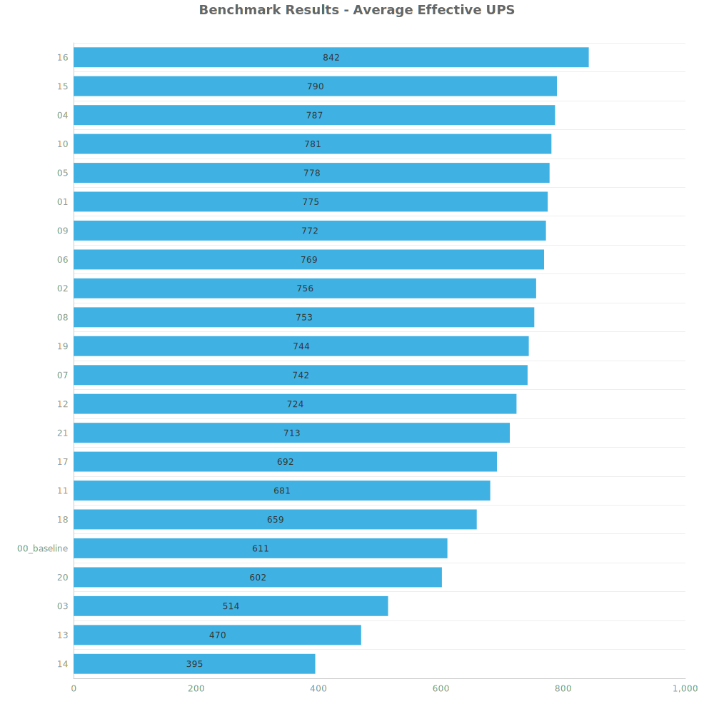
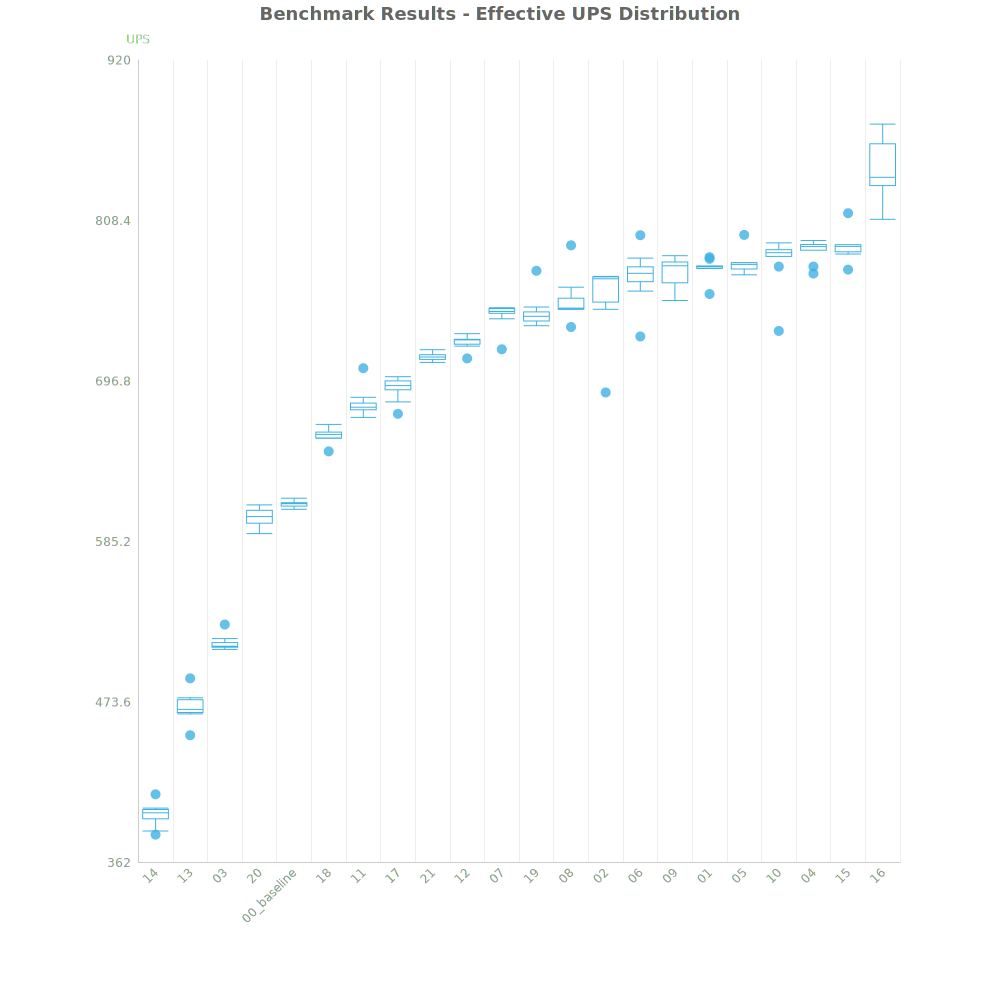
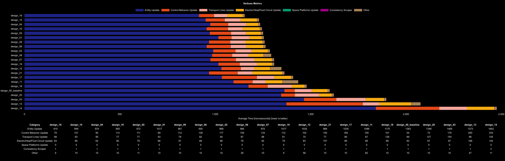

# Factorio Benchmark Results

**Platform:** windows-x86_64  
**Factorio Version:** 2.0.64  

## Scenario
* Each save was tested for 36000 tick(s) and 10 run(s)

## Results
| Metric            | Description                           |
| ----------------- | ------------------------------------- |
| **Mean UPS**      | Updates per second - higher is better |
| **Mean Avg (ms)** | Average frame time - lower is better  |
| **Mean Min (ms)** | Minimum frame time - lower is better  |
| **Mean Max (ms)** | Maximum frame time - lower is better  |

| Save        | Avg (ms) | Min (ms) | Max (ms) | UPS     | Execution Time (ms) |
| ----------- | -------- | -------- | -------- | ------- | ------------------- |
| 14          | 2.533    | 0.847    | 13.423   | 394     | 911764              |
| 13          | 2.129    | 0.568    | 9.965    | 469     | 766462              |
| 03          | 1.945    | 1.007    | 7.764    | 514     | 700067              |
| 20          | 1.661    | 0.930    | 4.420    | 602     | 597927              |
| 00_baseline | 1.636    | 0.921    | 4.975    | 611     | 589007              |
| 18          | 1.517    | 0.905    | 8.972    | 659     | 546219              |
| 11          | 1.469    | 0.656    | 6.857    | 680     | 528890              |
| 17          | 1.446    | 0.553    | 4.572    | 691     | 520520              |
| 21          | 1.402    | 0.400    | 9.840    | 713     | 504656              |
| 12          | 1.382    | 0.671    | 5.618    | 723     | 497327              |
| 07          | 1.347    | 0.427    | 7.462    | 742     | 484972              |
| 19          | 1.344    | 0.745    | 3.730    | 744     | 483671              |
| 08          | 1.329    | 0.472    | 7.350    | 752     | 478557              |
| 02          | 1.324    | 0.429    | 9.496    | 756     | 476589              |
| 06          | 1.301    | 0.400    | 9.401    | 769     | 468228              |
| 09          | 1.295    | 0.306    | 6.905    | 772     | 466171              |
| 01          | 1.290    | 0.581    | 5.080    | 775     | 464347              |
| 05          | 1.285    | 0.563    | 6.002    | 778     | 462572              |
| 10          | 1.282    | 0.319    | 6.783    | 780     | 461391              |
| 04          | 1.270    | 0.632    | 4.836    | 787     | 457250              |
| 15          | 1.265    | 0.372    | 8.162    | 790     | 455580              |
| 16          | 1.188    | 0.414    | 7.304    | **842** | 427724              |

Box and Whisker Plot:

## Conclusion