# 2025 Q1 Nauvis Science Competition: Production Science

## Production Science Entries

### Validation
All designs must be able to pass my acceptance criteria which is as follows:

All tests must reach a stable state and have fully saturated belts for 5 min after becoming stable:
1. cold start until science belt is fully saturated
2. Run until belts are backed up then release into infinity loaders
3. Remove one input and add it back
4. Cut off all inputs and add it back
5. each design must produce at 240/s continuously for 1 hour (216k ticks)

These issues happen commonly in real bases so it’s worth testing these things. It also ensures that when a 36k+ tick benchmark, they will continue to produce science throughout the
test without any hiccups.

#### Todo
- [x] Test: save file produces 960/s for 60 minutes (216k ticks) 
- [ ] Test: cold start until science belt is fully saturated
- [ ] Test: run until belts are backed up then release into infinity loaders
- [ ] Test: remove one input and add it back
- [ ] Test: cut off all inputs and add it back
- [ ] Clone: clone all designs, baseline must be at least 2ms of update time the rest will follow the same number of clones

### Designs

| Author                | Design Index             | Production Rate | Stone Map Gen Setting | Blueprint                                                               | Screenshot                                                                                                                                                          | Save File                                                         | Blueprint File Link                                                                              | Designer Notes                                                                                                                                                                                                                                                                                                                                                                                                                                                                                                                                                                                                                                                                                                                                                                                                                                                                                                                                                                                                                                                                                                                                                           |
| --------------------- | ------------------------ | --------------- | --------------------- | ----------------------------------------------------------------------- | ------------------------------------------------------------------------------------------------------------------------------------------------------------------- | ----------------------------------------------------------------- | ------------------------------------------------------------------------------------------------ | ------------------------------------------------------------------------------------------------------------------------------------------------------------------------------------------------------------------------------------------------------------------------------------------------------------------------------------------------------------------------------------------------------------------------------------------------------------------------------------------------------------------------------------------------------------------------------------------------------------------------------------------------------------------------------------------------------------------------------------------------------------------------------------------------------------------------------------------------------------------------------------------------------------------------------------------------------------------------------------------------------------------------------------------------------------------------------------------------------------------------------------------------------------------------ |
| abucnasty             | 00_baseline              | 240/s           | 100%                  | [00_baseline.txt](blueprints/00_baseline.txt)                           | <a href="design_screenshot/00_baseline.jpg">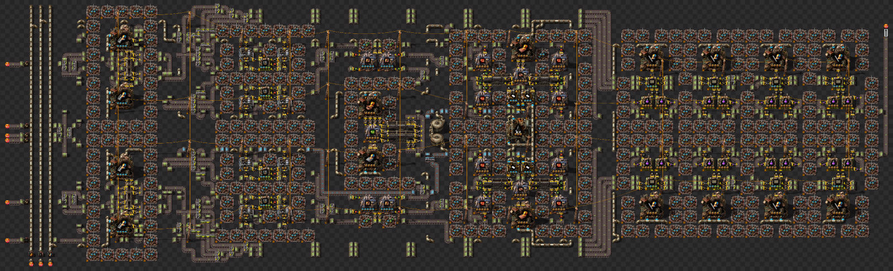</a>                                        | [00_baseline.zip](maps/00_baseline.zip)                           | [link](https://factoriobin.com/post/pix5u9)                                                      |                                                                                                                                                                                                                                                                                                                                                                                                                                                                                                                                                                                                                                                                                                                                                                                                                                                                                                                                                                                                                                                                                                                                                                          |
| Geist                 | 01_geist                 | 480/s           | 100%                  | [01_geist.txt](blueprints/01_geist.txt)                                 | <a href="design_screenshot/01_geist.jpg">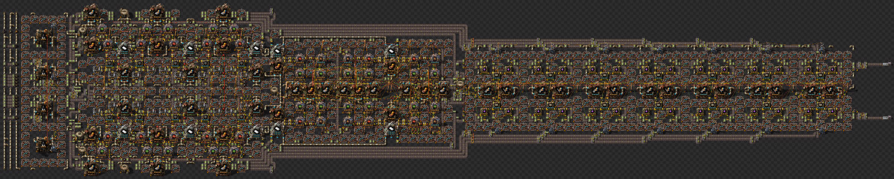</a>                                                 | [01_geist.zip](maps/01_geist.zip)                                 | [link](https://factoriobin.com/post/6ojavo)                                                      | DI Prod1s and Electric Furnaces. Goal is no belted circuits.   Mirror Tileable. Mirrored to 960/s in save file.                                                                                                                                                                                                                                                                                                                                                                                                                                                                                                                                                                                                                                                                                                                                                                                                                                                                                                                                                                                                                                                          |
| Geist                 | 02_geist                 | 480/s           | 100%                  | [02_geist.txt](blueprints/02_geist.txt)                                 | <a href="design_screenshot/02_geist.jpg">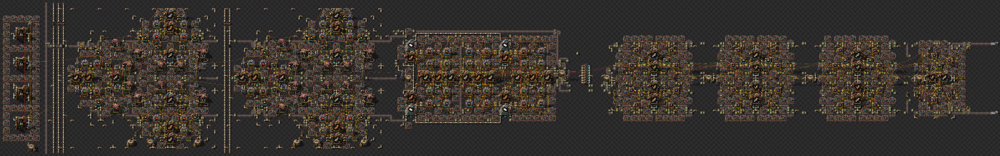</a>                                                 | [02_geist.zip](maps/02_geist.zip)                                 | [link](https://factoriobin.com/post/ppj5sn)                                                      | Fits segmented on 100% Stone Patches Coal belted Uses big miners in electric furnace production for resource efficiency, functionally the same to small miner variant                                                                                                                                                                                                                                                                                                                                                                                                                                                                                                                                                                                                                                                                                                                                                                                                                                                                                                                                                                                                    |
| Swiftdeath007         | 03_swiftdeath007         | 960/s           | 100%                  | [03_swiftdeath007.txt](blueprints/03_swiftdeath007.txt)                 | <a href="design_screenshot/03_swiftdeath007.jpg">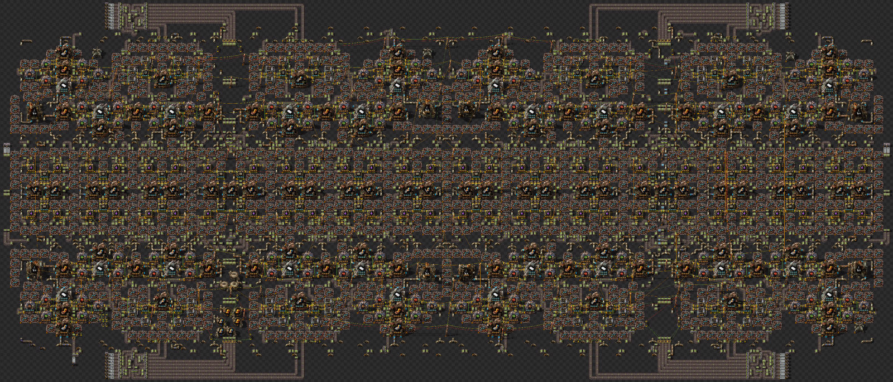</a>                         | [03_swiftdeath007.zip](maps/03_swiftdeath007.zip)                 | [link](https://factoriobin.com/post/obbcp5)                                                      | The design has monitors for all fluid and solid inputs so it can stop production of science if any input gets to low automatically. 2 stone inputs can be taken out without any issue, however once a third stone input is taken out, the module starts pulsing a signal to stop the labs and will underproduce. The entire design was built from the ground up off of making 120/s then copy/paste until it made 960/s. The module runs off of a basic 44 tick clock cycle with the signals carefully separated out so the inserters only get the signal needed to function. The module takes 3 minutes 55 seconds to fully produce science from a cold start. This took me roughly 60 hours to complete.                                                                                                                                                                                                                                                                                                                                                                                                                                                               |
| goirelandbrad         | 04_goirelandbrad         | 240/s           | 100%                  | [04_goirelandbrad.txt](blueprints/04_goirelandbrad.txt)                 | <a href="design_screenshot/04_goirelandbrad.jpg">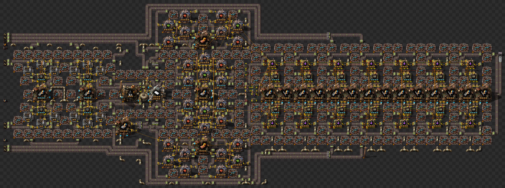</a>                         | [04_goirelandbrad.zip](maps/04_goirelandbrad.zip)                 | [link](https://factoriobin.com/post/7buo3s)                                                      | Decent amount of DI, but stone is belted. The only circuits for furnaces and prod modules are on the outputs. All insertors for purple and rails are controlled by a global clock. 12 assemblers work at 18/s and 2 at 12/s for exactly the right amount of science created. I went for dropping 12 science at a time because I could make it work... It does recover from missing inputs, but can be quite slow as the production rate of furnaces is exactly what is needed. If you block the output it recovers a lot lot quicker. Tested for 10 hours and it stayed steady. I have a latch and tank for petrol, but found that latching the foundries (and buildings in general) was worse than no control. (Could have been my bad circuits though).                                                                                                                                                                                                                                                                                                                                                                                                                |
| Flexime               | 05_flexime               | 240/s           | 100%                  | [05_flexime.txt](blueprints/05_flexime.txt)                             | <a href="design_screenshot/05_flexime.jpg">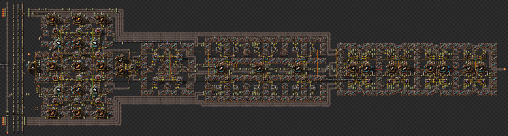</a>                                           | [05_flexime.zip](maps/05_flexime.zip)                             | [link](https://factoriobin.com/post/gcvqhb)                                                      | Was trying to keep it modular and share beacons gave up after realising copius amount of stone it needs. Uses KnightElite clock with fractions and regular clock for output.There's a bug with furnace/prod inserter that will take 1 tick longer and oscilitate between 13-14 tick to input both. Idea was to input both during craft time. Rail inserter is LLF with 2 inserters to go over a limit and have enough per crafting cycle.The red circuit is Thaeln's 360/s module.                                                                                                                                                                                                                                                                                                                                                                                                                                                                                                                                                                                                                                                                                       |
| mulain                | 06_mulain                | 240/s           | 100%                  | [06_mulain.txt](blueprints/06_mulain.txt)                               | <a href="design_screenshot/06_mulain.jpg">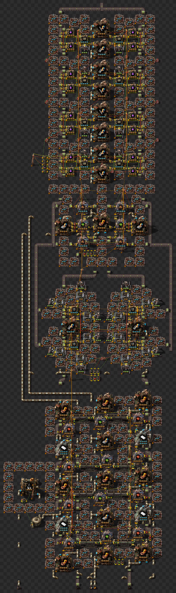</a>                                              | [06_mulain.zip](maps/06_mulain.zip)                               | [link](https://factoriobin.com/post/iyx9om)                                                      | Consists of 3 modules: 1) Red Circuits (thaeln-geist-abuc design, just added latched Petroleum Plant) 2) On-patch Electric Furnace 3) On-patch Production Science with Prod Module as header                                                                                                                                                                                                                                                                                                                                                                                                                                                                                                                                                                                                                                                                                                                                                                                                                                                                                                                                                                             |
| rydberg               | 07_rydberg               | 480/s           | 600%                  | [07_rydberg.txt](blueprints/07_rydberg.txt)                             | <a href="design_screenshot/07_rydberg.jpg">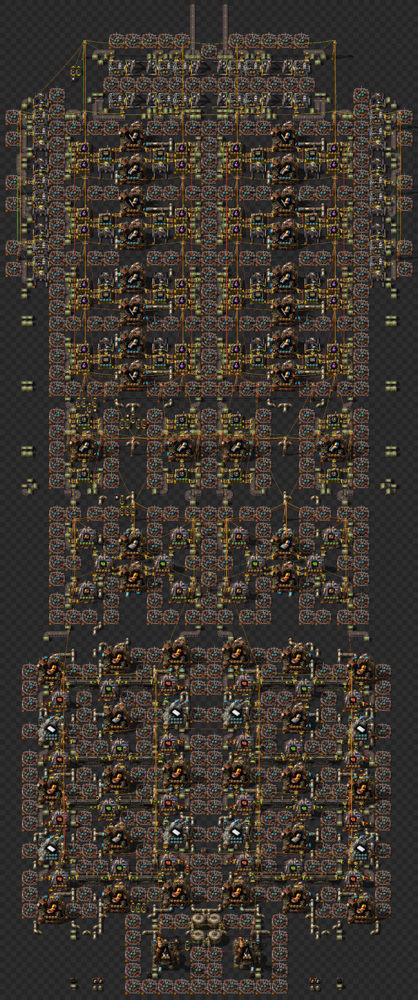</a>                                           | [07_rydberg.zip](maps/07_rydberg.zip)                             | [link](https://factoriobin.com/post/055vfm)                                                      | I hope it's ok I incorporated your advanced circuits build ;) I was to annoyed by the ratios to come up with my own so far.   Have fun testing! Looking forward for the analysis!                                                                                                                                                                                                                                                                                                                                                                                                                                                                                                                                                                                                                                                                                                                                                                                                                                                                                                                                                                                        |
| DerAntrix             | 08_derantrix             | 240/s           | 100%                  | [08_derantrix.txt](blueprints/08_derantrix.txt)                         | <a href="design_screenshot/08_derantrix.jpg">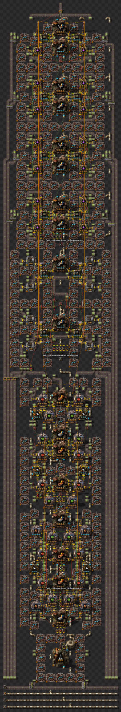</a>                                     | [08_derantrix.zip](maps/08_derantrix.zip)                         | [link](https://factoriobin.com/post/0t3zku)                                                      | This Design is a real Patchwork. Nowhere near finished, Using Clocks, LF and LLF i just created something that will work and hopefully is better than the Baseline. Im not nearly satisfied with this Design bc i didnt have the Time to finish it and i will need to work on it a lot more.                                                                                                                                                                                                                                                                                                                                                                                                                                                                                                                                                                                                                                                                                                                                                                                                                                                                             |
| Azhrei                | 09_azhrei                | 960/s           | 100%                  | [09_azhrei.txt](blueprints/09_azhrei.txt)                               | <a href="design_screenshot/09_azhrei.jpg">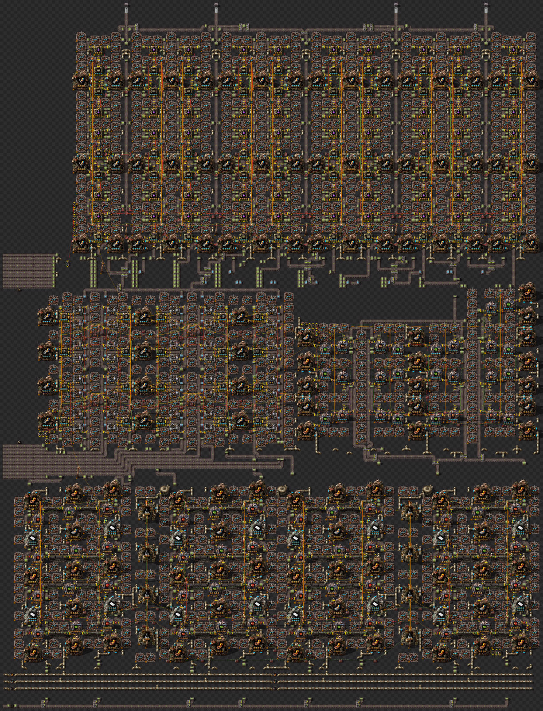</a>                                              | [09_azhrei.zip](maps/09_azhrei.zip)                               | [link](https://factoriobin.com/post/zucx48)                                                      | Producing offpatch. Uses clocks for most things with LLF for stone -> rails. Red circuit production "borrowed" from blue science competition.                                                                                                                                                                                                                                                                                                                                                                                                                                                                                                                                                                                                                                                                                                                                                                                                                                                                                                                                                                                                                            |
| Thaeln                | 10_thaeln                | 480/s           | 600%                  | [10_thaeln.txt](blueprints/10_thaeln.txt)                               | <a href="design_screenshot/10_thaeln.jpg">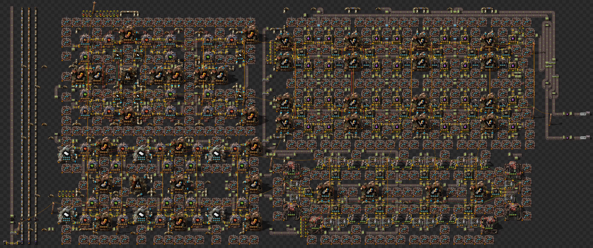</a>                                              | [10_thaeln.zip](maps/10_thaeln.zip)                               | [link](https://factoriobin.com/post/esfiy4)                                                      | For the performance test only the first blueprint is relevant ("1-patch build"). On-Site design for 600% setting. This design fits on a single 34-brush circle stone patch. The belted items are prod mods, ele furnaces and 400/s red chips for ele furnaces. The rest is all DI. For red chips I use a new full DI design that seems to perform a bit better than what we figured out for chemical.                                                                                                                                                                                                                                                                                                                                                                                                                                                                                                                                                                                                                                                                                                                                                                    |
| Thaeln                | 11_thaeln                | 480/s           | 200%                  | [11_thaeln.txt](blueprints/11_thaeln.txt)                               |                                               | [11_thaeln.zip](maps/11_thaeln.zip)                               | [link](https://factoriobin.com/post/7q1qrb)                                                      | For the performance test only the first blueprint is relevant ("all-in-one 2-patches"). The rest is some QoL stuff like seperated blueprints for each stone patch, drill only blueprints for easier placement, ... This design requires two stone patches (21-brush plus 23-brush circle). I selected the 200% map gen setting as my build meets the requirement, though I mainly designed it with 600% in mind and wanted a design that fits on below average patches for that setting. I noticed my 1-patch version doesn't fit on a lot of stone patches ingame, so I decided to make another version that requires two patches but smaller ones.                                                                                                                                                                                                                                                                                                                                                                                                                                                                                                                     |
| Schumulukulu          | 12_schumulukulu          | 960/s           | 400%                  | [12_schumulukulu.txt](blueprints/12_schumulukulu.txt)                   | <a href="design_screenshot/12_schumulukulu.jpg">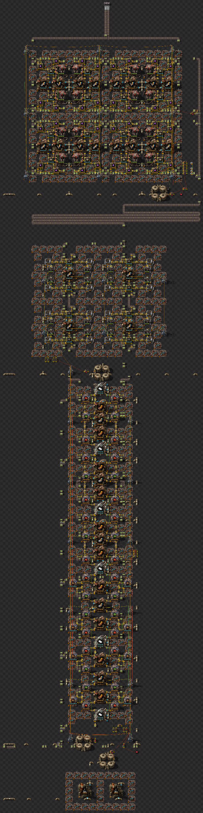</a>                            | [12_schumulukulu.zip](maps/12_schumulukulu.zip)                   | [link](https://factoriobin.com/post/las5mx)                                                      | On Patch Purple Science Build. Optimised for max Throughput per Stone Patch. Lead-Follower Clocked. 2 Stone Patches generate 2-Express-Lanes of Science (480).                                                                                                                                                                                                                                                                                                                                                                                                                                                                                                                                                                                                                                                                                                                                                                                                                                                                                                                                                                                                           |
| Yuu                   | 13_yuu                   | 960/s           | 600%                  | [13_yuu.txt](blueprints/13_yuu.txt)                                     | <a href="design_screenshot/13_yuu.jpg">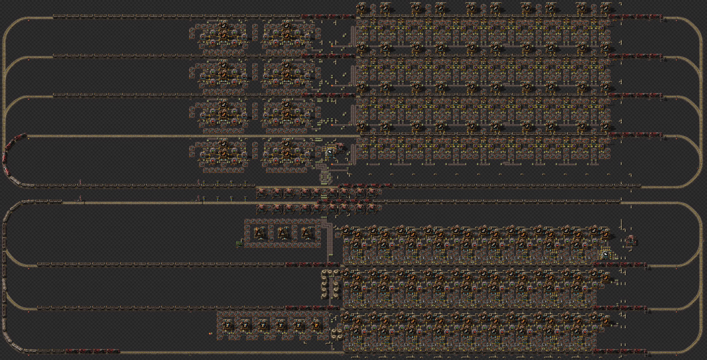</a>                                                       | [13_yuu.zip](maps/13_yuu.zip)                                     | [link](https://factoriobin.com/post/x5ic4p)                                                      | Region clone might be bugged                                                                                                                                                                                                                                                                                                                                                                                                                                                                                                                                                                                                                                                                                                                                                                                                                                                                                                                                                                                                                                                                                                                                             |
| RedPhoenixQ           | 14_redphoenixq           | 240/s           | 100%                  | [14_redphoenixq.txt](blueprints/14_redphoenixq.txt)                     | <a href="design_screenshot/14_redphoenixq.jpg">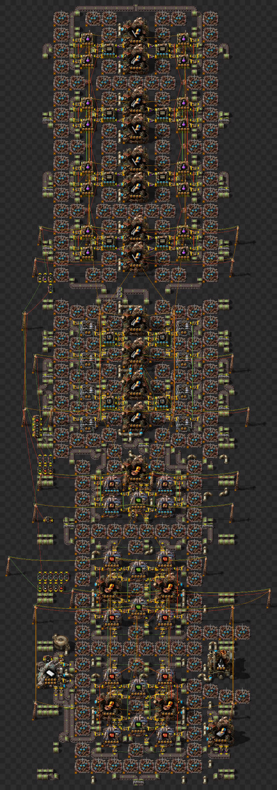</a>                               | [14_redphoenixq.zip](maps/14_redphoenixq.zip)                     | [link](https://factoriobin.com/post/b0rv5p)                                                      | There are two blueprints that chain into each other, one with the clock and another with overlapping power poles to connect the circuit networks. A few machine still monitor their contents to perform some locking logic (plastic production and green circuits for prod modules).  Almost everything is clocked with double(or more, sometimes less) swings. I used a slightly different method for clocking than I've seen in your videos. To calculate the clock values for 45 items/s for example, I take "50/60/16" (items_per_sec/ticks_per_sec/items_moved_per_activation). Using a tool like WolframAlpha I can get an exact fraction, in this case 5/96. I can then use the % operator with a value of 96 and keep the inserter active for 5 swings. For less helpful fractions like 13/384 I did almost the same thing, one % operator for 384 chained in to another one set to "floor(384/13)". If i used 16 as the items moved per activation, I'd active the inserted for one swing whenever the second % operator reset. That's how I achieved the sub tick clocks, which aren't 100% perfect but is good enough to not trigger wakelists in most cases. |
| yoyonas               | 15_yoyonas               | 480/s           | 200%                  | [15_yoyonas.txt](blueprints/15_yoyonas.txt)                             | <a href="design_screenshot/15_yoyonas.jpg">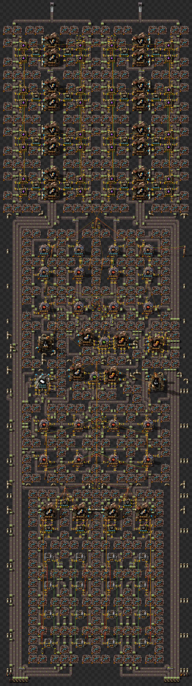</a>                                           | [15_yoyonas.zip](maps/15_yoyonas.zip)                             | [link](https://factoriobin.com/post/56o6sh)                                                      | First time designing something for UPS. It takes around 3 min to fully compress the output belts but is stable afterwards. I tried to utilize the natural speed of legendary/epic stack inserters "clocked" with manual stack sizes in the middle of the build and at the direct insertion of the rails. The middle part is a bit ugly and the red chips design could be a lot better.                                                                                                                                                                                                                                                                                                                                                                                                                                                                                                                                                                                                                                                                                                                                                                                   |
| teazy                 | 16_teazy                 | 960/s           | 100%                  | [16_teazy.txt](blueprints/16_teazy.txt)                                 |                                                  | [16_teazy.zip](maps/16_teazy.zip)                                 | [link](https://factoriobin.com/post/bssqcf)                                                      | since the rates of the modules dont really fit each other, you need to scale each module individually, to fit the total need.  overproduction is handled by stopping the modules, if it has output enough.  4 furnace makers make 53.2 furnaces per second 4 prod module makers make 49,6 prod modules per second. 1 belt (240/s) of science needs 40 each.  so 5 belts (1200/s) should still be fine with the 16 furnace makers available, etc.                                                                                                                                                                                                                                                                                                                                                                                                                                                                                                                                                                                                                                                                                                                         |
| AkaraVortex           | 17_akaravortex           | 240/s           | 100%                  | [17_akaravortex.txt](blueprints/17_akaravortex.txt)                     | <a href="design_screenshot/17_akaravortex.jpg">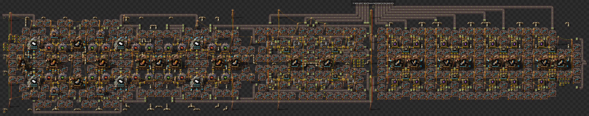</a>                               | [17_akaravortex.zip](maps/17_akaravortex.zip)                     | [link](https://factoriobin.com/post/ylqa0u)                                                      | Classic off-patch production. Some clocks are loose, but all belts have minimum sideloadings and high maximum stable bufferisation. I use 4 full DI module builds and 6 red circuit builds, this will not change, ss it is minimum required for Eco build, and allows for full red chip synchronosity due to ratio fo 1:1.5.                                                                                                                                                                                                                                                                                                                                                                                                                                                                                                                                                                                                                                                                                                                                                                                                                                             |
| AkaraVortex           | 18_akaravortex           | 240/s           | 100%                  | [18_akaravortex.txt](blueprints/18_akaravortex.txt)                     | <a href="design_screenshot/18_akaravortex.jpg">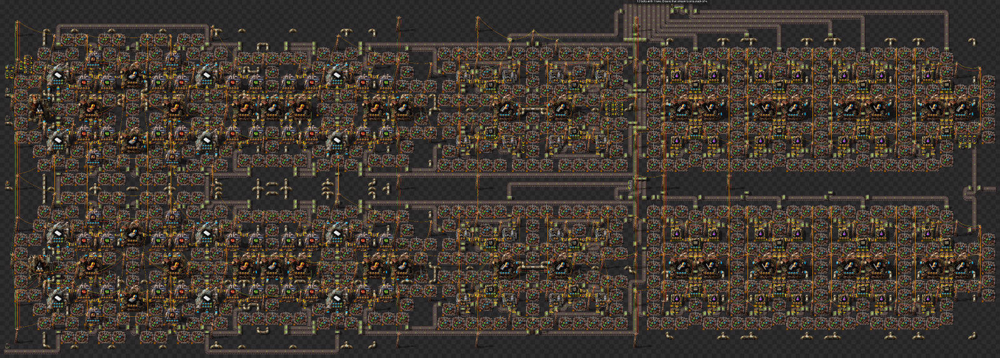</a>                               | [18_akaravortex.zip](maps/18_akaravortex.zip)                     | [link](https://factoriobin.com/post/ylqa0u/3)                                                    | Simple conversion of max speed blade. But clocks are even worse due to lower buffers.  This design is here to be compared with said max speed (not direct mining) design. But do green trees really have a price for which you can betray them?  This is exactly 20% energy consumption on everything, not just low pollution. 3-4 rows of trees on perimeter should fully consume all the pollution and stay green.                                                                                                                                                                                                                                                                                                                                                                                                                                                                                                                                                                                                                                                                                                                                                     |
| AkaraVortex           | 19_akaravortex           | 240/s           | 100%                  | [19_akaravortex.txt](blueprints/19_akaravortex.txt)                     | <a href="design_screenshot/19_akaravortex.jpg">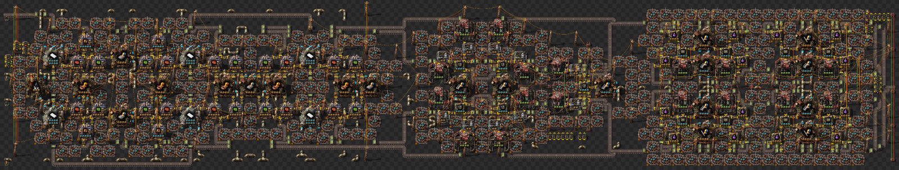</a>                               | [19_akaravortex.zip](maps/19_akaravortex.zip)                     | [link](https://factoriobin.com/post/ylqa0u/2)                                                    | Most optimized and efficient design. Can be placed on 2 below-average sized patches (here I used radius 16). With a decency to use only big mining drills.  Features forwarding and preceding sideloadings to minimize gaps, reduction of sideloadings everywhere. Easy clock sharing. Assymentric science build with 2 different  speed type assemblers.                                                                                                                                                                                                                                                                                                                                                                                                                                                                                                                                                                                                                                                                                                                                                                                                                |
| Groot opperhoofd      | 20_groot_opperhoofd      | 960/s           | 100%                  | [20_groot_opperhoofd.txt](blueprints/20_groot_opperhoofd.txt)           | <a href="design_screenshot/20_groot_opperhoofd.jpg">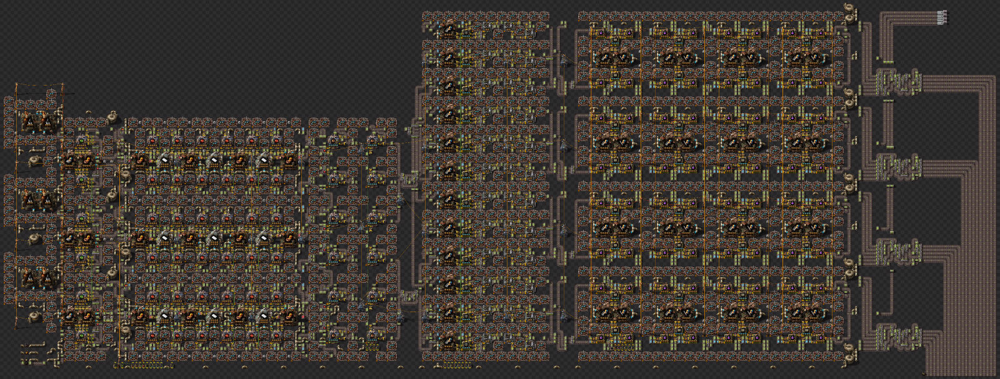</a>                | [20_groot_opperhoofd.zip](maps/20_groot_opperhoofd.zip)           | [link](https://factoriobin.com/post/bxvcvj)                                                      | Direct insertion where possible. Tileable building blocks.                                                                                                                                                                                                                                                                                                                                                                                                                                                                                                                                                                                                                                                                                                                                                                                                                                                                                                                                                                                                                                                                                                               |
| Em (EmiliaT)          | 21_em                    | 960/s           | 100%                  | [21_em.txt](blueprints/21_em.txt)                                       | <a href="design_screenshot/21_em.jpg">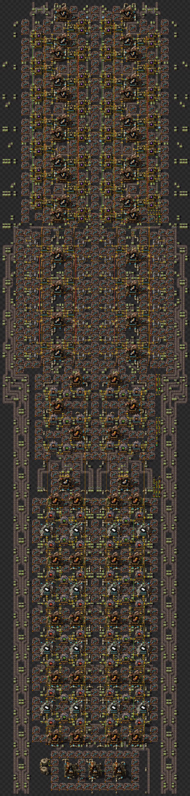</a>                                                          | [21_em.zip](maps/21_em.zip)                                       | [link](https://factoriobin.com/post/19t8ll)                                                      | the pack assemblers need to be prefilled with 8 electric furnace or prod modules for it to work, hopefully fine that i didnt make this multistage, also my first competition submission :3                                                                                                                                                                                                                                                                                                                                                                                                                                                                                                                                                                                                                                                                                                                                                                                                                                                                                                                                                                               |
| warbaque              | 22_warbaque              | 960/s           | 100%                  | [22_warbaque.txt](blueprints/22_warbaque.txt)                           |                                         | [22_warbaque.zip](maps/22_warbaque.zip)                           | [link](https://katiska.cc/temp/factorio/blueprints/ups/purple.txt)                               | improved prod module clocking                                                                                                                                                                                                                                                                                                                                                                                                                                                                                                                                                                                                                                                                                                                                                                                                                                                                                                                                                                                                                                                                                                                                            |
| warbaque              | 23_warbaque              | 960/s           | 100%                  | [23_warbaque.txt](blueprints/23_warbaque.txt)                           |                                         | [23_warbaque.zip](maps/23_warbaque.zip)                           | [link](https://katiska.cc/temp/factorio/blueprints/ups/purple.txt)                               | improved red circuit clocking (or atleast it should be better)                                                                                                                                                                                                                                                                                                                                                                                                                                                                                                                                                                                                                                                                                                                                                                                                                                                                                                                                                                                                                                                                                                           |
| Syvkal                | 24_syvkal                | 480/s           | 100%                  | [24_syvkal.txt](blueprints/24_syvkal.txt)                               | <a href="design_screenshot/24_syvkal.jpg">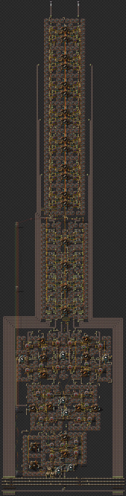</a>                                              | [24_syvkal.zip](maps/24_syvkal.zip)                               | [link](https://factoriobin.com/post/i1w7o60tbus3-EXPIRES)                                        | Horribly WIP, but I wanted to submit something.                                                                                                                                                                                                                                                                                                                                                                                                                                                                                                                                                                                                                                                                                                                                                                                                                                                                                                                                                                                                                                                                                                                          |
| MCMayhem57            | 25_mcmayhem57            | 480/s           | 100%                  | [25_mcmayhem57.txt](blueprints/25_mcmayhem57.txt)                       | <a href="design_screenshot/25_mcmayhem57.jpg">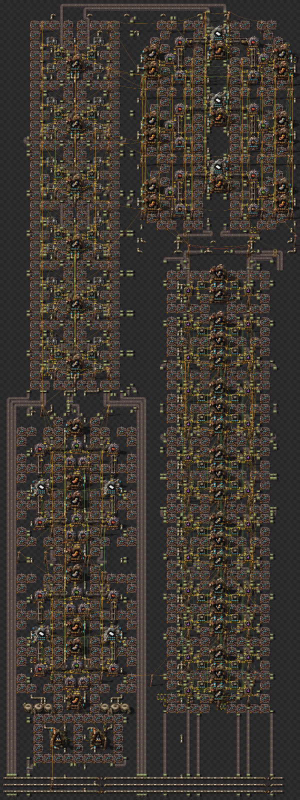</a>                                  | [25_mcmayhem57.zip](maps/25_mcmayhem57.zip)                       | [link](https://factoriobin.com/post/7eccsi)                                                      | Requires full backpressure to run optimally. It also barely fits within one pipe length. The miner array has 30 belts, 6 of which are completely unused. The design is a regular 480/s blade that had to be folded to fit within a single pipe length. Also, the miners unload onto belts, not undergrounds.  This design has a 0% chance of winning, but it was a good exerise.                                                                                                                                                                                                                                                                                                                                                                                                                                                                                                                                                                                                                                                                                                                                                                                         |
| Galacta487            | 26_galacta487            | 240/s           | 100%                  | [26_galacta487.txt](blueprints/26_galacta487.txt)                       | <a href="design_screenshot/26_galacta487.jpg">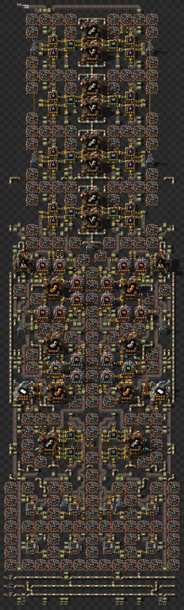</a>                                  | [26_galacta487.zip](maps/26_galacta487.zip)                       | [link](https://factoriobin.com/post/rlwykn)                                                      |                                                                                                                                                                                                                                                                                                                                                                                                                                                                                                                                                                                                                                                                                                                                                                                                                                                                                                                                                                                                                                                                                                                                                                          |
| TheFlyingCurryFish154 | 27_theflyingcurryfish154 | 480/s           | 200%                  | [27_theflyingcurryfish154.txt](blueprints/27_theflyingcurryfish154.txt) | <a href="design_screenshot/27_theflyingcurryfish154.jpg">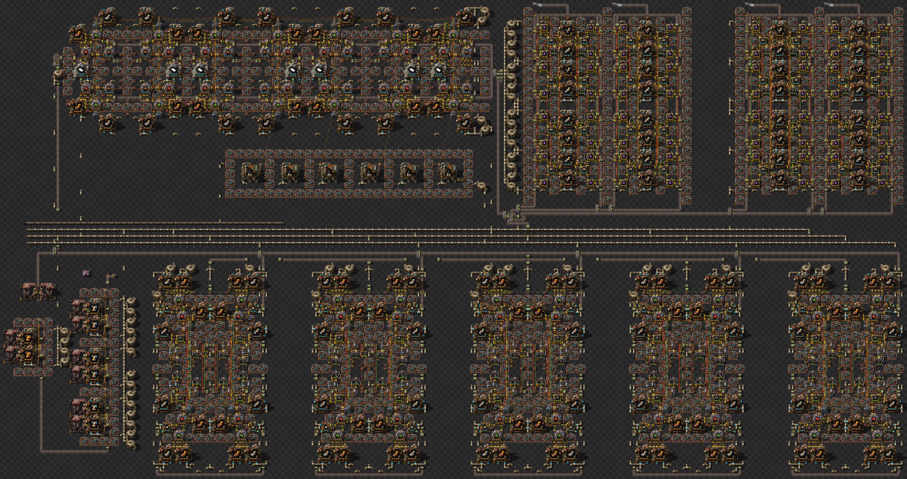</a> | [27_theflyingcurryfish154.zip](maps/27_theflyingcurryfish154.zip) | [link](https://discord.com/channels/1381752136450441266/1424111172906651729/1429590061720141864) | Everything is Direct Insertion except for Modules, Furnaces and Coal Still using LF dont have the energy for clocking                                                                                                                                                                                                                                                                                                                                                                                                                                                                                                                                                                                                                                                                                                                                                                                                                                                                                                                                                                                                                                                    |
| Erichteia             | 28_erichteia             | 960/s           | 100%                  | [28_erichteia.txt](blueprints/28_erichteia.txt)                         |                                      | [28_erichteia.zip](maps/28_erichteia.zip)                         | [link](https://factoriobin.com/post/k5qea2)                                                      | Direct mining, DI, Latched clock, Default settings                                                                                                                                                                                                                                                                                                                                                                                                                                                                                                                                                                                                                                                                                                                                                                                                                                                                                                                                                                                                                                                                                                                       |
| The End               | 29_the_end               | 480/s           | 600%                  | [29_the_end.txt](blueprints/29_the_end.txt)                             | <a href="design_screenshot/29_the_end.jpg">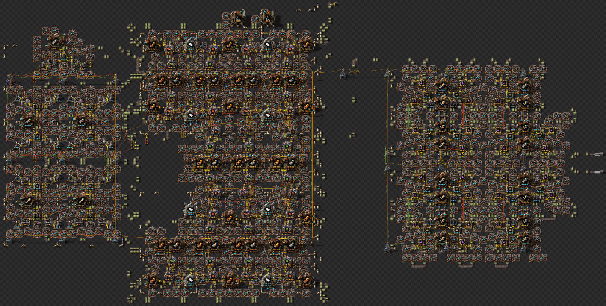</a>                                           | [29_the_end.zip](maps/29_the_end.zip)                             | [link](https://factoriobin.com/post/feh6yl)                                                      |                                                                                                                                                                                                                                                                                                                                                                                                                                                                                                                                                                                                                                                                                                                                                                                                                                                                                                                                                                                                                                                                                                                                                                          |

