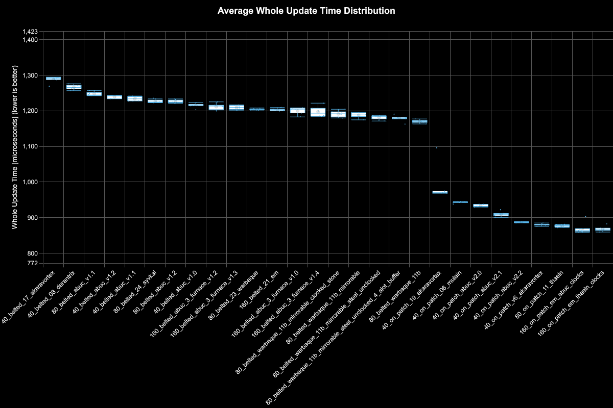
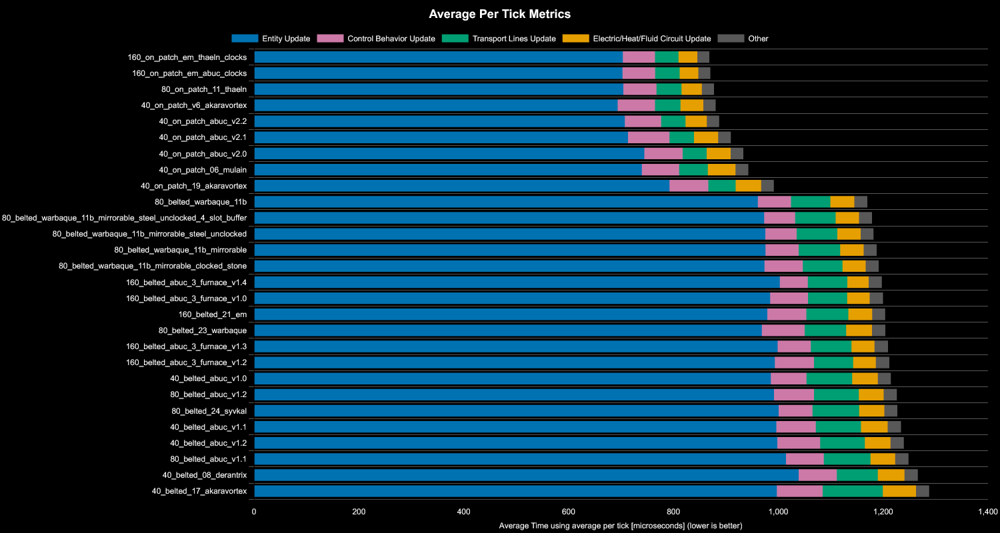
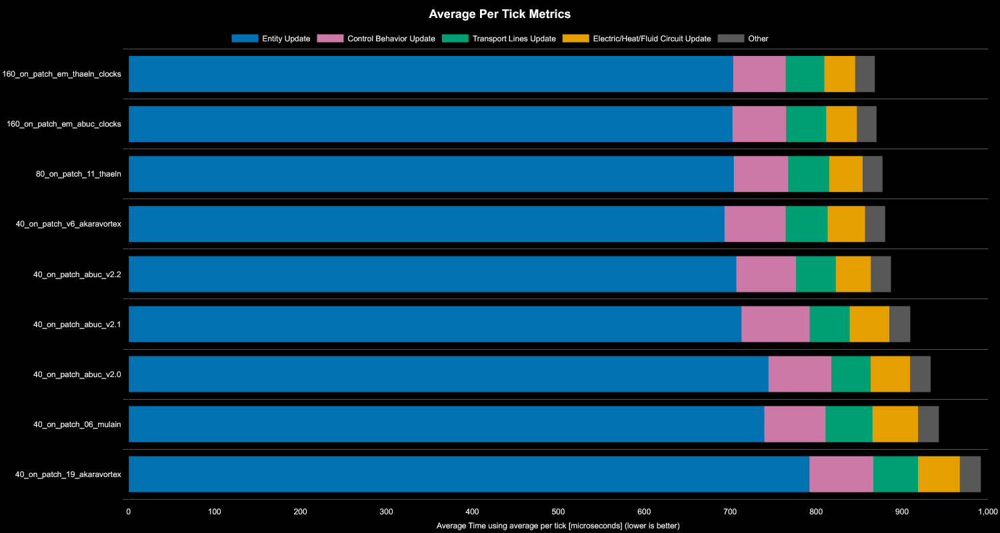
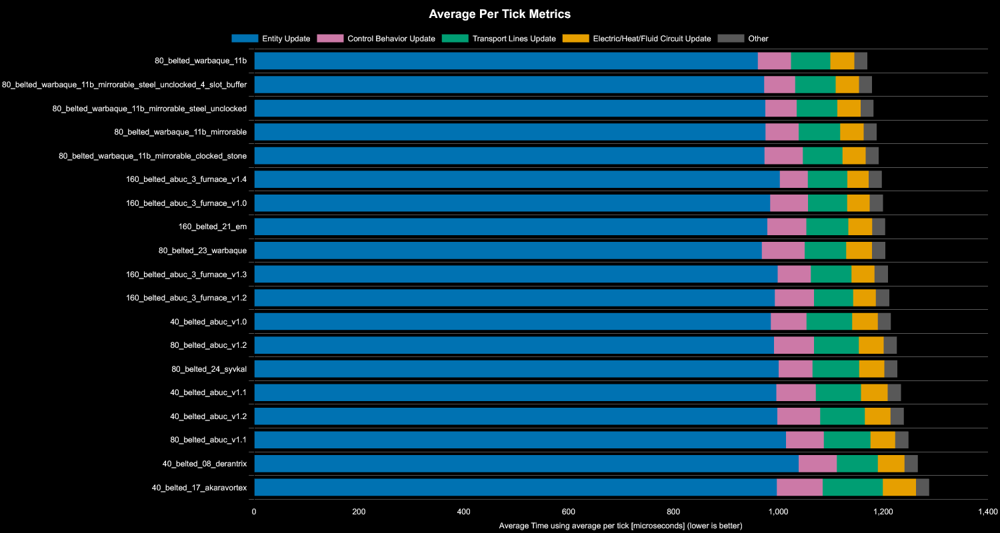
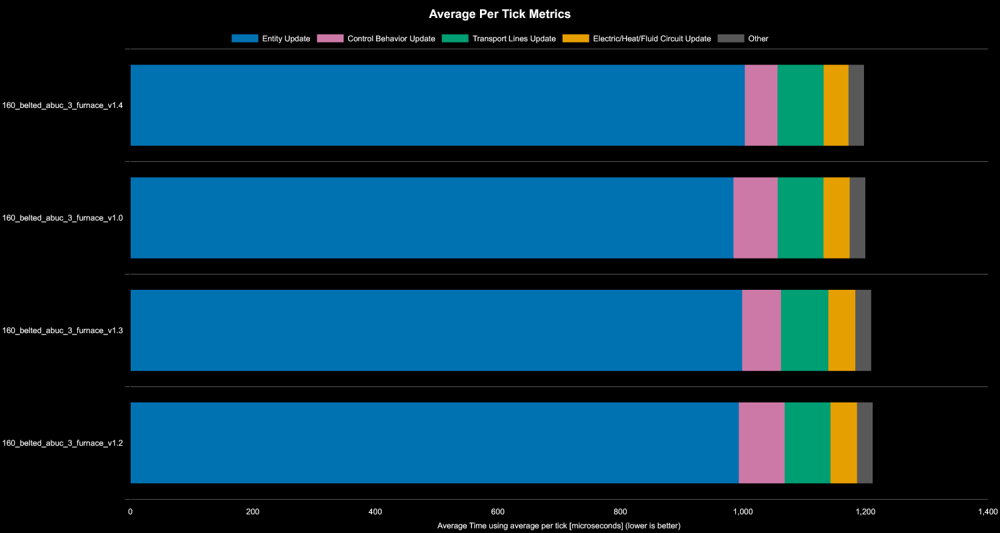
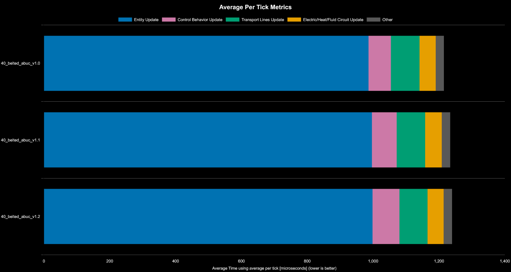

# Factorio Benchmark Results

**Platform:** windows-x86_64

**Factorio Version:** 2.0.72

## The Question
- for the production of furnaces in production science, which of the following strategies are superior and by how much:
  - on patch stone
  - belted stone
- are larger patch sizes superior
- what inserters should be clocked or not clocked

## Conclusion
  - clocking:
    - stone from belt is not worth clocking
    - stone brick output is worth clocking
    - red circuits is worth clocking
    - steel DI from foundry is not worth clocking
  - direct insertion mining:
    - clocking miners is worth it
    - direct insertion mining is far superior to belt fed stone

## Test Scenario
- Each save was tested for 36_000 tick(s) and 6 run(s)
- Each save produces 384_000 furnaces per minute

All blueprints for the designs in this test are here: [blueprints](./blueprints.txt)

## Results

| Save File                                                       | Entity Update | Control Behavior Update | Transport Lines Update | Electric/Heat/Fluid Circuit Update | Other | Whole Update | % Decrease from Previous | % Decrease from Best |
| --------------------------------------------------------------- | ------------- | ----------------------- | ---------------------- | ---------------------------------- | ----- | ------------ | ------------------------ | -------------------- |
| 160_on_patch_em_thaeln_clocks                                   | 703           | 61                      | 45                     | 36                                 | 23    | 868          |                          | 0%                   |
| 160_on_patch_em_abuc_clocks                                     | 703           | 63                      | 47                     | 36                                 | 23    | 870          | -0.23%                   | -0.23%               |
| 80_on_patch_11_thaeln                                           | 704           | 63                      | 48                     | 39                                 | 23    | 877          | -0.78%                   | -1.01%               |
| 40_on_patch_v6_akaravortex                                      | 694           | 71                      | 49                     | 44                                 | 24    | 880          | -0.37%                   | -1.39%               |
| 40_on_patch_abuc_v2.2                                           | 707           | 69                      | 46                     | 41                                 | 23    | 887          | -0.75%                   | -2.16%               |
| 40_on_patch_abuc_v2.1                                           | 713           | 79                      | 47                     | 46                                 | 24    | 910          | -2.53%                   | -4.74%               |
| 40_on_patch_abuc_v2.0                                           | 745           | 73                      | 46                     | 46                                 | 24    | 933          | -2.61%                   | -7.48%               |
| 40_on_patch_06_mulain                                           | 740           | 71                      | 55                     | 53                                 | 24    | 943          | -1.02%                   | -8.58%               |
| 40_on_patch_19_akaravortex                                      | 792           | 74                      | 52                     | 49                                 | 24    | 992          | -5.16%                   | -14.19%              |
| 80_belted_warbaque_11b                                          | 961           | 63                      | 75                     | 46                                 | 25    | 1170         | -17.99%                  | -34.73%              |
| 80_belted_warbaque_11b_mirrorable_steel_unclocked_4_slot_buffer | 973           | 59                      | 77                     | 45                                 | 25    | 1179         | -0.74%                   | -35.73%              |
| 80_belted_warbaque_11b_mirrorable_steel_unclocked               | 975           | 60                      | 78                     | 44                                 | 25    | 1182         | -0.27%                   | -36.09%              |
| 80_belted_warbaque_11b_mirrorable                               | 976           | 63                      | 79                     | 45                                 | 25    | 1188         | -0.5%                    | -36.77%              |
| 80_belted_warbaque_11b_mirrorable_clocked_stone                 | 974           | 73                      | 76                     | 44                                 | 25    | 1191         | -0.31%                   | -37.2%               |
| 160_belted_abuc_3_furnace_v1.4                                  | 1003          | 53                      | 76                     | 41                                 | 25    | 1198         | -0.51%                   | -37.9%               |
| 160_belted_abuc_3_furnace_v1.0                                  | 984           | 72                      | 75                     | 43                                 | 26    | 1200         | -0.19%                   | -38.17%              |
| 160_belted_21_em                                                | 979           | 74                      | 80                     | 45                                 | 25    | 1204         | -0.33%                   | -38.62%              |
| 80_belted_23_warbaque                                           | 969           | 82                      | 79                     | 49                                 | 25    | 1204         | -0.04%                   | -38.67%              |
| 160_belted_abuc_3_furnace_v1.3                                  | 999           | 63                      | 77                     | 44                                 | 26    | 1209         | -0.42%                   | -39.25%              |
| 160_belted_abuc_3_furnace_v1.2                                  | 993           | 75                      | 75                     | 43                                 | 26    | 1212         | -0.2%                    | -39.53%              |
| 40_belted_abuc_v1.0                                             | 986           | 68                      | 87                     | 49                                 | 25    | 1215         | -0.25%                   | -39.89%              |
| 80_belted_abuc_v1.2                                             | 992           | 76                      | 86                     | 47                                 | 25    | 1226         | -0.94%                   | -41.2%               |
| 80_belted_24_syvkal                                             | 1001          | 64                      | 89                     | 48                                 | 25    | 1227         | -0.07%                   | -41.3%               |
| 40_belted_abuc_v1.1                                             | 996           | 75                      | 86                     | 51                                 | 26    | 1234         | -0.57%                   | -42.11%              |
| 40_belted_abuc_v1.2                                             | 998           | 82                      | 85                     | 49                                 | 26    | 1240         | -0.45%                   | -42.75%              |
| 80_belted_abuc_v1.1                                             | 1015          | 72                      | 89                     | 47                                 | 25    | 1248         | -0.7%                    | -43.74%              |
| 40_belted_08_derantrix                                          | 1039          | 73                      | 78                     | 51                                 | 25    | 1266         | -1.44%                   | -45.82%              |
| 40_belted_17_akaravortex                                        | 997           | 88                      | 115                    | 63                                 | 25    | 1288         | -1.7%                    | -48.29%              |

## On Patch Designs

| Save File                     | Entity Update | Control Behavior Update | Transport Lines Update | Electric/Heat/Fluid Circuit Update | Other | Whole Update | % Decrease from Previous | % Decrease from Best |
| ----------------------------- | ------------- | ----------------------- | ---------------------- | ---------------------------------- | ----- | ------------ | ------------------------ | -------------------- |
| 160_on_patch_em_thaeln_clocks | 703           | 61                      | 45                     | 36                                 | 23    | 868          |                          | 0%                   |
| 160_on_patch_em_abuc_clocks   | 703           | 63                      | 47                     | 36                                 | 23    | 870          | -0.23%                   | -0.23%               |
| 80_on_patch_11_thaeln         | 704           | 63                      | 48                     | 39                                 | 23    | 877          | -0.78%                   | -1.01%               |
| 40_on_patch_v6_akaravortex    | 694           | 71                      | 49                     | 44                                 | 24    | 880          | -0.37%                   | -1.39%               |
| 40_on_patch_abuc_v2.2         | 707           | 69                      | 46                     | 41                                 | 23    | 887          | -0.75%                   | -2.16%               |
| 40_on_patch_abuc_v2.1         | 713           | 79                      | 47                     | 46                                 | 24    | 910          | -2.53%                   | -4.74%               |
| 40_on_patch_abuc_v2.0         | 745           | 73                      | 46                     | 46                                 | 24    | 933          | -2.61%                   | -7.48%               |
| 40_on_patch_06_mulain         | 740           | 71                      | 55                     | 53                                 | 24    | 943          | -1.02%                   | -8.58%               |
| 40_on_patch_19_akaravortex    | 792           | 74                      | 52                     | 49                                 | 24    | 992          | -5.16%                   | -14.19%              |

## Belted Designs

| Save File                                                       | Entity Update | Transport Lines Update | Control Behavior Update | Electric/Heat/Fluid Circuit Update | Other | Whole Update | % Decrease from Previous | % Decrease from Best |
| --------------------------------------------------------------- | ------------- | ---------------------- | ----------------------- | ---------------------------------- | ----- | ------------ | ------------------------ | -------------------- |
| 80_belted_warbaque_11b                                          | 961           | 75                     | 63                      | 46                                 | 25    | 1170         |                          | 0%                   |
| 80_belted_warbaque_11b_mirrorable_steel_unclocked_4_slot_buffer | 973           | 77                     | 59                      | 45                                 | 25    | 1179         | -0.74%                   | -0.74%               |
| 80_belted_warbaque_11b_mirrorable_steel_unclocked               | 975           | 78                     | 60                      | 44                                 | 25    | 1182         | -0.27%                   | -1%                  |
| 80_belted_warbaque_11b_mirrorable                               | 976           | 79                     | 63                      | 45                                 | 25    | 1188         | -0.5%                    | -1.51%               |
| 80_belted_warbaque_11b_mirrorable_clocked_stone                 | 974           | 76                     | 73                      | 44                                 | 25    | 1191         | -0.31%                   | -1.83%               |
| 160_belted_abuc_3_furnace_v1.4                                  | 1003          | 76                     | 53                      | 41                                 | 25    | 1198         | -0.51%                   | -2.35%               |
| 160_belted_abuc_3_furnace_v1.0                                  | 984           | 75                     | 72                      | 43                                 | 26    | 1200         | -0.19%                   | -2.55%               |
| 160_belted_21_em                                                | 979           | 80                     | 74                      | 45                                 | 25    | 1204         | -0.33%                   | -2.89%               |
| 80_belted_23_warbaque                                           | 969           | 79                     | 82                      | 49                                 | 25    | 1204         | -0.04%                   | -2.92%               |
| 160_belted_abuc_3_furnace_v1.3                                  | 999           | 77                     | 63                      | 44                                 | 26    | 1209         | -0.42%                   | -3.36%               |
| 160_belted_abuc_3_furnace_v1.2                                  | 993           | 75                     | 75                      | 43                                 | 26    | 1212         | -0.2%                    | -3.56%               |
| 40_belted_abuc_v1.0                                             | 986           | 87                     | 68                      | 49                                 | 25    | 1215         | -0.25%                   | -3.83%               |
| 80_belted_abuc_v1.2                                             | 992           | 86                     | 76                      | 47                                 | 25    | 1226         | -0.94%                   | -4.8%                |
| 80_belted_24_syvkal                                             | 1001          | 89                     | 64                      | 48                                 | 25    | 1227         | -0.07%                   | -4.87%               |
| 40_belted_abuc_v1.1                                             | 996           | 86                     | 75                      | 51                                 | 26    | 1234         | -0.57%                   | -5.47%               |
| 40_belted_abuc_v1.2                                             | 998           | 85                     | 82                      | 49                                 | 26    | 1240         | -0.45%                   | -5.95%               |
| 80_belted_abuc_v1.1                                             | 1015          | 89                     | 72                      | 47                                 | 25    | 1248         | -0.7%                    | -6.69%               |
| 40_belted_08_derantrix                                          | 1039          | 78                     | 73                      | 51                                 | 25    | 1266         | -1.44%                   | -8.23%               |
| 40_belted_17_akaravortex                                        | 997           | 115                    | 88                      | 63                                 | 25    | 1288         | -1.7%                    | -10.07%              |

## Inserter Clocking 3 Furnace Layout

The following 4 save files were used to compare the differences in if clocking stone input was worth it or not:

- 160_belted_abuc_3_furnace_v1.0: all clocked. stone has 4 or 5 swings back to back
- 160_belted_abuc_3_furnace_v1.2: all clocked. stone has 2 or 3 swings back to back
- 160_belted_abuc_3_furnace_v1.3: stone inserter no clocking
- 160_belted_abuc_3_furnace_v1.4: stone & steel inserter have no clocking

| Save File                      | Entity Update | Transport Lines Update | Control Behavior Update | Electric/Heat/Fluid Circuit Update | Other | Whole Update | % Decrease from Previous | % Decrease from Best |
| ------------------------------ | ------------- | ---------------------- | ----------------------- | ---------------------------------- | ----- | ------------ | ------------------------ | -------------------- |
| 160_belted_abuc_3_furnace_v1.4 | 1003          | 76                     | 53                      | 41                                 | 25    | 1198         |                          | 0%                   |
| 160_belted_abuc_3_furnace_v1.0 | 984           | 75                     | 72                      | 43                                 | 26    | 1200         | -0.19%                   | -0.19%               |
| 160_belted_abuc_3_furnace_v1.3 | 999           | 77                     | 63                      | 44                                 | 26    | 1209         | -0.78%                   | -0.98%               |
| 160_belted_abuc_3_furnace_v1.2 | 993           | 75                     | 75                      | 43                                 | 26    | 1212         | -0.2%                    | -1.18%               |

The best performing design has no clocking on the stone input or steel. This makes sense as the number of scans saved is less than 2 per second across these inserters.

## Inserter Clocking 2 Furnace Layout

The following 3 saves files vary the inserter clocking methods for stone specifically in isolation.

- 40_belted_abuc_v1.0: stone inserters unclocked 
- 40_belted_abuc_v1.1: stone inserters swing 5 times back to back
- 40_belted_abuc_v1.2: stone inserters swing either 2 or 3 times

| Save File           | Entity Update | Transport Lines Update | Control Behavior Update | Electric/Heat/Fluid Circuit Update | Other | Whole Update | % Decrease from Previous | % Decrease from Best |
| ------------------- | ------------- | ---------------------- | ----------------------- | ---------------------------------- | ----- | ------------ | ------------------------ | -------------------- |
| 40_belted_abuc_v1.0 | 986           | 87                     | 68                      | 49                                 | 25    | 1215         |                          | 0%                   |
| 40_belted_abuc_v1.1 | 996           | 86                     | 75                      | 51                                 | 26    | 1234         | -1.59%                   | -1.59%               |
| 40_belted_abuc_v1.2 | 998           | 85                     | 82                      | 49                                 | 26    | 1240         | -0.45%                   | -2.05%               |

v1.2 increased control behavior update time by sending more signals to the inserters with no benefit. v1.1 did not decrease entity update time and in fact made it worse.

The best design was the original unclocked stone design proving that clocking inserters for stone inputs was not worth it.

## Clocking Mining Drills

Refer to the results from [2025-11-11-clocked-mining-drills](../../../../../benchmarks/2025-11-11-clocked-mining-drills/README.md)

Conclusion: clocked mining drills directly inserting into a furnace is better due to reducing intermediate transfer every tick.