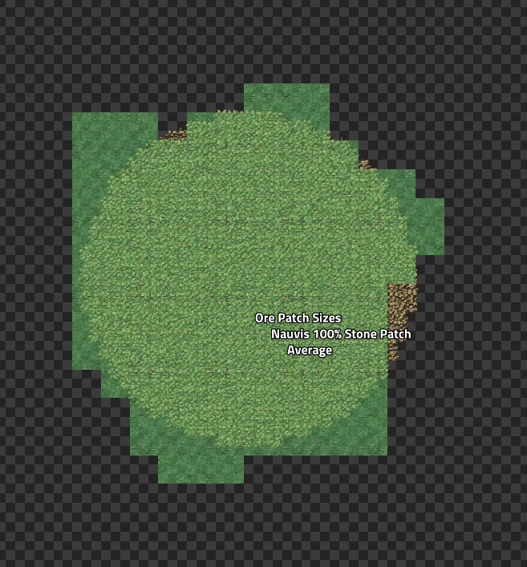
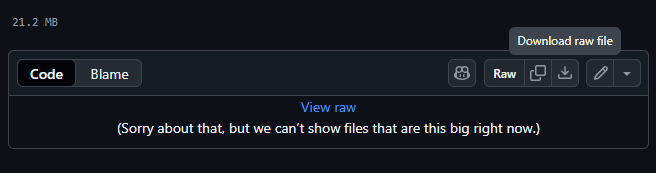

<h1>2025 Q1 Production Science Competition</h1>

<h2> Table of Contents</h2>

- [Requirements](#requirements)
  - [Guidelines on Patch Sizes by Map Gen Settings](#guidelines-on-patch-sizes-by-map-gen-settings)
- [Stability Tests](#stability-tests)
- [Creating your Save File](#creating-your-save-file)
- [Where to Submit](#where-to-submit)

## Requirements
1. must produce at least 240 science per second of normal quality
2. has to be able to accept raw ingredients only (calcite import accepted) and handle the entire production chain to produce the final science output
3. raw ingredients can be any of iron ore, copper ore, crude oil, water, coal, stone, uranium, calcite, molten iron, molten copper. All other recipes you must make yourself within your design.
4. Must be able to produce the science on Nauvis

### Guidelines on Patch Sizes by Map Gen Settings
Production science will heavily favor on patch designs due to the high volume of stone being consumed (a minimum of 5 stacked turbo belts per 240 science output). Thus many people will gravitate to directly inserting miners into rail or stone furnaces.

For this reason, abucnasty literally "mined" this data by placing electric miners over ore patches and then calculating the entity position x and y deltas to determine average patch area in square tiles. The min distance per patch was taken as the diameter.

- Blueprint book: https://factoriobin.com/post/ou1w9c
- Google Sheet of data [Nauvis Data Patch Size "Mining"](https://docs.google.com/spreadsheets/d/1HwgV7Wa_YkSqwttC_2RrT9PZA-GXn4wVyRDR4dFB9lk/edit?usp=sharing)

Based on the above results, the following average patch sizes emerged:

| Patch Size World Setting | Average Patch Size [tiles^2] | Equivalent Circular Brush Size |
| ------------------------ | ---------------------------- | ------------------------------ |
| 100%                     | 970                          | 18                             |
| 200%                     | 1809                         | 24                             |
| 400%                     | 3204                         | 32                             |
| 600%                     | 4352                         | 37                             |

For convenience, the above blueprint book contains a sample of patches that were outliers at each spawn setting and the average in concrete tiles so you can verify your design fits within them. You can test this yourself in an editor world by setting the resource brush size to one of the above values and setting the shape to circular. You will see that the blueprint book examples will closely resemble these brush sizes. 

Use the brush size when building your save file.

So the guidance here is design your build however you want, but keep in mind patch sizes when designing as the form entry will require you to specify if the build works at 100%+, 200%+, 400%+, 600%+ etc. 

If the build does not fit on any generated patch size, it will be considered "editor only". This does not impact your designs placement in the competition, but the designs will be broken down into subgroups based on patch size settings.

## Stability Tests
Must be able to pass abucnasty's acceptance criteria which is as follows.

All tests must reach a stable state and have fully saturated belts for 5 min after becoming stable:

1. cold start until science belt is fully saturated
2. Run until belts are backed up then release into infinity loaders
3. Remove one input and add it back
4. Cut off all inputs and add it back
5. must be stable for 216000 ticks (60 minutes). Stable is defined as the production graph over 10 minutes shows `240*60*10` science produced. If you design makes 480/s then it would be `480*60*10`.

These issues happen commonly in real bases so it’s worth testing these things. It also ensures that when a 36k+ tick benchmark is run, they will continue to produce science throughout the test without any hiccups. This will be verified by abucnasty and if the design does not pass the stability test it will be instantly eliminated.

## Creating your Save File
Use the following template map to start: [benchmark_purple_template](maps/benchmark_purple_template.zip)

You can download this file directly by pressing the "Download raw file" button in github:

The save file has max productivity researched and mining productivity level 8000. So research will not be the bottle neck.

Try to limit the number of miners you create to be just enough for your build.

The save file must produce 960/s purple science. If your design creates 240/s then you will need 4 copies of it in the save file. Do not region clone this as abuc will be doing this himself.

## Where to Submit

Submit your designs at the following link https://tally.so/r/mBMGNe

You must provide:
1. discord name
2. save file link (from discord)
3. blueprint file link (from a site like factoriobin)
4. production rate of your blueprint (240,480,960,1920 per second)
5. stone ore size minimum map gen settings